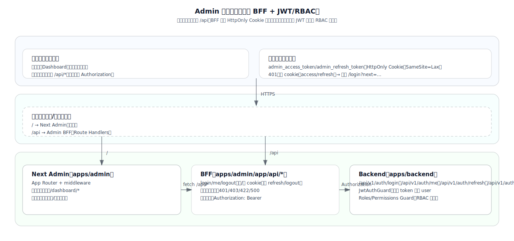

# SnapMatch Admin（管理后台）

`apps/admin` 是 SnapMatch 平台的管理后台，基于 Next.js（App Router）实现。

本项目采用“**同源 BFF + HttpOnly Cookie 会话 + 后端 JWT/RBAC 强授权**”的方式接入 `apps/backend`：

- 浏览器只请求同源 `/api/*`
- `apps/admin/app/api/*`（BFF）负责：读取/写入 cookie、转发后端、统一错误结构
- `apps/backend` 负责：JWT 校验、角色/权限（RBAC）强校验

## 总体架构



## 目录结构

- `app/`：Next.js App Router
  - `app/(guest)/`：访客页面（如登录/注册/错误页）
  - `app/dashboard/`：后台受保护页面（需要登录）
  - `app/api/`：BFF（Route Handlers）
    - `app/api/auth/`：登录态相关接口（login/me/logout）
- `components/`：页面与 UI 组件（含 `components/ui/`）
- `lib/`：通用工具与封装
  - `lib/api/`：后端请求封装（服务端专用）
  - `lib/auth/`：会话 cookie、权限判断（展示层）
- `hooks/`：自定义 Hooks（如有）
- `public/`：静态资源
- `proxy.ts`：路由保护与跳转（Next.js 16 推荐方式，保护 `/dashboard/:path*`）
- `CHANGELOG.md`：Admin 变更记录（每次变更需带版本号）

## 本地开发

### 1) 启动后端

后端位于 `apps/backend`，需先按 `docs/backend.md` 配置 `.env.local` 并启动（默认 `http://localhost:3002`）：

```bash
pnpm -C apps/backend dev
```

### 2) 配置 Admin 环境变量

复制并按需修改：

```bash
cp apps/admin/.env.example apps/admin/.env.local
```

关键变量：

- `BACKEND_BASE_URL`：后端基址（默认 `http://localhost:3002`）

### 3) 启动 Admin

```bash
pnpm -C apps/admin dev
```

默认地址：`http://localhost:3001`

## 鉴权与权限（当前实现）

### 会话策略

- Cookie：`admin_access_token`（HttpOnly，SameSite=Lax）
- Cookie：`admin_refresh_token`（HttpOnly，SameSite=Lax，用于服务端登出/续期能力）
- 未登录访问 `/dashboard/*`：`proxy.ts` 重定向到 `/login?next=...`
- 后端返回 401：BFF 会清 cookie，并返回 401 给前端，由前端跳转登录

### BFF 接口（同源）

- `POST /api/auth/login`：账号密码登录 → Set-Cookie
- `GET /api/auth/me`：获取当前用户（roles/permissions）
- `POST /api/auth/logout`：退出登录（先调用后端 `/api/v1/auth/logout` 撤销会话，再清理 cookie）

### RBAC（展示层）

- 后端强校验：在 `apps/backend` 使用 `@Roles/@Permissions` Guard
- 前端展示层：`lib/auth/can.ts` + 侧边栏菜单过滤（示例：Users 仅 `admin` 可见）

### 错误返回约定（前端只对接 BFF）

- BFF/后端统一返回 envelope：`{ code, message, data, timestamp }`
- 错误时可包含：`errors`（用于表单/字段级提示）
- 建议前端策略：
  - `401`：跳转登录
  - `403`：无权限提示
  - 其它：展示 `message`

## 维护说明

- 变更记录：新增功能或修复请追加到 `CHANGELOG.md`（必须带版本号）
- 代码风格：以仓库 ESLint/Prettier 为准，提交前建议运行 `pnpm -C apps/admin lint`

## Dashboard 顶部多标签页（Tabbar）

`/dashboard/*` 页面顶部会展示多标签页导航（类似 vben 的 tabbar）：

- 自动加入：访问的 dashboard 页面会自动出现在 tabbar 中
- 关闭策略：支持关闭当前/其他/左侧/右侧/全部
- 固定标签：支持固定/取消固定（固定标签不可被关闭）
- 右键菜单：刷新、关闭相关操作、固定切换
- 拖拽排序：支持拖拽调整标签顺序（移动端禁用拖拽）
- 持久化：顺序、关闭列表、固定列表会持久化到 `localStorage`

配置入口：

- `lib/navigation/dashboard-tabs.ts`：可按 `href` 配置 `hidden/label/order/affixTab/tabClosable/keepAlive`
- `lib/store/app-store.ts`：全局 Zustand store（未来可承载更多全局状态）
