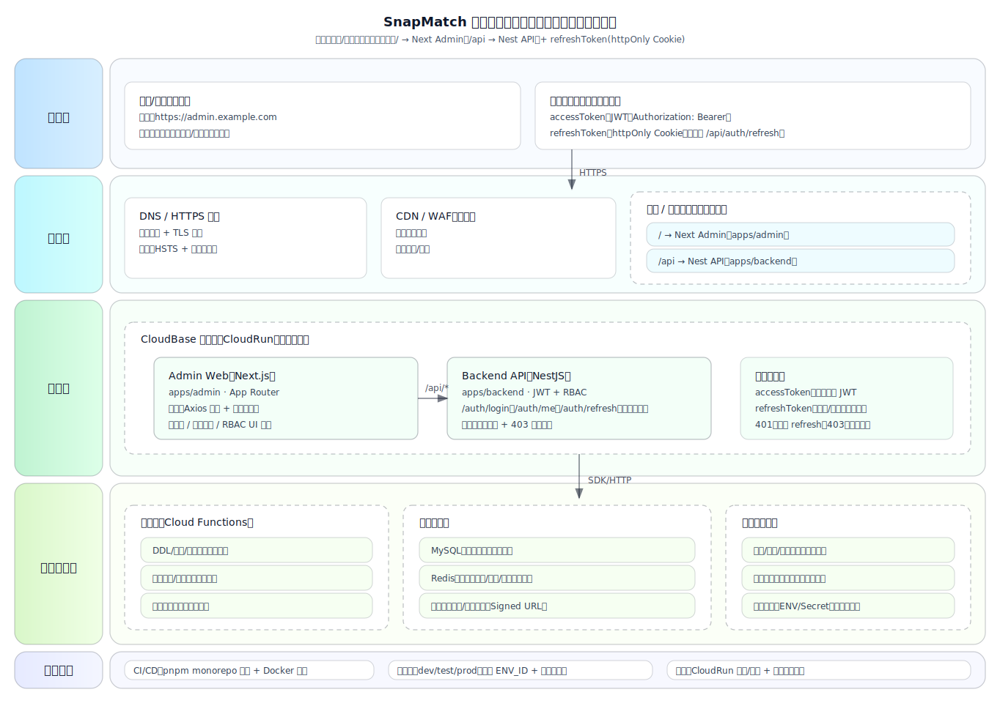

# 管理后台（Admin）设计与部署方案（CloudBase/腾讯云目标 A）

本文面向当前仓库 `snapmatch-platform` 的 Monorepo 架构，给出一套**可上线、可扩展、可运维**的管理后台
（`apps/admin`）与后端（`apps/backend`）的设计与部署方案，并提供系统架构图 SVG 源码。

> 适用前提：你计划在 CloudBase/腾讯云部署，且发布时倾向“同时部署”（同一仓库、同一流水线）。

---

## 1. 目标与结论（推荐方案）

### 1.1 目标

- 管理端登录态：`token/refresh` 机制完备
- 统一鉴权体验：`401` 自动刷新、`403` 统一提示、无权限页面可控
- 部署稳定：避免跨域 Cookie 与 CORS 的线上坑
- 结构可扩展：未来“建表/迁移”走云函数；业务数据可平滑接入 CloudBase 资源

### 1.2 推荐结论（强烈建议）

- **对外单域名同源**：浏览器始终访问一个 Origin，例如 `https://admin.example.com`
- **网关/反向代理按路径分流**：
  - `/` → Next.js Admin（`apps/admin`）
  - `/api/*` → Nest API（`apps/backend`）
- **鉴权模型**：
  - `accessToken`：JWT（短有效期），前端通过 `Authorization: Bearer <token>` 携带
  - `refreshToken`：`httpOnly Cookie`（仅刷新接口使用），后端支持旋转（rotation）与失效策略

这套组合的核心收益是：**同源请求 + httpOnly refresh**，最大限度降低 XSS/跨域/Cookie 策略的复杂度。

---

## 2. 系统架构图（SVG）

图文件：`docs/admin-system-architecture.svg`



---

## 3. 仓库现状与模块边界

- `apps/admin`：Next.js（管理后台）
- `apps/backend`：NestJS（JWT + RBAC 权限控制）
- `cloudbaserc.json`：预留 CloudBase Functions 入口（当前 `functions` 为空）
- 现有文档：
  - `docs/deployment.md`：Web/Admin 部署形态概述
  - `docs/backend.md`：后端开发说明（当前为 accessToken 登录）

本方案在现状基础上，补齐“**refresh + 401/403 统一策略**”与“**单域名上线形态**”。

---

## 4. 单域名同源：为什么比“同主域不同子域”更适合你

你是 Monorepo 且倾向同时部署，强烈建议走同源方案，原因：

- 不需要处理跨域 Cookie：避免 `SameSite=None; Secure`、`withCredentials`、CORS credentials 等坑
- 401 自动刷新更稳定：刷新接口自动携带 `httpOnly Cookie`，本地/线上一致
- 运维更清晰：一个域名入口、一套证书、一套 WAF/限流策略

> 你依然可以把 Next、Nest 作为两个独立服务部署，只要**对外入口统一由网关按路径分流**即可。

---

## 5. 鉴权与权限：推荐落地规范（重点）

### 5.1 Token 结构与存储策略

- `accessToken`：
  - 形式：JWT
  - 存储：`HttpOnly Cookie`（`admin_access_token`，由 Admin BFF 读取并转成 `Authorization: Bearer ...`）
  - 用途：访问后端受保护接口（`/auth/me` 与业务 API）
- `refreshToken`：
  - 形式：随机串（数据库仅存 hash）
  - 存储：`HttpOnly Cookie`（`admin_refresh_token`）
  - 用途：续期（后端 `POST /auth/refresh` 旋转刷新）与登出/踢下线（`POST /auth/logout` 撤销会话）

### 5.2 401/403 统一处理（前端请求层）

当前 `apps/admin` 采用 BFF（Route Handlers）统一转发后端，并在 401 时清理 cookie、引导重新登录：

- `401`：
  - BFF 清理 `admin_access_token` / `admin_refresh_token`
  - 前端跳转 `/login?next=...`
- `403`：
  - 统一 toast/notification 提示“无权限”
  - 对关键页面：可导航到 403 页面（你已有 404/500 页面，可新增 403）

### 5.3 后端接口契约（当前实现）

后端（`apps/backend`）已实现：

- `POST /auth/login`：返回 `accessToken` + `refreshToken` + `refreshExpiresAt`
- `POST /auth/refresh`：输入 `{ refreshToken }`，旋转 refresh token 并返回新的 `accessToken`
- `POST /auth/logout`：输入 `{ refreshToken }`，撤销会话（踢下线）
- `GET /auth/me`：校验 JWT 并返回用户

Admin（`apps/admin`）通过 BFF 读取 `HttpOnly Cookie`（`admin_refresh_token`），再以 JSON body 调用后端 `/auth/refresh` / `/auth/logout`，避免前端 JS 直接接触 refresh token。

### 5.4 CSRF 风险说明（为什么同源更好）

refresh token 存在 `HttpOnly Cookie`，理论上会引入 CSRF 风险。推荐组合：

- 同源请求 + `SameSite=Lax`（通常已足够）
- refresh 接口限定 `POST` 且仅接受 `Content-Type: application/json`
- 可选：对 refresh 接口增加 CSRF token（更严格时启用）

---

## 6. 部署拓扑（CloudBase/腾讯云目标 A）

### 6.1 组件与职责

建议分 2～3 个服务（容器）：

1) `admin`（Next.js，`apps/admin`）
2) `backend`（NestJS，`apps/backend`）
3) `gateway`（Nginx，路径分流；可选但推荐）

对外只暴露 `gateway` 一个入口域名：

- `https://admin.example.com/` → 由 `gateway` 转发到 `admin`
- `https://admin.example.com/api/*` → 由 `gateway` 转发到 `backend`

### 6.2 CloudRun（CloudBase 云托管）推荐

你可以将三者都部署到 CloudRun 容器模式：

- `snapmatch-admin`：Next 容器
- `snapmatch-backend`：Nest 容器
- `snapmatch-gateway`：Nginx 容器（public）

并让 `snapmatch-admin`、`snapmatch-backend` 仅内网访问（或不绑定公网域名），由 `gateway` 统一对外。

### 6.3 Nginx（网关）示例配置

核心目标：**同域名路径分流**。

```nginx
server {
  listen 80;
  server_name admin.example.com;

  # 后端 API：/api/*
  location /api/ {
    proxy_pass http://snapmatch-backend:3002/;
    proxy_set_header Host $host;
    proxy_set_header X-Forwarded-Proto $scheme;
    proxy_set_header X-Forwarded-For $proxy_add_x_forwarded_for;
  }

  # 管理后台：/
  location / {
    proxy_pass http://snapmatch-admin:3001/;
    proxy_set_header Host $host;
    proxy_set_header X-Forwarded-Proto $scheme;
    proxy_set_header X-Forwarded-For $proxy_add_x_forwarded_for;
  }
}
```

> 说明：上面 `snapmatch-backend` / `snapmatch-admin` 的可达地址取决于你实际的云托管网络与服务发现方式。
> 在 CloudRun 中通常会有“内网域名/内网访问”能力；若你使用 CLB/Nginx 在 VPC 内，也可通过内网 IP/域名转发。

---

## 7. 发布与运维（Monorepo 同步部署）

### 7.1 构建策略（建议）

- 统一依赖管理：`pnpm` workspace
- 构建：
  - `pnpm -C apps/admin build`
  - `pnpm -C apps/backend build`
- 镜像：
  - 为 `admin`、`backend`、`gateway` 各维护一个 `Dockerfile`
  - 通过 CI 生成并推送镜像，再触发 CloudRun 部署

### 7.2 多环境（dev/test/prod）

建议每个环境一个 CloudBase 环境 ID（`ENV_ID`）：

- `dev`：开发联调
- `test`：预发验证
- `prod`：生产

每个环境独立：

- 域名（或至少独立二级域名）
- `JWT_SECRET`、Cookie 配置、安全策略
- 数据库与存储桶（避免串环境）

### 7.3 观测与审计

最小可用清单：

- `/health` 健康检查（后端已具备）
- API 错误日志（4xx/5xx）
- 写操作审计日志（建议：用户、权限点、资源 ID、前后差异、requestId）

---

## 8. 与“云函数建表/迁移”的协作方式（面向未来）

你计划未来“建表/迁移”走云函数，建议把它定位成**运维工具链**，而不是业务请求的主路径：

- 云函数负责：
  - DDL/迁移脚本（手动触发或定时）
  - 数据修复、一次性回填
  - 运维任务（清理、统计）
- Nest 负责：
  - 在线业务 API（高频读写、权限校验、审计）
  - 需要时调用云函数（仅限受控场景、强校验、强审计）

这样能避免把“业务核心链路”绑死在云函数上，同时满足你对“建表/迁移云函数化”的诉求。

---

## 9. 本地开发与线上一致性建议

- 本地端口（参考 `docs/deployment.md`）：
  - Admin：`http://localhost:3001`
  - Backend：`http://localhost:3002`
- 推荐在本地也模拟同源：
  - 用本地 Nginx/Traefik（可选）
  - 或在 Admin 开发模式下用 Next `rewrites` 把 `/api` 代理到 `localhost:3002`

关键原则：**前端始终用相对路径 `/api` 请求**，上线不会改代码，只改网关转发。
