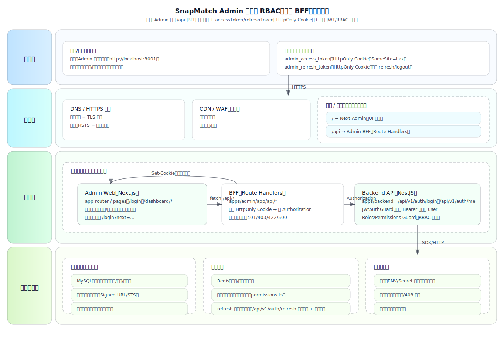
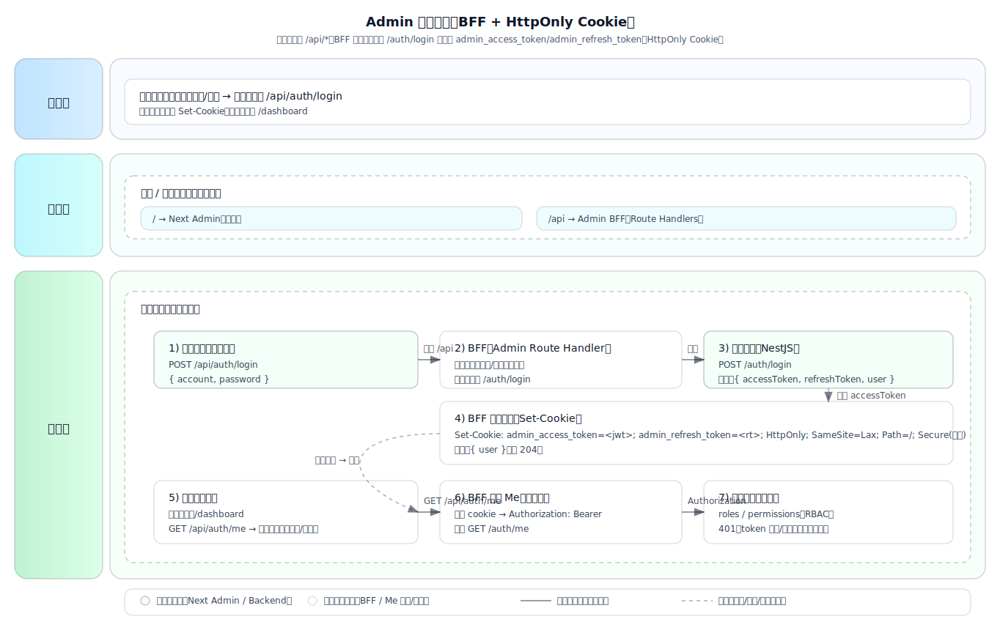
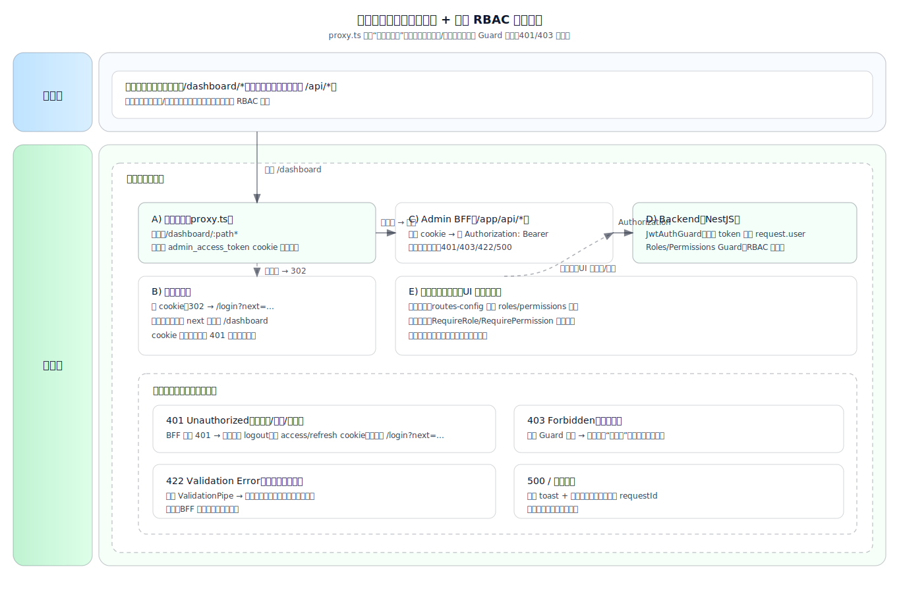

# Admin 接入后端登录与角色/权限（RBAC）设计方案

本文面向 `apps/admin`（Next.js App Router）接入 `apps/backend`（NestJS，JWT + RBAC）场景，给出一套**最小可行**且**可扩展**的落地设计，便于后续逐步接入业务资源接口（packages/assets/content 等）。

> 背景现状（来自仓库已有实现/文档）
>
> - 后端已具备：`POST /auth/login`、`GET /auth/me`、全局 JWT Guard + `@Roles/@Permissions` RBAC（见 `docs/backend/README.md`）。
> - Admin 目前登录是前端假逻辑（`apps/admin/app/(guest)/login/login-form.tsx`），尚未定义统一 API 封装与鉴权收口。
> - 仓库文档建议：写操作/权限校验放服务端（Server Actions 或 Route Handlers）（见 `docs/admin-api-strategy.md`）。

---

## 1. 目标与原则

### 1.1 目标

- Admin 使用后端完成登录（账号/密码）并获取当前用户信息（roles/permissions）。
- Admin 具备路由级保护（未登录不可访问 `/dashboard/*`）。
- Admin 支持“菜单/按钮可见性”等展示层权限控制。
- **所有写接口的权限强校验在后端完成**，前端只做展示与兜底引导。

### 1.2 核心原则

- **鉴权收口**：Admin 前端不直接与后端（`apps/backend`）交互，统一走 Admin 自身的 `/app/api/*`（BFF 层）。
- **Token 不落地到 localStorage**：优先使用 `HttpOnly` Cookie 存 `accessToken`（降低 XSS 风险）。
- **前端展示 ≠ 后端授权**：前端权限控制仅用于 UI/交互友好，真实授权由后端 Guard/装饰器决定。

---

## 2. 总体架构：BFF（Admin Route Handlers）+ 后端 JWT/RBAC

### 2.1 组件分工

- `apps/backend`：签发/校验 JWT、注入 `request.user`、执行 `@Roles/@Permissions` 强校验。
- `apps/admin`：
  - `/app/api/*`：作为 BFF 层，读取 cookie 中的 token，转发请求到后端，并做统一错误映射。
  - `proxy.ts`：对 `/dashboard/*` 做“是否已登录”的轻量拦截（只看 cookie 是否存在），并承载 SSR 场景的静默续期与 header 注入。
  - 页面/组件：基于 `me.roles/me.permissions` 做菜单/按钮可见性与禁用态。

### 2.2 为什么推荐 BFF

- 避免浏览器直连后端引发的 CORS、Header 注入、Token 存储等问题。
- 同域请求天然携带 cookie，前端调用简单统一（`fetch("/api/...")`）。
- 写入类逻辑可以放在服务端（Route Handler/Server Action），更贴合仓库已有“写入放服务端”的建议。

### 2.3 总体架构图（参考 `docs/admin/assets/system-architecture.svg` 风格）

> 本图基于当前落地方案：`admin_access_token` 与 `admin_refresh_token` 均存在 `HttpOnly Cookie`，
> 由 Admin BFF 读取并转发到后端。后端已提供 `/auth/refresh`（旋转 refresh token）与 `/auth/logout`（撤销会话），
> 且 `accessToken` 绑定会话 `sid`，被撤销后会立即失效。

---

## 3. 认证形态选择：HttpOnly Cookie 存 accessToken（推荐）

### 3.1 登录流程（推荐实现）

1. Admin 登录页提交 `{ account, password }`
2. `POST /api/auth/login`（Admin Route Handler）调用后端 `POST /auth/login`
3. 后端返回 `{ accessToken, user }`
4. Admin Route Handler 写入 cookie：
   - `Set-Cookie: admin_access_token=<jwt>; HttpOnly; SameSite=Lax; Path=/; Secure(生产)`
   - `Set-Cookie: admin_refresh_token=<rt>; HttpOnly; SameSite=Lax; Path=/; Secure(生产)`
5. 前端收到 `user`（或 204），跳转到 dashboard

> 前端不直接接触 token，只拿到 user 信息用于展示层逻辑。

### 3.2 获取当前用户（Me）

- `GET /api/auth/me`：从 cookie 读取 token → `Authorization: Bearer <token>` 转发到后端 `GET /auth/me`
- 返回 `{ user }`，用于初始化全局 auth 状态

### 3.3 退出登录

- `POST /api/auth/logout`：
  - 先调用后端 `POST /auth/logout` 撤销会话（使用 `admin_refresh_token`）
  - 再清空 `admin_access_token` 与 `admin_refresh_token` 两个 cookie

---

## 4. 路由保护与权限控制

### 4.1 路由级保护：`proxy.ts`

建议在 `apps/admin/proxy.ts`：

- 匹配：`/dashboard/:path*`
- 判断：是否存在 `admin_access_token` cookie
- 不存在：重定向到 `/login?next=<原始路径>`

说明：

- `proxy.ts` 不做 token 解码/验签（避免复杂逻辑与网络请求）；真实有效性在后端接口调用时兜底。
- token 失效时（后端返回 401），前端统一触发登出并跳登录。

### 4.2 展示层权限控制（前端）

建议实现极薄的权限工具（示意）：

- `isAdmin(user)`：`roles` 包含 `admin`
- `hasPermission(user, perm)`：`permissions` 包含 `*` 或包含该 perm
- `can(user, { roles?: Role[]; permissions?: string[] })`：统一判断

落地点：

- 菜单：`apps/admin/lib/routes-config.tsx` 增加 `roles?/permissions?` 字段，Sidebar 渲染时过滤不可见项
- 按钮：提供 `<RequirePermission>` / `<RequireRole>` 组件，或在 click handler 前做禁用/提示

### 4.3 后端强校验（必须）

所有写接口必须在后端使用：

- `@Roles(Role.Admin)` 或
- `@Permissions("packages:write")`

前端任何权限判断都不能替代后端校验。

---

## 5. API 设计与封装建议（结合当前项目）

### 5.1 Admin 侧调用规范：Client 只打 `/api/*`

客户端组件（Client Component）只调用 Admin 自己的 API：

- `fetch("/api/auth/me")`
- `fetch("/api/packages")`
- `fetch("/api/packages", { method: "POST", body: ... })`

这样可以：

- 避免跨域（同域 cookie 自动携带）
- 隐藏后端地址与鉴权细节
- 更方便做统一错误处理

### 5.2 Server 侧统一封装：`serverRequest()`

在 Admin 的 Route Handlers/Server Actions 内部，建议统一通过 `serverRequest()` 访问后端：

- 从 `cookies()` 读取 token（`admin_access_token`）
- 构造 `Authorization: Bearer <token>`
- 处理后端错误（401/403/422/500）并映射为统一返回

### 5.3 目录结构建议（关键件）

建议新增/组织为：

- `apps/admin/app/api/auth/login/route.ts`
- `apps/admin/app/api/auth/me/route.ts`
- `apps/admin/app/api/auth/logout/route.ts`
- `apps/admin/lib/api/server-request.ts`（仅服务端用）
- `apps/admin/proxy.ts` -（可选）`apps/admin/lib/auth/permissions.ts`（前端权限工具与类型）

后续每个资源一个 proxy：

- `apps/admin/app/api/packages/route.ts`
- `apps/admin/app/api/packages/[id]/route.ts`
- `apps/admin/app/api/assets/sign/route.ts`

---

## 6. 环境变量与本地联调

### 6.1 建议端口

- Admin：`http://localhost:3001`
- Backend：`http://localhost:3002`

### 6.2 Admin 侧（建议）

- `NEXT_PUBLIC_ADMIN_BASE_URL`（如果需要跨域跳转/独立域名，参考根 README）
- `BACKEND_BASE_URL`（仅服务端使用，建议放在 `apps/admin/.env.local`，不要暴露给浏览器）

### 6.3 Backend 侧（已有）

见 `docs/backend/README.md`：

- `ADMIN_ORIGIN=http://localhost:3001`
- `JWT_SECRET=...`
- `CLOUDBASE_ENV` / `CLOUDBASE_SECRET_ID` / `CLOUDBASE_SECRET_KEY`

---

## 7. 错误处理与体验建议

- 401（未登录/过期）：前端触发 `logout`，跳转 `/login?next=...`
- 403（无权限）：跳转到“无权限页面”或弹 Toast 提示
- 422（参数校验失败）：表单按字段展示错误
- 500：统一错误提示 + 重试入口（必要时记录 requestId）

---

## 8. 权限点字典与一致性（建议后续补齐）

为避免权限字符串散落，建议：

- 后端新增 `apps/backend/src/auth/permissions.ts` 维护权限点常量/字典
- Admin 侧只消费（可复制/生成类型）保持一致

示例权限点（仅示意）：

- `packages:read` / `packages:write`
- `assets:sign`
- `content:write`

---

## 9. MVP 落地顺序（建议按此拆任务）

1. 登录打通：LoginForm → `POST /api/auth/login` → cookie → 跳转 dashboard
2. 配置 `proxy.ts`：保护 `/dashboard/*`
3. 做 `GET /api/auth/me` + 全局 Auth 状态（Provider/Hook）
4. 实现 `serverRequest()` + 一个示例业务 proxy（例如 `/api/health` 或 `/api/packages`）
5. 路由菜单增加权限字段并过滤；按钮级权限组件
6. 权限字典统一化（后端维护，前端消费）

---

## 10. 需要确认的关键决策

请确认以下两点，以便下一步我直接开始落地代码：

1. **交互路径**：是否统一走 Admin 的 `/api/*`（BFF）转发后端？（本文默认：是）
2. **权限粒度**：仅角色（`admin/photographer`）够用，还是需要细权限点（`packages:write` 等）？
