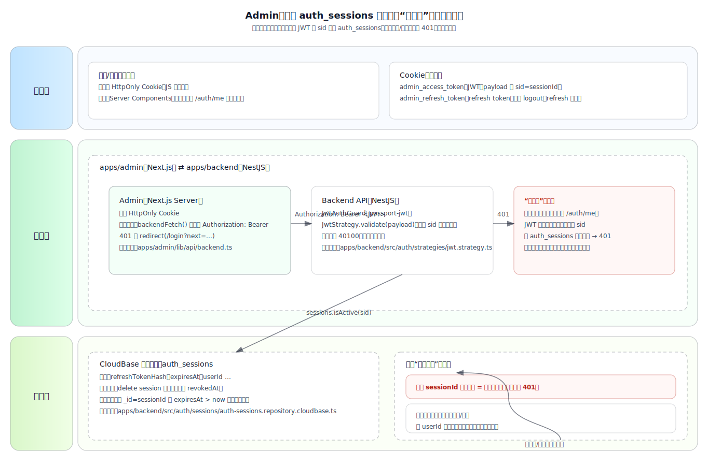

# Admin：删除 `auth_sessions` 是否等同“踢下线”（代码实证）

结论：**是的（对“被删的会话”而言）**。在当前实现里，后端对每一个需要鉴权的请求都会用 JWT 中的 `sid` 回查 `auth_sessions`；只要对应记录不存在（被删除/已过期），即使 JWT 本身还没到 `exp`，也会被判定为 `401`，等同“会话失效/被踢下线”（下一次请求生效）。

## 1. 认证方案是什么？

### 1.1 Admin 端（`apps/admin`）

- **存储**：`admin_access_token` / `admin_refresh_token` 都存在 **HttpOnly Cookie**（浏览器 JS 不可读）。
- **携带方式**：服务端（Next.js Server Components / Route Handler）读取 Cookie，并在请求后端时拼上 `Authorization: Bearer <JWT>`。
- **关键实现**
  - `apps/admin/lib/api/backend.ts`：`backendFetch()` 读取 `admin_access_token` 并设置 `authorization` header
  - `apps/admin/lib/auth/session.ts`：统一读写/清理 cookie
  - `apps/admin/app/dashboard/layout.tsx`：服务端渲染时调用后端 `/auth/me` 来确认登录态；401 则重定向登录页

### 1.2 后端（`apps/backend`）

- **Access Token**：NestJS + `passport-jwt` 校验 `Authorization: Bearer <JWT>`。
- **强制会话回查**：JWT payload 里包含 `sid=sessionId`；在 `JwtStrategy.validate()` 内部会调用 `sessions.isSessionActive(sid)`，从 `auth_sessions` 判断会话是否仍有效。
- **关键实现**
  - `apps/backend/src/auth/auth.service.ts`：登录时创建会话并把 `sid` 写入 JWT payload
  - `apps/backend/src/auth/strategies/jwt.strategy.ts`：每次鉴权都会回查 `sid`
  - `apps/backend/src/auth/sessions/auth-sessions.repository.cloudbase.ts`：`isActive()` 通过 CloudBase DataModel 查询 `auth_sessions` 中 `_id=sessionId` 且 `expiresAt > now` 是否存在
  - `apps/backend/src/auth/sessions/auth-sessions.repository.cloudbase.ts`：`revoke()` 采用 **delete 记录** 的方式撤销会话

## 2. “删 `auth_sessions` 记录”为什么等同踢下线？

你可以把 `auth_sessions` 理解为“服务端维护的会话白名单（按 sessionId）”：

1. 登录成功后：
   - 后端创建一条 `auth_sessions` 记录，并返回 `refreshToken`
   - 同时签发 JWT（`admin_access_token`），并把 `sid`（即 sessionId）写进 JWT

2. 之后每一次请求后端受保护接口（包括 `/auth/me`）：
   - JWT 签名/过期校验通过后
   - **还会用 `sid` 回查 `auth_sessions` 是否存在且未过期**

3. 你从表里删除该 `sid` 对应记录后：
   - `isActive(sid)` 查询不到记录 → `validate()` 抛 `401`（`40100 会话已失效`）
   - Admin 下一次请求后端就会收到 401，然后被迫重新登录

因此：**删除 `auth_sessions` 的会话记录=对该会话“立即失效”（下一次请求生效）**，效果等同“登录认证过期/被踢下线”。

## 3. 你说的“删除某个用户”具体会发生什么？

这里有两种“删法”，效果不同：

1. **只删某一条 session 记录（按 `_id=sessionId`）**
   - 只踢掉该用户的某一次登录（某一设备/浏览器）

2. **删该用户的所有 session（按 `userId` 批量删除）**
   - 踢掉该用户所有端的登录（全端下线）
   - 后端已有接口层能力：`AuthSessionsService.revokeAllByUserId(userId)`（目前主要是 repository 支持）

## 4. 架构图（SVG 内嵌）

下面的图按现有代码实现绘制，样式参考 `docs/admin/assets/auth-rbac-architecture.svg`。

说明：部分 Markdown 渲染器会出于安全策略**屏蔽内联 `<svg>`**，因此这里采用“SVG 文件嵌入”的方式（仍为 SVG 格式）。

如果你的渲染器不支持 `` 显示 SVG，可直接打开：`docs/admin/assets/auth-session-kickout.svg`。

## 5. 一个小提醒（不影响结论）

当前 `apps/admin` 的 `/dashboard` 在服务端直接调用后端 `/auth/me`（而不是走 `GET /api/auth/me`），因此后端返回 401 时会重定向登录页，但 **cookie 不一定会被主动清理**。这不会影响“踢下线”的实际效果（因为每次请求仍会 401），但如果你希望“401 后自动清 cookie”，可以把 `/auth/me` 的调用统一走 BFF 路由，或在服务端捕获 401 后追加清 cookie 的响应策略。
