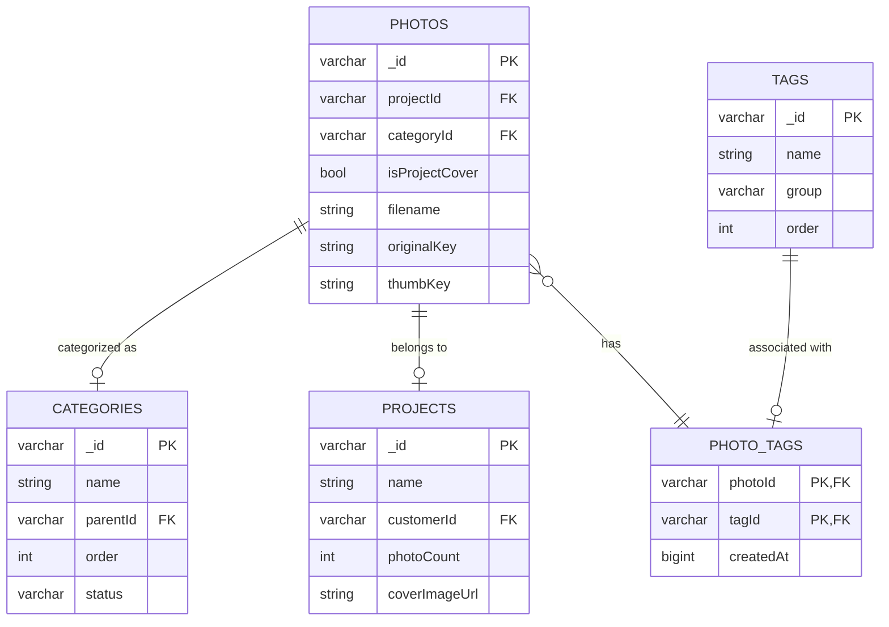

# 全局照片库 - 数据库设计

> **数据库类型**: MySQL
> **字符集**: utf8mb4
> **最后更新**: 2026-01-10

---

## 📋 概述

全局照片库需要在现有 `photos` 表基础上进行扩展，并新增 `categories`、`tags`、`photo_tags` 表来支持类目和标签功能。

### 现有表结构（参考）

**`photos` 表**（已存在，需要扩展）：

- `_id`: 照片ID
- `projectId`: 项目ID
- `filename`: 文件名
- `originalKey`: 原始文件键
- `previewKey`: 预览图键
- `thumbKey`: 缩略图键
- `fileSize`: 文件大小
- `width/height`: 图片尺寸
- `status`: 处理状态
- `selected`: 是否被客户选中
- `selectedAt`: 选中时间
- `createdAt`: 创建时间

**`projects` 表**（已存在）：

- `_id`: 项目ID
- `name`: 项目名称
- `customerId`: 客户ID
- `status`: 项目状态
- `photoCount`: 照片数量
- `coverImageUrl`: 封面图URL

---

## 🔧 表结构扩展

### 1. 扩展 `photos` 表

**新增字段**：

```sql
ALTER TABLE photos
ADD COLUMN categoryId VARCHAR(34) COMMENT '类目ID（外键，但无约束）' AFTER projectId,
ADD COLUMN isProjectCover BOOLEAN DEFAULT FALSE COMMENT '是否是项目封面' AFTER categoryId,
ADD INDEX IDX_PHOTOS_CATEGORY (categoryId),
ADD INDEX IDX_PHOTOS_COVER (isProjectCover);
```

**完整字段说明**：

| 字段             | 类型        | 说明                          | 默认值 |
| ---------------- | ----------- | ----------------------------- | ------ |
| `categoryId`     | VARCHAR(34) | 类目ID（关联categories.\_id） | NULL   |
| `isProjectCover` | BOOLEAN     | 是否是项目封面照片            | FALSE  |

**设计决策**：

1. **`categoryId` 允许为 NULL**：
   - 照片可以暂时不分类
   - 允许灵活的分类管理

2. **`isProjectCover` 冗余字段**：
   - 快速查询项目封面，无需JOIN
   - 便于封面照片的特殊处理

3. **不使用外键约束**：
   - 性能考虑
   - 应用层严格校验
   - 避免级联删除问题

---

### 2. 新建 `categories` 表（类目表）

**用途**：照片的顶级分类，如「人像写真」、「婚纱摄影」、「家庭纪实」

```sql
CREATE TABLE IF NOT EXISTS categories (
  _id VARCHAR(34) PRIMARY KEY COMMENT '类目ID（cat_前缀+nanoid）',
  name VARCHAR(100) NOT NULL COMMENT '类目名称',
  type VARCHAR(50) DEFAULT 'photo' COMMENT '类型：photo/package',
  parentId VARCHAR(34) COMMENT '父类目ID（支持二级类目）',
  order INT DEFAULT 0 COMMENT '排序顺序',
  status VARCHAR(50) DEFAULT 'active' COMMENT '状态：active/hidden',
  createdAt BIGINT NOT NULL COMMENT '创建时间（毫秒时间戳）',
  updatedAt BIGINT NOT NULL COMMENT '更新时间（毫秒时间戳）',

  INDEX IDX_CATEGORIES_PARENT (parentId),
  INDEX IDX_CATEGORIES_TYPE (type),
  INDEX IDX_CATEGORIES_STATUS (status),
  INDEX IDX_CATEGORIES_ORDER (order)
) ENGINE=InnoDB DEFAULT CHARSET=utf8mb4 COMMENT='照片类目表';
```

**字段说明**：

| 字段       | 类型         | 说明                                           |
| ---------- | ------------ | ---------------------------------------------- |
| `_id`      | VARCHAR(34)  | 类目ID，格式：`cat_01ARZ3NDEKTSV4RRFFQ69G5FAV` |
| `name`     | VARCHAR(100) | 类目名称，如「人像写真」                       |
| `type`     | VARCHAR(50)  | 类型，预留扩展（photo/package）                |
| `parentId` | VARCHAR(34)  | 父类目ID，支持二级分类                         |
| `order`    | INT          | 排序顺序，数字越小越靠前                       |
| `status`   | VARCHAR(50)  | 状态，active=显示，hidden=隐藏                 |

**示例数据**：

```sql
INSERT INTO categories (_id, name, type, parentId, order, status, createdAt, updatedAt) VALUES
('cat_01ARZ3NDEKTSV4RRFFQ69G5FAV', '人像写真', 'photo', NULL, 1, 'active', 1704873600000, 1704873600000),
('cat_02ARZ3NDEKTSV4RRFFQ69G5FAV', '婚纱摄影', 'photo', NULL, 2, 'active', 1704873600000, 1704873600000),
('cat_03ARZ3NDEKTSV4RRFFQ69G5FAV', '家庭纪实', 'photo', NULL, 3, 'active', 1704873600000, 1704873600000);
```

---

### 3. 新建 `tags` 表（标签表）

**用途**：照片的细粒度属性，分为多个标签组

```sql
CREATE TABLE IF NOT EXISTS tags (
  _id VARCHAR(34) PRIMARY KEY COMMENT '标签ID（tag_前缀+nanoid）',
  name VARCHAR(50) NOT NULL COMMENT '标签名称',
  `group` VARCHAR(50) NOT NULL COMMENT '标签分组：style/emotion/scene/people/clothing/service/time',
  applicableTo JSON COMMENT '适用类型：["photo", "package"]',
  order INT DEFAULT 0 COMMENT '排序顺序',
  createdAt BIGINT NOT NULL COMMENT '创建时间（毫秒时间戳）',

  INDEX IDX_TAGS_GROUP (group),
  INDEX IDX_TAGS_ORDER (order)
) ENGINE=InnoDB DEFAULT CHARSET=utf8mb4 COMMENT='照片标签表';
```

**字段说明**：

| 字段           | 类型        | 说明                                           |
| -------------- | ----------- | ---------------------------------------------- |
| `_id`          | VARCHAR(34) | 标签ID，格式：`tag_01ARZ3NDEKTSV4RRFFQ69G5FAV` |
| `name`         | VARCHAR(50) | 标签名称，如「新中式」、「纯欲」               |
| `group`        | VARCHAR(50) | 标签分组，见下方枚举                           |
| `applicableTo` | JSON        | 适用类型，预留扩展                             |
| `order`        | INT         | 排序顺序                                       |

**标签分组（TagGroup）**：

| 分组       | 说明     | 示例               |
| ---------- | -------- | ------------------ |
| `style`    | 风格     | 新中式、韩式、欧式 |
| `emotion`  | 情绪     | 纯欲、甜美、高冷   |
| `scene`    | 场景     | 棚拍、外景、室内   |
| `people`   | 人物关系 | 情侣、亲子、独照   |
| `clothing` | 服装     | 婚纱、汉服、日常   |
| `service`  | 服务属性 | 含妆造、含精修     |
| `time`     | 时间节点 | 日出、日落、夜景   |

**示例数据**：

```sql
INSERT INTO tags (_id, name, `group`, applicableTo, order, createdAt) VALUES
-- 风格标签
('tag_01ARZ3NDEKTSV4RRFFQ69G5FAV', '新中式', 'style', '["photo"]', 1, 1704873600000),
('tag_02ARZ3NDEKTSV4RRFFQ69G5FAV', '韩式', 'style', '["photo"]', 2, 1704873600000),
('tag_03ARZ3NDEKTSV4RRFFQ69G5FAV', '欧式', 'style', '["photo"]', 3, 1704873600000),

-- 情绪标签
('tag_04ARZ3NDEKTSV4RRFFQ69G5FAV', '纯欲', 'emotion', '["photo"]', 1, 1704873600000),
('tag_05ARZ3NDEKTSV4RRFFQ69G5FAV', '甜美', 'emotion', '["photo"]', 2, 1704873600000),

-- 场景标签
('tag_06ARZ3NDEKTSV4RRFFQ69G5FAV', '棚拍', 'scene', '["photo"]', 1, 1704873600000),
('tag_07ARZ3NDEKTSV4RRFFQ69G5FAV', '外景', 'scene', '["photo"]', 2, 1704873600000);
```

---

### 4. 新建 `photo_tags` 表（照片-标签关联表）

**用途**：实现照片与标签的多对多关系

```sql
CREATE TABLE IF NOT EXISTS photo_tags (
  photoId VARCHAR(34) NOT NULL COMMENT '照片ID',
  tagId VARCHAR(34) NOT NULL COMMENT '标签ID',
  createdAt BIGINT NOT NULL COMMENT '创建时间（毫秒时间戳）',

  PRIMARY KEY (photoId, tagId),
  INDEX IDX_PHOTO_TAGS_PHOTO (photoId),
  INDEX IDX_PHOTO_TAGS_TAG (tagId)
) ENGINE=InnoDB DEFAULT CHARSET=utf8mb4 COMMENT='照片-标签关联表';
```

**字段说明**：

| 字段        | 类型        | 说明     |
| ----------- | ----------- | -------- |
| `photoId`   | VARCHAR(34) | 照片ID   |
| `tagId`     | VARCHAR(34) | 标签ID   |
| `createdAt` | BIGINT      | 创建时间 |

**设计决策**：

1. **联合主键** `(photoId, tagId)`：
   - 防止重复关联
   - 自动创建唯一索引

2. **双向索引**：
   - 快速查询照片的所有标签
   - 快速查询标签的所有照片

---

## 🔗 实体关系图



---

## 🔍 常用查询示例

### 1. 获取照片列表（分页+筛选+类目+标签）

```sql
-- 查询指定类目、包含指定标签的照片
SELECT DISTINCT
  p._id,
  p.filename,
  p.thumbKey,
  p.previewKey,
  p.projectId,
  p.categoryId,
  p.isProjectCover,
  p.createdAt,
  pr.name as projectName,
  c.name as customerName
FROM photos p
LEFT JOIN projects pr ON p.projectId = pr._id
LEFT JOIN customers c ON pr.customerId = c._id
LEFT JOIN photo_tags pt ON p._id = pt.photoId
WHERE p.categoryId = 'cat_01ARZ3NDEKTSV4RRFFQ69G5FAV'  -- 类目筛选
  AND pt.tagId IN ('tag_01ARZ3NDEKTSV4RRFFQ69G5FAV', 'tag_02ARZ3NDEKTSV4RRFFQ69G5FAV')  -- 标签筛选
ORDER BY p.createdAt DESC
LIMIT 50 OFFSET 0;
```

**优化**：使用子查询先筛选有标签的照片

```sql
SELECT DISTINCT p.*, pr.name as projectName, c.name as customerName
FROM photos p
LEFT JOIN projects pr ON p.projectId = pr._id
LEFT JOIN customers c ON pr.customerId = c._id
WHERE p.categoryId = ?
  AND p._id IN (
    SELECT photoId
    FROM photo_tags
    WHERE tagId IN (?)
    GROUP BY photoId
    HAVING COUNT(DISTINCT tagId) = ?  -- 确保包含所有标签
  )
ORDER BY p.createdAt DESC
LIMIT ? OFFSET ?;
```

### 2. 获取照片的所有标签

```sql
SELECT t._id, t.name, t.`group`
FROM tags t
INNER JOIN photo_tags pt ON t._id = pt.tagId
WHERE pt.photoId = 'pho_01ARZ3NDEKTSV4RRFFQ69G5FAV'
ORDER BY t.`group`, t.order;
```

### 3. 全局搜索（文件名、项目名、客户名、标签名）

```sql
-- 搜索文件名
SELECT p.*, pr.name as projectName, c.name as customerName
FROM photos p
LEFT JOIN projects pr ON p.projectId = pr._id
LEFT JOIN customers c ON pr.customerId = c._id
WHERE p.filename LIKE '%搜索关键词%';

-- 搜索项目名
SELECT p.*, pr.name as projectName, c.name as customerName
FROM photos p
LEFT JOIN projects pr ON p.projectId = pr._id
LEFT JOIN customers c ON pr.customerId = c._id
WHERE pr.name LIKE '%搜索关键词%';

-- 搜索客户名
SELECT p.*, pr.name as projectName, c.name as customerName
FROM photos p
LEFT JOIN projects pr ON p.projectId = pr._id
LEFT JOIN customers c ON pr.customerId = c._id
WHERE c.name LIKE '%搜索关键词%';

-- 搜索标签名
SELECT DISTINCT p.*, pr.name as projectName, c.name as customerName
FROM photos p
LEFT JOIN projects pr ON p.projectId = pr._id
LEFT JOIN customers c ON pr.customerId = c._id
INNER JOIN photo_tags pt ON p._id = pt.photoId
INNER JOIN tags t ON pt.tagId = t._id
WHERE t.name LIKE '%搜索关键词%';
```

### 4. 批量删除照片

```sql
-- 开始事务
BEGIN;

-- 1. 删除照片-标签关联
DELETE FROM photo_tags
WHERE photoId IN ('pho_001', 'pho_002', 'pho_003');

-- 2. 更新项目的照片数量
UPDATE projects
SET photoCount = photoCount - (
  SELECT COUNT(*)
  FROM photos
  WHERE projectId = projects._id
    AND _id IN ('pho_001', 'pho_002', 'pho_003')
)
WHERE _id IN (
  SELECT DISTINCT projectId
  FROM photos
  WHERE _id IN ('pho_001', 'pho_002', 'pho_003')
);

-- 3. 删除照片记录
DELETE FROM photos
WHERE _id IN ('pho_001', 'pho_002', 'pho_003');

-- 提交事务
COMMIT;
```

### 5. 批量修改类目

```sql
UPDATE photos
SET categoryId = 'cat_01ARZ3NDEKTSV4RRFFQ69G5FAV',
    updatedAt = ?
WHERE _id IN ('pho_001', 'pho_002', 'pho_003');
```

### 6. 批量添加标签

```sql
INSERT INTO photo_tags (photoId, tagId, createdAt) VALUES
('pho_001', 'tag_01ARZ3NDEKTSV4RRFFQ69G5FAV', ?),
('pho_001', 'tag_02ARZ3NDEKTSV4RRFFQ69G5FAV', ?),
('pho_002', 'tag_01ARZ3NDEKTSV4RRFFQ69G5FAV', ?)
ON DUPLICATE KEY UPDATE createdAt = createdAt;  -- 防止重复插入
```

### 7. 批量删除标签

```sql
DELETE FROM photo_tags
WHERE photoId IN ('pho_001', 'pho_002', 'pho_003')
  AND tagId IN ('tag_01ARZ3NDEKTSV4RRFFQ69G5FAV', 'tag_02ARZ3NDEKTSV4RRFFQ69G5FAV');
```

---

## 📊 索引策略

### 1. 单列索引

```sql
-- photos 表
CREATE INDEX IDX_PHOTOS_CATEGORY ON photos(categoryId);
CREATE INDEX IDX_PHOTOS_COVER ON photos(isProjectCover);
CREATE INDEX IDX_PHOTOS_CREATED ON photos(createdAt DESC);

-- categories 表
CREATE INDEX IDX_CATEGORIES_PARENT ON categories(parentId);
CREATE INDEX IDX_CATEGORIES_TYPE ON categories(type);
CREATE INDEX IDX_CATEGORIES_STATUS ON categories(status);

-- tags 表
CREATE INDEX IDX_TAGS_GROUP ON tags(group);
```

### 2. 复合索引

```sql
-- 类目 + 创建时间（用于分页查询）
CREATE INDEX IDX_PHOTOS_CATEGORY_TIME ON photos(categoryId, createdAt DESC);

-- 项目 + 是否封面（用于查询项目封面）
CREATE INDEX IDX_PHOTOS_PROJECT_COVER ON photos(projectId, isProjectCover);
```

### 3. 覆盖索引

```sql
-- 查询照片列表时只需要这几个字段
CREATE INDEX IDX_PHOTOS_LIST ON photos(categoryId, createdAt, _id, filename, thumbKey);
```

---

## 🛡️ 数据一致性保障

### 1. 项目照片数量维护

**触发器方案**（推荐）：

```sql
DELIMITER //

CREATE TRIGGER trg_photo_insert AFTER INSERT ON photos
FOR EACH ROW
BEGIN
  UPDATE projects
  SET photoCount = photoCount + 1
  WHERE _id = NEW.projectId;
END//

CREATE TRIGGER trg_photo_delete AFTER DELETE ON photos
FOR EACH ROW
BEGIN
  UPDATE projects
  SET photoCount = photoCount - 1
  WHERE _id = OLD.projectId;
END//

DELIMITER ;
```

**应用层方案**（备选）：

```typescript
async function deletePhoto(photoId: string) {
  await transaction(async (em) => {
    const photo = await em.findOne(Photo, photoId);

    // 1. 删除照片
    await em.remove(photo);

    // 2. 更新项目照片数量
    await em
      .createQuery(Project)
      .update({ photoCount: () => `photoCount - 1` })
      .where({ id: photo.projectId })
      .execute();
  });
}
```

### 2. 封面照片唯一性

**应用层校验**：

```typescript
async function setProjectCover(projectId: string, photoId: string) {
  await transaction(async (em) => {
    // 1. 取消原封面
    await em.update(Photo, { projectId }, { isProjectCover: false });

    // 2. 设置新封面
    await em.update(Photo, { id: photoId }, { isProjectCover: true });

    // 3. 更新项目
    await em.update(
      Project,
      { id: projectId },
      {
        coverImageUrl: photo.originalKey,
      },
    );
  });
}
```

---

## ✅ 验证清单

执行完SQL后，请验证：

### 表结构验证

```sql
-- 查看所有表
SHOW TABLES LIKE '%photo%';
SHOW TABLES LIKE '%categor%';
SHOW TABLES LIKE '%tag%';

-- 查看表结构
DESC photos;
DESC categories;
DESC tags;
DESC photo_tags;

-- 查看索引
SHOW INDEX FROM photos;
SHOW INDEX FROM categories;
SHOW INDEX FROM tags;
SHOW INDEX FROM photo_tags;
```

### 功能验证

```sql
-- 1. 插入测试数据
INSERT INTO categories (_id, name, type, order, status, createdAt, updatedAt)
VALUES ('cat_test', '测试类目', 'photo', 1, 'active', 1704873600000, 1704873600000);

INSERT INTO tags (_id, name, `group`, applicableTo, order, createdAt)
VALUES ('tag_test', '测试标签', 'style', '["photo"]', 1, 1704873600000);

-- 2. 测试关联
INSERT INTO photo_tags (photoId, tagId, createdAt)
VALUES ('pho_test', 'tag_test', 1704873600000);

-- 3. 测试查询
SELECT p.*, c.name as categoryName, t.name as tagName
FROM photos p
LEFT JOIN categories c ON p.categoryId = c._id
LEFT JOIN photo_tags pt ON p._id = pt.photoId
LEFT JOIN tags t ON pt.tagId = t._id
WHERE p._id = 'pho_test';
```

---

**维护者**: 开发团队
**最后更新**: 2026-01-10
