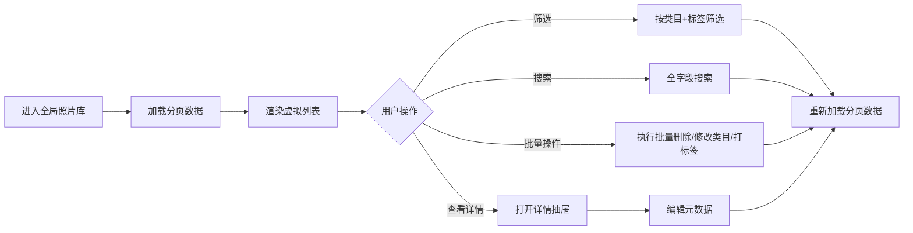
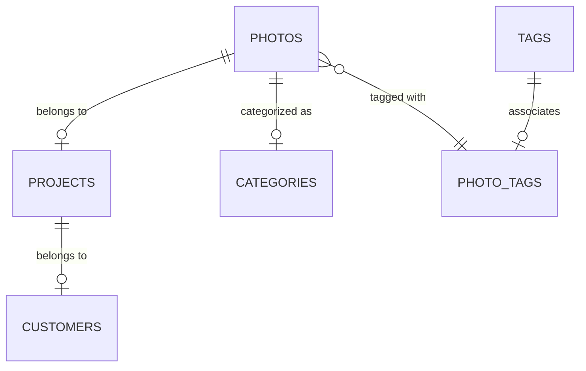

# 全局照片库技术规范文档

> **模块名称**: 全局照片管理中心
> **路由**: `/dashboard/delivery/photos`
> **最后更新**: 2026-01-10
> **版本**: v1.0
> **状态**: 🎯 需求已确认，待开发

---

## 📋 文档概述

本文档是全局照片库模块的完整技术规范，包含数据模型、API设计、前端实现和性能优化策略。

### 文档结构

```
docs/modules/global-photo-library/
├── README.md                          # 本文件（总览）
├── 01-database-schema.md              # 数据库设计
├── 02-backend-api.md                  # 后端API规范
├── 03-frontend-implementation.md      # 前端实现指南
└── 04-performance-optimization.md     # 性能优化策略
```

---

## 🎯 核心功能

### 功能定位

**全局照片库是独立的资产管理视图**，与现有的 `ProjectDetailDrawer` 完全独立：

- ✅ **全局浏览**: 查看**所有项目**的照片，不限项目范围
- ✅ **多维筛选**: 按类目、标签、项目、客户等多维度筛选
- ✅ **批量操作**: 批量删除、修改类目、打标签/取消标签
- ✅ **全局搜索**: 按文件名、项目名、客户名、标签名搜索
- ❌ **不包含**: 项目内照片列表（已由 ProjectDetailDrawer 实现）
- ❌ **不包含**: 跨项目移动照片（已确认不需要此功能）

### 核心业务流程



---

## 🎨 用户体验设计

### 交互模式

1. **默认行为**:
   - 进入页面时不筛选类目，显示所有照片（分页返回）
   - 一次性加载一页的所有照片（如50张）
   - 使用缩略图优先加载策略

2. **筛选流程**:
   - 类目必选（默认为「全部」）
   - 标签可选（支持多个标签AND组合）
   - 实时筛选，无需点击「应用」按钮

3. **批量操作流程**:
   - 点击照片选中（支持 Ctrl/Cmd + 多选）
   - 顶部显示批量操作工具栏
   - 执行操作前二次确认（删除操作）

4. **详情查看流程**:
   - 点击照片打开详情抽屉
   - 左侧：大图预览
   - 右侧：元数据编辑（类目、标签、项目信息、文件信息）

### 性能策略（三层优化）

```typescript
// 层级1：数据层 - 分页
{
  page: 1,
  limit: 50,
  category?: string,
  tags?: string[]
}

// 层级2：渲染层 - 虚拟列表
<VirtualList
  itemCount={photoCount}
  itemSize={200}
  windowHeight={800}
/>

// 层级3：图片层 - 缩略图优先
<Image
  src={photo.thumbUrl}   // 优先加载缩略图（~20KB）
  onClick={() => loadOriginalUrl()} // 点击时加载原图（~2MB）
/>
```

---

## 🗄️ 数据模型设计

### 核心实体关系



### 表结构概览

| 表名         | 说明            | 关键字段                                     |
| ------------ | --------------- | -------------------------------------------- |
| `photos`     | 照片主表        | projectId, categoryId, originalKey, thumbKey |
| `categories` | 类目表          | name, type, parentId                         |
| `tags`       | 标签表          | name, group, applicableTo                    |
| `photo_tags` | 照片-标签关联表 | photoId, tagId                               |
| `projects`   | 项目表          | name, customerId, status                     |
| `customers`  | 客户表          | name, phone, email                           |

### 照片-项目关系

**严格一对一关系**：

- 一张照片只能属于一个项目
- 删除项目时需要处理关联照片（级联删除或转移）
- 删除照片时需要更新项目的 `photoCount`

详细设计见：[01-database-schema.md](./01-database-schema.md)

---

## 🔌 API 设计

### RESTful API 端点

```
GET    /api/photos                    # 获取照片列表（分页+筛选）
GET    /api/photos/:id                # 获取照片详情
PATCH  /api/photos/:id                # 更新照片元数据
DELETE /api/photos/:id                # 删除照片
POST   /api/photos/batch              # 批量操作
GET    /api/photos/search             # 全局搜索
GET    /api/categories                # 获取类目列表
GET    /api/tags                      # 获取标签列表
```

### 核心API示例

#### 1. 获取照片列表（分页+筛选）

```http
GET /api/photos?page=1&limit=50&category=cat_123&tags=tag_456,tag_789
```

**响应**：

```json
{
  "data": [...],
  "meta": {
    "total": 1250,
    "page": 1,
    "limit": 50,
    "totalPages": 25
  }
}
```

#### 2. 批量操作

```http
POST /api/photos/batch
```

**请求体**：

```json
{
  "action": "delete" | "updateCategory" | "addTags" | "removeTags",
  "photoIds": ["pho_123", "pho_456"],
  "payload": {
    "categoryId": "cat_789",      // updateCategory 时使用
    "tagIds": ["tag_123"]         // addTags/removeTags 时使用
  }
}
```

详细API规范见：[02-backend-api.md](./02-backend-api.md)

---

## 💻 前端实现

### 技术栈

- **框架**: Next.js 15 (App Router)
- **状态管理**: React Query + Zustand
- **虚拟列表**: `@tanstack/react-virtual` 或 `react-window`
- **UI组件**: Shadcn UI
- **图片优化**: Next.js Image + 自定义缩略图加载

### 核心组件架构

```
apps/admin/app/dashboard/delivery/photos/
├── page.tsx                           # 主页面
├── components/
│   ├── PhotoGrid.tsx                  # 照片网格（虚拟列表）
│   ├── FilterBar.tsx                  # 筛选器（类目+标签）
│   ├── SearchBar.tsx                  # 搜索栏
│   ├── BatchActionBar.tsx             # 批量操作工具栏
│   ├── PhotoCard.tsx                  # 单张照片卡片
│   └── PhotoDetailDrawer.tsx          # 照片详情抽屉
└── hooks/
    ├── usePhotos.ts                   # 照片列表 Hook
    ├── usePhotoBatchOperations.ts     # 批量操作 Hook
    └── usePhotoSearch.ts              # 搜索 Hook
```

### 关键实现细节

#### 1. 虚拟列表实现

```typescript
import { useVirtualizer } from '@tanstack/react-virtual';

export function PhotoGrid({ photos }: { photos: Photo[] }) {
  const parentRef = useRef<HTMLDivElement>(null);

  const virtualizer = useVirtualizer({
    count: photos.length,
    getScrollElement: () => parentRef.current,
    estimateSize: () => 200, // 每行高度
    overscan: 5 // 预渲染5行
  });

  return (
    <div ref={parentRef} style={{ height: '800px', overflow: 'auto' }}>
      <div style={{ height: `${virtualizer.getTotalSize()}px` }}>
        {virtualizer.getVirtualItems().map((virtualItem) => (
          <PhotoCard
            key={virtualItem.key}
            photo={photos[virtualItem.index]}
            style={{
              position: 'absolute',
              top: 0,
              left: 0,
              width: '100%',
              height: `${virtualItem.size}px`,
              transform: `translateY(${virtualItem.start}px)`
            }}
          />
        ))}
      </div>
    </div>
  );
}
```

#### 2. 缩略图优先加载

```typescript
export function PhotoCard({ photo }: { photo: Photo }) {
  const [loadOriginal, setLoadOriginal] = useState(false);

  return (
    <Image
      src={loadOriginal ? photo.originalKey : photo.thumbKey}
      alt={photo.filename}
      loading="lazy"
      onClick={() => setLoadOriginal(true)}
      placeholder="blur"
      blurDataURL={photo.blurDataURL}
    />
  );
}
```

详细前端实现见：[03-frontend-implementation.md](./03-frontend-implementation.md)

---

## ⚡ 性能优化

### 优化目标

- ⚡ **首屏加载**: < 1秒（50张缩略图）
- ⚡ **滚动性能**: 60 FPS
- ⚡ **批量操作**: 100张照片 < 3秒
- ⚡ **搜索响应**: < 500ms

### 优化策略

#### 数据库层面

```sql
-- 索引优化
CREATE INDEX IDX_PHOTOS_CATEGORY ON photos(categoryId);
CREATE INDEX IDX_PHOTOS_PROJECT ON photos(projectId);
CREATE INDEX IDX_PHOTOS_CREATED ON photos(createdAt DESC);

-- 复合索引（类目+创建时间）
CREATE INDEX IDX_PHOTOS_CATEGORY_TIME ON photos(categoryId, createdAt DESC);

-- 标签查询优化
CREATE INDEX IDX_PHOTO_TAGS_PHOTO ON photo_tags(photoId);
CREATE INDEX IDX_PHOTO_TAGS_TAG ON photo_tags(tagId);
```

#### 应用层面

```typescript
// 1. 请求去重
const queryClient = new QueryClient({
  defaultOptions: {
    queries: {
      staleTime: 5 * 60 * 1000, // 5分钟内不重复请求
      cacheTime: 10 * 60 * 1000, // 缓存10分钟
    },
  },
});

// 2. 并行请求
const [photos, categories, tags] = await Promise.all([
  fetchPhotos(),
  fetchCategories(),
  fetchTags(),
]);

// 3. 批量操作优化
async function batchUpdate(photoIds: string[], updates: any) {
  // 分批处理，每批50张
  for (let i = 0; i < photoIds.length; i += 50) {
    const batch = photoIds.slice(i, i + 50);
    await api.post('/api/photos/batch', {
      photoIds: batch,
      ...updates,
    });
  }
}
```

#### 渲染层面

```typescript
// 1. 虚拟列表（只渲染可见项）
// 2. 图片懒加载（loading="lazy"）
// 3. 防抖搜索（debounce 300ms）
// 4. React.memo（避免不必要的重渲染）
export const PhotoCard = React.memo(
  ({ photo }: PhotoCardProps) => {
    // ...
  },
  (prev, next) => prev.photo.id === next.photo.id,
);
```

详细性能优化策略见：[04-performance-optimization.md](./04-performance-optimization.md)

---

## 🔐 安全与权限

### 权限控制

```typescript
// 权限定义
enum PhotoPermission {
  VIEW = 'photos:view',
  EDIT = 'photos:edit',
  DELETE = 'photos:delete',
  BATCH_DELETE = 'photos:batch_delete'
}

// API 权限检查
@RequirePermission(PhotoPermission.VIEW)
async findAll() {
  // ...
}

@RequirePermission(PhotoPermission.DELETE)
async delete() {
  // 二次确认
  if (photo.isProjectCover) {
    throw new Error('无法删除项目封面照片');
  }
  // ...
}
```

### 数据校验

```typescript
// 删除前校验
async function deletePhoto(photoId: string) {
  const photo = await findPhoto(photoId);

  // 1. 是否是项目封面
  if (photo.isProjectCover) {
    throw new Error('请先更换项目封面再删除');
  }

  // 2. 是否被客户选中
  if (photo.selected) {
    throw new Error('已选中的照片无法删除');
  }

  // 3. 是否是项目中唯一的照片
  const projectPhotoCount = await countProjectPhotos(photo.projectId);
  if (projectPhotoCount <= 1) {
    throw new Error('无法删除项目中唯一的照片');
  }

  // 执行删除
  await delete photoId;
}
```

---

## 📊 成功标准

完成本模块后，应该能够：

### ✅ 功能完整性

- [x] 查看**所有项目**的照片（不限项目）
- [x] 按类目筛选照片
- [x] 按标签组合筛选照片
- [x] 全局搜索（文件名、项目名、客户名、标签名）
- [x] 批量删除照片
- [x] 批量修改类目
- [x] 批量打标签/取消标签
- [x] 查看照片详情
- [x] 编辑照片元数据

### ✅ 性能指标

- [x] 首屏加载时间 < 1秒
- [x] 滚动帧率 ≥ 60 FPS
- [x] 批量操作100张照片 < 3秒
- [x] 搜索响应时间 < 500ms
- [x] 支持至少 10,000 张照片

### ✅ 用户体验

- [x] 界面响应流畅，无卡顿
- [x] 操作反馈及时（loading状态、成功/失败提示）
- [x] 错误处理友好（清晰的错误提示）
- [x] 支持键盘快捷键（可选）
- [x] 移动端适配（响应式布局）

---

## 🚀 开发计划

### Phase 1: 数据库层（0.5天）

- [ ] 扩展 `photos` 表（增加 `categoryId`, `isProjectCover` 等字段）
- [ ] 创建 `categories` 表
- [ ] 创建 `tags` 表
- [ ] 创建 `photo_tags` 关联表
- [ ] 创建索引
- [ ] 编写数据库迁移脚本

### Phase 2: 后端API（1天）

- [ ] 实现照片查询API（分页+筛选）
- [ ] 实现照片详情API
- [ ] 实现批量操作API
- [ ] 实现搜索API
- [ ] 实现类目管理API
- [ ] 实现标签管理API
- [ ] 编写单元测试

### Phase 3: 前端组件（1.5天）

- [ ] 创建主页面布局
- [ ] 实现筛选器组件
- [ ] 实现搜索栏组件
- [ ] 实现虚拟列表网格
- [ ] 实现照片卡片组件
- [ ] 实现详情抽屉组件
- [ ] 实现批量操作工具栏
- [ ] 集成React Query

### Phase 4: 性能优化（0.5天）

- [ ] 虚拟列表优化
- [ ] 图片懒加载
- [ ] 搜索防抖
- [ ] 组件memo优化
- [ ] 缓存策略

### Phase 5: 测试与上线（0.5天）

- [ ] 端到端测试
- [ ] 性能测试
- [ ] 安全测试
- [ ] Bug修复
- [ ] 部署上线

**总计**: 约 4-5 天

---

## 🔗 相关文档

- [数据库设计](./01-database-schema.md)
- [后端API规范](./02-backend-api.md)
- [前端实现指南](./03-frontend-implementation.md)
- [性能优化策略](./04-performance-optimization.md)

---

**维护者**: 开发团队
**最后更新**: 2026-01-10
**文档版本**: v1.0
