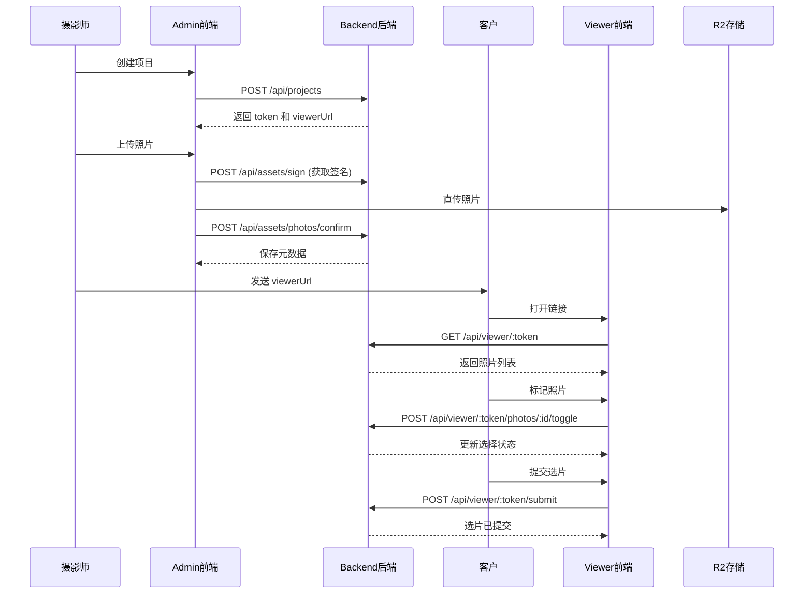

# 照片上传与选片功能（MVP）完整实现指南

> **业务模块**：照片上传与客户选片
> **技术栈**：NestJS + Next.js + MySQL + TypeORM + R2存储
> **预计时长**：3-5 天
> **最后更新**：2026-01-04

## ⚠️ 重要：术语规范（必读）

**在开始之前，请务必阅读**：[00-terminology.md](./00-terminology.md)

### 核心术语

| 中文         | 英文        | 表名       | 说明           |
| ------------ | ----------- | ---------- | -------------- |
| **项目**     | Project     | `projects` | 组织照片的容器 |
| **照片**     | Photo       | `photos`   | 单张照片       |
| **选片**     | Selection   | -          | 客户选择照片   |
| **选片链接** | Viewer Link | -          | 客户访问链接   |

### ⛔ 严格禁止

❌ **不要使用**：

- `photo_set` / `PhotoSet` / `照片集` / `相册`

✅ **必须使用**：

- `project` / `Project` / `项目`
- `photo` / `Photo` / `照片`

**违反规范会导致 PR 被拒绝！**

---

## 📋 模块概述

### 业务场景

摄影师需要：

1. 创建一个**项目**来组织一批照片
2. 上传照片到这个**项目**
3. 生成一个**选片链接**发给客户
4. 客户通过链接浏览照片并标记喜欢的照片
5. 提交选片结果

### 完整流程



### MVP 范围

**✅ 包含**：

- 创建项目
- 上传照片并关联到项目
- 生成访问链接
- 客户浏览照片
- 客户标记照片
- 客户提交选片

**❌ 不包含**：

- 客户管理（CRM）
- 套餐限制（精修张数限制）
- 多相册分组
- 精修交付流程
- 加片订单与支付
- 通知系统

---

## 🗂️ 目录结构

实现完成后，项目的文件结构如下：

```
snapmatch-platform/
├── apps/
│   ├── backend/
│   │   └── src/
│   │       ├── database/
│   │       │   └── entities/
│   │       │       ├── project.entity.ts         # 新增
│   │       │       └── photo.entity.ts           # 新增
│   │       ├── projects/                          # 新增模块
│   │       │   ├── dto/
│   │       │   │   ├── create-project.dto.ts
│   │       │   │   ├── update-project.dto.ts
│   │       │   │   └── project-response.dto.ts
│   │       │   ├── projects.controller.ts
│   │       │   ├── projects.service.ts
│   │       │   └── projects.module.ts
│   │       ├── viewer/                            # 新增模块
│   │       │   ├── viewer.controller.ts
│   │       │   ├── viewer.service.ts
│   │       │   └── viewer.module.ts
│   │       └── assets/
│   │           └── assets.service.ts              # 扩展
│   │
│   └── admin/
│       └── app/
│           └── (guest)/                           # 无需登录的页面组
│               └── viewer/
│                   └── [token]/
│                       └── page.tsx              # 选片端主页面
│       └── app/
│           └── dashboard/
│               └── delivery/                       # 管理后台页面
│                   ├── projects/
│                   │   ├── page.tsx               # 项目列表
│                   │   ├── new/
│                   │   │   └── page.tsx           # 创建项目
│                   │   └── [id]/
│                   │       └── page.tsx           # 项目详情
│                   └── photos/
│                       └── [projectId]/
│                           └── page.tsx           # 照片列表
│
└── docs/
    └── modules/
        └── photo-selection-mvp/
            ├── README.md                           # 本文件
            ├── 01-database-schema.sql.md           # 数据库表结构（SQL脚本）
            ├── 02-backend-implementation.md        # 后端API开发任务清单
            ├── 03-admin-ui.md                      # 管理后台UI开发任务清单
            ├── 04-viewer-ui.md                     # 选片端UI开发任务清单
            └── 05-testing.md                       # 端到端测试与优化任务清单
```

---

## 📚 实现步骤

### 第一步：数据库表结构（0.5天）

**文档**：[01-database-schema.sql.md](./01-database-schema.sql.md)

**开发进度**：

- [x] 创建实体文件 (2/2)
- [x] 注册实体到模块 (1/1)
- [ ] 执行 SQL 建表语句 (0/1)
- [ ] 验证表结构 (0/1)

**任务**：

- ✅ 已完成：创建 Project 实体
- ✅ 已完成：创建 Photo 实体
- 📋 待执行：从文档复制 SQL 语句到数据库工具执行
- 📋 待验证：检查表结构和索引

**产出**：

- 2张数据库表：`projects`, `photos`
- 实体定义文件

---

### 第二步：后端实现（1.5天）

**文档**：[02-backend-implementation.md](./02-backend-implementation.md)

**开发进度**：

- [ ] Phase 1: DTO定义 (0/3)
- [ ] Phase 2: Projects模块 (0/3)
- [ ] Phase 3: Assets模块扩展 (0/3)
- [ ] Phase 4: Viewer模块 (0/3)
- [ ] Phase 5: 注册到AppModule (0/2)

**任务**：

- 创建 Projects CRUD 接口
- 实现照片确认接口（扩展 Assets 模块）
- 实现 Viewer 访问控制
- 实现 Token 机制

**产出**：

- 11个后端 API 端点
- 完整的后端模块

---

### 第三步：管理后台 UI（1天）

**文档**：[03-admin-ui.md](./03-admin-ui.md)

**开发进度**：

- [ ] Phase 1: 准备工作 (0/2)
- [ ] Phase 2: API客户端 (0/2)
- [ ] Phase 3: 项目列表页 (0/5)
- [ ] Phase 4: 创建项目页 (0/2)
- [ ] Phase 5: 照片列表页 (0/4)
- [ ] Phase 6: 项目详情页 (0/1)
- [ ] Phase 7: 用户体验 (0/3)

**任务**：

- 创建项目列表页
- 创建项目创建表单
- 创建照片上传组件
- 显示照片列表
- 实现项目详情页

**产出**：

- 管理员能创建项目
- 管理员能上传照片
- 管理员能查看项目

---

### 第四步：选片端 UI（1天）

**文档**：[04-viewer-ui.md](./04-viewer-ui.md)

**开发进度**：

- [ ] Phase 1: 准备工作 (0/2)
- [ ] Phase 2: Viewer主页面 (0/3)
- [ ] Phase 3: 照片网格组件 (0/2)
- [ ] Phase 4: 大图查看器 (0/1)
- [ ] Phase 5: 选片面板 (0/2)
- [ ] Phase 6: 提交流程 (0/2)
- [ ] Phase 7: 实现Hooks (0/2)
- [ ] Phase 8: 用户体验优化 (0/3)
- [ ] Phase 9: 安全与防护 (0/2)

**任务**：

- 创建 Viewer 页面（`/viewer/[token]`）
- 实现照片网格展示
- 实现大图查看器
- 实现照片标记功能
- 实现选片提交
- 实现选片统计显示

**产出**：

- 客户能通过链接访问照片
- 客户能标记照片
- 客户能提交选片

---

### 第五步：端到端测试（0.5天）

**文档**：[05-testing.md](./05-testing.md)

**开发进度**：

- [ ] Phase 1: 完整流程测试 (0/1)
- [ ] Phase 2: 边界情况测试 (0/4)
- [ ] Phase 3: Bug修复 (0/0)
- [ ] Phase 4: 性能优化 (0/2)
- [ ] Phase 5: 兼容性测试 (0/1)
- [ ] Phase 6: 安全测试 (0/4)
- [ ] Phase 7: 用户体验优化 (0/3)
- [ ] Phase 8: 上线检查 (0/3)

**任务**：

- 完整流程测试
- 边界情况测试
- Bug 修复
- 性能优化
- 安全测试

**产出**：

- 功能完整可用
- 无关键 bug
- 性能指标达标

---

## 🎯 快速开始

### 对于学习者

如果你是第一次实现这个功能，建议按照顺序阅读：

1. 先看本文件，了解整体架构
2. 阅读术语规范 [00-terminology.md](./00-terminology.md)
3. 依次完成 01-05 的任务清单
4. 每个文档都有详细的开发任务和完整代码示例

### 对于开发者

如果你已经熟悉技术栈，可以直接：

1. 查看 [01-database-schema.sql.md](./01-database-schema.sql.md) 了解数据结构
2. 查看 [02-backend-implementation.md](./02-backend-implementation.md) 了解后端接口
3. 查看 [03-admin-ui.md](./03-admin-ui.md) 和 [04-viewer-ui.md](./04-viewer-ui.md) 了解前端实现
4. 使用 [05-testing.md](./05-testing.md) 进行测试验证

### 文档格式说明

所有开发文档都已重构为**任务清单格式**，特点：

- ✅ 每个任务都有优先级标记（🔴高/🟡中/🟢低）
- ✅ 每个任务都有依赖关系和预计时间
- ✅ 每个任务都有完整的代码示例
- ✅ 每个任务都有验证清单
- ✅ 包含关键设计决策说明

---

## 🔗 相关文档

### 后端技术文档

- [NestJS 官方文档](https://docs.nestjs.com/)
- [TypeORM 文档](https://typeorm.io/)
- [MySQL 参考手册](https://dev.mysql.com/doc/)

### 前端技术文档

- [Next.js 文档](https://nextjs.org/docs)
- [React 文档](https://react.dev/)
- [React Query 文档](https://tanstack.com/query/latest)
- [shadcn/ui 组件库](https://ui.shadcn.com/)

### 项目内部文档

- [后端开发教程](../../tutorial/03-backend-development/README.md)
- [前端开发教程](../../tutorial/04-frontend-admin/README.md)
- [上传功能实现](../upload-assets-signing-scheme.md)

---

## 💡 关键设计决策

### 决策1：为什么只做2张表？

**原因**：

- ✅ 最小可用原则（MVP）
- ✅ 避免过度设计
- ✅ 快速验证核心流程

**后续扩展**：

- 需要客户管理时，添加 `customers` 表
- 需要多相册时，添加 `albums` 表
- 需要套餐限制时，在 `projects` 表添加 `packagePhotosCount` 字段

### 决策2：为什么用 Token 而不是登录？

**原因**：

- ✅ 降低客户使用门槛（无需注册登录）
- ✅ 安全性足够（32位随机字符）
- ✅ 符合"分享链接"的交互习惯

**安全考虑**：

- Token 长度：32位随机字符（nanoid）
- 过期时间：可配置（expiresAt 字段）
- 撤销机制：通过 status 字段控制（active/revoked）

### 决策3：为什么分离 Admin 和 Viewer？

**原因**：

- ✅ 不同的用户角色（管理员 vs 客户）
- ✅ 不同的界面需求（管理功能 vs 浏览功能）
- ✅ 更好的安全性（管理员需要登录，客户只需要 Token）

**实现方式**：

- Admin：`/dashboard/delivery/*` 路径，需要 JWT 认证
- Viewer：`/viewer/[token]` 路径，只需要 Token 验证

### 决策4：为什么选择任务清单格式？

**原因**：

- ✅ 更适合开发过程跟踪
- ✅ 每个任务都是可执行的 checkbox
- ✅ 包含完整的代码示例
- ✅ 明确的优先级和依赖关系

**与传统教程的区别**：

- ❌ 不是教学导向，而是任务导向
- ❌ 减少解释，增加可执行的代码
- ❌ 专注于"做什么"，而非"为什么"

---

## 📊 成功标准

完成本模块后，应该能够：

### ✅ 管理员可以：

1. 创建一个项目（填写名称、描述、过期时间）
2. 上传照片到项目
3. 查看项目详情（照片数量、状态）
4. 生成选片链接并发给客户
5. 查看客户选片结果

### ✅ 客户可以：

1. 通过链接访问项目
2. 浏览照片（网格布局、大图模式）
3. 标记喜欢的照片（点击切换）
4. 查看已选照片数量
5. 提交选片结果
6. 提交后锁定，无法再修改

### ✅ 技术指标：

- 照片上传成功率：> 99%
- 页面加载速度：< 2秒
- 支持同时上传 100+ 张照片
- Token 访问安全：无越权访问
- 性能指标达标（见 05-testing.md）

---

## 🚀 开始实现

**准备好了吗？让我们开始吧！**

→ [第一步：数据库表结构（SQL）](./01-database-schema.sql.md)

> **⚠️ 重要提示**：本项目使用 SQL 脚本而非迁移系统，适合个人快速开发。
> 脚本位置：`apps/backend/scripts/create-tables.sql`

---

**最后更新**：2026-01-04
**维护者**：开发团队
**文档版本**：v2.0（任务清单格式）
