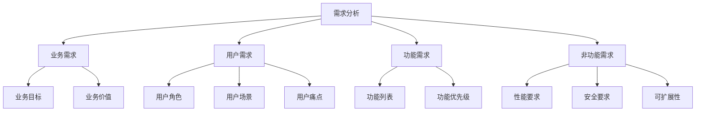

# 需求分析

> **所属阶段**：[项目规划与架构设计](./README.md)
> **预计时长**：1-2 小时
> **难度等级**：⭐⭐☆☆☆

## 📋 章节大纲

### 第一部分：需求分析概述

- 什么是需求分析
- 为什么需求分析很重要
- 需求分析的核心要素
- 需求分析的方法论

### 第二部分：SnapMatch 项目需求分析实战

- 业务背景与目标用户
- 用户角色分析
- 功能需求梳理
- 非功能需求定义
- MVP 范围划定

### 第三部分：需求分析工具与模板

- 用户故事模板
- 需求优先级矩阵
- 功能清单模板
- 需求文档结构

### 第四部分：最佳实践与常见陷阱

- 需求分析最佳实践
- 常见陷阱与避免方法
- 需求变更管理
- 需求验证方法

---

## 🎯 学习目标

完成本节后，你将能够：

- [ ] 理解需求分析的重要性和核心要素
- [ ] 掌握需求分析的方法论和工具
- [ ] 能够独立完成项目需求分析
- [ ] 学会划定 MVP 范围和优先级
- [ ] 避免需求分析中的常见陷阱

## 💡 关键要点

- **需求分析是项目的基石**：清晰的需求是项目成功的前提
- **用户为中心**：始终从用户视角思考问题
- **MVP 优先**：先做核心功能，快速验证
- **需求可追溯**：每个功能都应该能追溯到业务价值
- **持续迭代**：需求是演化的，不是一成不变的

---

## 第一部分：需求分析概述

### 1.1 什么是需求分析

**需求分析（Requirements Analysis）** 是在项目启动阶段，通过系统的调研和分析，明确项目的：

- **要解决什么问题**（问题定义）
- **为谁解决问题**（用户群体）
- **如何解决问题**（解决方案）
- **达到什么效果**（成功指标）

#### 需求分析的核心要素



### 1.2 为什么需求分析很重要

#### 真实案例：需求不明确的代价

| 问题           | 影响           | 代价             |
| -------------- | -------------- | ---------------- |
| 需求频繁变更   | 开发返工       | 时间成本增加 50% |
| 功能范围蔓延   | 项目延期       | 成本超支 100%    |
| 用户理解偏差   | 产品不符合预期 | 用户体验差       |
| 非功能需求忽略 | 系统不稳定     | 后期重构成本高   |

#### 需求分析的价值

✅ **明确目标**：对齐团队对项目的理解
✅ **降低风险**：早期发现问题和风险
✅ **提高效率**：避免不必要的开发和返工
✅ **用户满意**：确保产品符合用户预期
✅ **可衡量性**：定义成功的标准

### 1.3 需求分析的方法论

#### 需求收集方法

1. **用户访谈**：与目标用户进行深度访谈
2. **问卷调查**：大规模收集用户反馈
3. **竞品分析**：研究同类产品的功能
4. **场景分析**：梳理用户使用场景
5. **数据分析**：基于数据挖掘用户需求

#### 需求分析框架

**5W2H 分析法**：

- **What**：要实现什么功能？
- **Why**：为什么要实现这个功能？
- **Who**：为谁实现这个功能？
- **When**：什么时候需要？
- **Where**：在什么场景下使用？
- **How**：如何实现？
- **How much**：成本和资源是多少？

---

## 第二部分：SnapMatch 项目需求分析实战

### 2.1 业务背景与目标用户

#### 业务背景

**SnapMatch** 是一个面向摄影师的作品管理与交付平台，解决摄影师在作品展示和客户交付过程中的痛点：

> 💡 **行业痛点**：
>
> - 摄影师缺乏专业的作品展示平台
> - 客户选片流程低效（传统微信/邮件）
> - 高清照片交付困难（文件大、传输慢）
> - 作品管理混乱（无法分类、搜索）

#### 目标用户

**主要用户群体**：

1. **摄影师**（Photographer）
   - 年龄：25-45 岁
   - 职业：专业摄影师、自由摄影师
   - 技术水平：中等，熟悉基础操作
   - 痛点：作品管理混乱、客户交付困难

2. **客户**（Customer）
   - 年龄：20-50 岁
   - 职业：新娘、家庭、企业客户
   - 痛点：选片体验差、照片获取慢

3. **管理员**（Admin）
   - 角色：平台运营者
   - 痛点：用户管理繁琐、数据统计困难

#### 用户画像示例

**摄影师 - 张伟**：

```markdown
- 基本信息：30 岁，婚纱摄影师，从业 5 年
- 工作流程：
  1. 拍摄婚礼/写真
  2. 导出照片（500-1000 张）
  3. 筛选修图（50-100 张精修）
  4. 通过微信发给客户选片
  5. 客户选定 30 张，再次修整
  6. 通过网盘/硬盘交付（经常传输失败）

- 痛点：
  - 微信发送照片压缩严重
  - 客户选片周期长（2-3 周）
  - 照片交付体验差（网盘限速、链接过期）
  - 无法展示作品集，获客困难

- 期望：
  - 专业作品展示平台
  - 高效的选片流程
  - 快速的高清照片交付
  - 客户管理工具
```

### 2.2 用户角色分析

#### 角色定义矩阵

| 角色             | 权限级别   | 主要职责           | 典型操作                     |
| ---------------- | ---------- | ------------------ | ---------------------------- |
| **Admin**        | 超级管理员 | 平台管理、用户管理 | 管理用户、配置权限、查看数据 |
| **Photographer** | 普通用户   | 作品管理、客户交付 | 上传作品、创建相册、交付照片 |
| **Customer**     | 只读用户   | 浏览作品、选片     | 浏览作品集、选择照片、下载   |

#### 权限需求

**Admin**：

- ✅ 管理所有用户账号
- ✅ 分配角色和权限
- ✅ 查看平台数据统计
- ✅ 配置系统参数

**Photographer**：

- ✅ 管理自己的作品集
- ✅ 创建客户相册
- ✅ 上传和交付照片
- ✅ 查看自己的数据统计

**Customer**：

- ✅ 浏览公开作品集
- ✅ 查看授权相册
- ✅ 选择照片（打标签）
- ✅ 下载选中照片

### 2.3 功能需求梳理

#### 核心功能模块

##### 1. 用户认证与权限管理

**功能列表**：

- [ ] 用户注册/登录
  - 支持账号密码登录
  - 支持 Token 自动刷新
  - 支持多设备登录管理

- [ ] 角色权限管理
  - 预定义角色（Admin/Photographer/Customer）
  - 动态权限分配
  - 权限继承机制

**用户故事**：

> 作为 **管理员**，我希望能够 **管理用户账号**，以便 **控制平台访问权限**

**验收标准**：

- 可以创建、编辑、禁用用户
- 可以分配用户角色
- 可以重置用户密码

##### 2. 作品集管理

**功能列表**：

- [ ] 作品集创建
  - 支持多个作品集
  - 设置作品集封面
  - 设置作品集访问权限（公开/私密）

- [ ] 作品集内容管理
  - 上传作品图片/视频
  - 设置作品描述和标签
  - 作品排序

- [ ] 作品集展示
  - 响应式瀑布流布局
  - 图片懒加载
  - 全屏预览

**用户故事**：

> 作为 **摄影师**，我希望能够 **创建精美的作品集**，以便 **向潜在客户展示我的作品**

**验收标准**：

- 支持创建多个作品集
- 支持上传图片和视频
- 支持公开/私密访问控制

##### 3. 客户选片系统

**功能列表**：

- [ ] 相册创建
  - 关联客户信息
  - 设置选片数量限制
  - 设置选片截止时间

- [ ] 选片界面
  - 网格/列表视图切换
  - 多选/单选模式
  - 实时选择计数

- [ ] 选片管理
  - 查看客户选择结果
  - 导出选片清单
  - 批量下载选中照片

**用户故事**：

> 作为 **客户**，我希望能够 **在线选片**，以便 **快速选择我喜欢的照片**

**验收标准**：

- 支持浏览所有照片
- 支持多选照片
- 实时显示已选数量

##### 4. 照片交付系统

**功能列表**：

- [ ] 照片上传
  - 支持批量上传
  - 支持大文件分片上传
  - 断点续传

- [ ] 照片处理
  - 自动生成缩略图
  - 添加水印（可选）
  - 多尺寸导出

- [ ] 照片交付
  - 生成下载链接
  - 设置链接有效期
  - 批量打包下载

**用户故事**：

> 作为 **摄影师**，我希望能够 **高效交付高清照片**，以便 **客户快速获取照片**

**验收标准**：

- 支持上传 200MB 以内单个文件
- 支持生成临时下载链接
- 支持客户端直接下载

##### 5. 数据统计与分析

**功能列表**：

- [ ] 访问统计
  - 作品集浏览量
  - 用户访问来源
  - 热门作品排行

- [ ] 业务统计
  - 选片完成率
  - 交付成功率
  - 用户增长趋势

### 2.4 非功能需求定义

#### 性能需求

| 指标         | 目标值    | 说明           |
| ------------ | --------- | -------------- |
| 页面加载时间 | < 2 秒    | 首屏加载       |
| API 响应时间 | < 200 ms  | P95 响应时间   |
| 图片上传速度 | > 10 MB/s | 支持大文件上传 |
| 并发用户数   | > 1000    | 同时在线用户   |

#### 安全需求

- **认证安全**：密码哈希存储（bcrypt）、Token 过期机制
- **数据安全**：HTTPS 加密传输、敏感数据加密存储
- **权限安全**：RBAC 权限控制、接口鉴权
- **数据备份**：每日自动备份、异地备份

#### 可扩展性

- **水平扩展**：支持通过增加服务实例提升性能
- **模块化设计**：模块独立部署、故障隔离
- **API 版本控制**：支持多版本 API 共存

#### 可用性

- **系统可用性**：99.9% SLA
- **故障恢复时间**：< 1 小时
- **数据持久性**：99.999%

### 2.5 MVP 范围划定

#### MVP 定义原则

**MVP（Minimum Viable Product）** = **最小可行产品**

- ✅ 包含核心功能，能够解决用户主要痛点
- ✅ 快速上线，验证产品假设
- ❌ 不包含所有功能
- ❌ 不追求完美

#### SnapMatch MVP 功能清单

**第一期（MVP）** - 核心功能

**时间**：2-3 个月
**目标**：验证核心价值假设

**功能列表**：

1. ✅ **用户系统**
   - 管理员登录
   - 摄影师注册/登录
   - 基础权限控制

2. ✅ **作品集管理**
   - 创建作品集
   - 上传作品（图片）
   - 作品集展示

3. ✅ **客户选片**
   - 创建客户相册
   - 上传照片
   - 客户在线选片
   - 查看选片结果

4. ✅ **照片交付**
   - 照片上传（支持大文件）
   - 生成下载链接
   - 客户下载照片

**明确排除**：

- ❌ 视频支持
- ❌ 高级数据分析
- ❌ 移动端 APP
- ❌ 支付功能
- ❌ 社交分享

**第二期** - 增强功能

- 视频支持
- 高级数据统计
- 客户管理 CRM
- 在线支付

**第三期** - 生态建设

- 摄影师社区
- 作品交易市场
- AI 辅助修图

---

## 第三部分：需求分析工具与模板

### 3.1 用户故事模板

#### 标准格式

```markdown
**用户故事**：

> 作为 **[角色]**，我希望 **[功能]**，以便 **[价值/目标]**

**验收标准**：

- [ ] 标准 1
- [ ] 标准 2
- [ ] 标准 3

**优先级**：P0 / P1 / P2 / P3

**复杂度**：简单 / 中等 / 复杂

**预估工时**：X 人天
```

#### 实际示例

**用户故事**：

> 作为 **摄影师**，我希望能够 **批量上传照片**，以便 **快速创建相册**

**验收标准**：

- [ ] 支持一次选择多张照片（最多 100 张）
- [ ] 显示上传进度
- [ ] 支持上传失败重试
- [ ] 支持取消上传

**优先级**：P0（必须有）

**复杂度**：中等

**预估工时**：5 人天

### 3.2 需求优先级矩阵

#### 优先级定义

| 优先级 | 名称   | 说明                     | 示例                 |
| ------ | ------ | ------------------------ | -------------------- |
| **P0** | 必须有 | 核心功能，不做就无法使用 | 用户登录、照片上传   |
| **P1** | 应该有 | 重要功能，影响用户体验   | 选片界面、作品集展示 |
| **P2** | 可以有 | 锦上添花的功能           | 数据统计、社交分享   |
| **P3** | 未来做 | 长期规划                 | AI 功能、视频编辑    |

#### 优先级评估矩阵

从 **价值** 和 **成本** 两个维度评估：

```
高价值  │ P0        │ P1
       │ (必须做)   │ (尽快做)
────────────────────────────
低价值  │ P2        │ P3
       │ (可以做)   │ (以后做)
────────────────────────────
       │ 低成本    │ 高成本
```

**SnapMatch 功能优先级示例**：

| 功能     | 价值 | 成本 | 优先级 |
| -------- | ---- | ---- | ------ |
| 用户登录 | 高   | 低   | **P0** |
| 照片上传 | 高   | 中   | **P0** |
| 在线选片 | 高   | 中   | **P0** |
| 数据统计 | 中   | 高   | **P2** |
| 社交分享 | 低   | 中   | **P3** |

### 3.3 功能清单模板

#### Excel 表格结构

| ID   | 模块     | 功能名称   | 用户故事              | 优先级 | 状态   | 负责人 | 预估工时 |
| ---- | -------- | ---------- | --------------------- | ------ | ------ | ------ | -------- |
| F001 | 用户系统 | 用户登录   | 作为管理员，我希望... | P0     | 待开发 | @张三  | 3人天    |
| F002 | 作品集   | 创建作品集 | 作为摄影师，我希望... | P0     | 待开发 | @李四  | 5人天    |

#### Markdown 表格示例

```markdown
## 功能清单

### 用户系统模块

| ID   | 功能          | 优先级 | 状态      | 预估工时 |
| ---- | ------------- | ------ | --------- | -------- |
| F001 | 用户注册/登录 | P0     | ✅ 已完成 | 3人天    |
| F002 | 角色权限管理  | P0     | 🚧 开发中 | 5人天    |
| F003 | 用户个人资料  | P1     | ⏳ 待开发 | 2人天    |

### 作品集模块

| ID   | 功能       | 优先级 | 状态      | 预估工时 |
| ---- | ---------- | ------ | --------- | -------- |
| F101 | 创建作品集 | P0     | ⏳ 待开发 | 5人天    |
| F102 | 上传作品   | P0     | ⏳ 待开发 | 8人天    |
```

### 3.4 需求文档结构

#### 完整的需求文档目录

```markdown
# 项目需求文档 v1.0

## 1. 项目概述

1.1 项目背景
1.2 项目目标
1.3 成功指标

## 2. 用户分析

2.1 目标用户
2.2 用户角色
2.3 用户画像

## 3. 功能需求

3.1 功能模块划分
3.2 功能清单
3.3 用户故事

## 4. 非功能需求

4.1 性能需求
4.2 安全需求
4.3 可扩展性

## 5. MVP 定义

5.1 MVP 功能范围
5.2 功能优先级
5.3 路线图

## 6. 约束条件

6.1 技术约束
6.2 资源约束
6.3 时间约束

## 7. 附录

7.1 术语表
7.2 参考资料
7.3 变更记录
```

---

## 第四部分：最佳实践与常见陷阱

### 4.1 需求分析最佳实践

#### ✅ DO（推荐做法）

1. **用户参与**：让真实用户参与需求讨论

   ```markdown
   ✅ 组织用户访谈和调研
   ✅ 建立用户反馈群
   ✅ 定期收集用户意见
   ```

2. **简洁明确**：需求描述要清晰易懂

   ```markdown
   ✅ 好的需求：
   "用户可以上传照片，支持 JPG/PNG 格式，单个文件不超过 20MB"

   ❌ 差的需求：
   "上传功能要好用"
   ```

3. **可验证性**：需求要有明确的验收标准

   ```markdown
   ✅ 包含验收标准：

   - [ ] 支持拖拽上传
   - [ ] 显示上传进度
   - [ ] 上传失败提示用户
   ```

4. **优先级清晰**：明确哪些是必须做的

   ```markdown
   ✅ 标注优先级：

   - P0: 用户登录（必须有）
   - P1: 记住密码（应该有）
   - P2: 社交分享（可以有）
   ```

5. **持续迭代**：需求是演化的，不是一成不变的
   ```markdown
   ✅ 建立变更流程：

   - 收集反馈
   - 评估影响
   - 更新需求
   - 通知团队
   ```

### 4.2 常见陷阱与避免方法

#### ❌ DON'T（常见错误）

1. **需求蔓延（Feature Creep）**

   **问题**：不断增加功能，导致范围失控

   ```markdown
   ❌ 错误做法：
   "既然做了上传，顺便做个图片编辑吧"
   "用户可能需要视频功能，加上吧"

   ✅ 正确做法：

   - 明确 MVP 边界
   - 新需求放入后续版本
   - 坚持核心价值优先
   ```

2. **过度设计**

   **问题**：追求完美，添加不必要的功能

   ```markdown
   ❌ 错误做法：
   "MVP 也要包含 AI 推荐算法"
   "必须支持 10 种文件格式"

   ✅ 正确做法：

   - 只做核心功能
   - 快速验证假设
   - 根据反馈迭代
   ```

3. **忽视非功能需求**

   **问题**：只关注功能，忽略性能、安全等

   ```markdown
   ❌ 错误做法：
   "性能后面再优化"
   "安全上线后再说"

   ✅ 正确做法：

   - 早期定义性能目标
   - 安全设计从开始
   - 预留扩展空间
   ```

4. **需求不明确**

   **问题**：描述模糊，团队理解不一致

   ```markdown
   ❌ 错误做法：
   "用户体验要好"
   "性能要快"

   ✅ 正确做法：
   "页面加载时间 < 2 秒"
   "用户 3 步内完成操作"
   ```

5. **忽视用户真实需求**

   **问题**：按照自己的想象设计，而非用户真实需求

   ```markdown
   ❌ 错误做法：

   - 不做用户调研
   - 假设用户需要什么
   - 拒绝用户反馈

   ✅ 正确做法：

   - 深度用户访谈
   - 数据驱动决策
   - 快速原型验证
   ```

### 4.3 需求变更管理

#### 变更流程


#### 变更评估清单

每次需求变更时，评估以下维度：

- [ ] **价值评估**：这个变更能带来什么价值？
- [ ] **成本评估**：需要多少时间和资源？
- [ ] **风险评估**：对现有功能有什么影响？
- [ ] **优先级评估**：是否比当前任务更重要？
- [ ] **资源评估**：当前资源是否支持？

### 4.4 需求验证方法

#### 原型测试

1. **低保真原型**：纸面原型、线框图
2. **高保真原型**：Figma、Sketch 设计
3. **可交互原型**：Axure、Protopie

#### 用户验证方法

- **用户访谈**：深度访谈 5-10 个目标用户
- **可用性测试**：观察用户使用原型
- **A/B 测试**：对比不同方案效果
- **问卷调查**：大规模收集反馈

---

## 📚 参考资源

### 推荐书籍

1. **《用户故事与敏捷方法》** - Mike Cohn
   - 如何编写高质量的用户故事
   - 需求优先级排序方法

2. **《敏捷软件开发：原则、模式与实践》** - Robert C. Martin
   - 敏捷需求管理实践
   - 需求变更管理

3. **《启示录：打造用户喜爱的产品》** - Marty Cagan
   - 产品需求分析实战
   - 如何发现用户真实需求

### 在线资源

- [敏捷需求管理最佳实践](https://www.atlassian.com/agile/project-management/requirements)
- [用户故事编写指南](https://www.mountaingoatsoftware.com/blog/the-perfect-user-story-in-3-steps/)
- [MVP 定义方法](https://www.romanpichler.com/blog/mvp-defined/)

### 工具推荐

- **需求管理**：Jira、Notion、飞书文档
- **原型设计**：Figma、Sketch、Axure
- **协作工具**：Miro、FigJam、ProcessOn

---

## 📝 练习题

### 练习 1：编写用户故事

**任务**：为 SnapMatch 项目编写 3 个用户故事

**要求**：

1. 选择 3 个不同的功能模块
2. 按照标准格式编写
3. 包含验收标准
4. 标注优先级

**示例模板**：

```markdown
**用户故事**：

> 作为 **[角色]**，我希望 **[功能]**，以便 **[价值]**

**验收标准**：

- [ ] 标准 1
- [ ] 标准 2

**优先级**：P0/P1/P2/P3
```

### 练习 2：MVP 范围划定

**任务**：假设你要开发一个"在线学习平台"，划定 MVP 范围

**要求**：

1. 列出至少 10 个功能需求
2. 按照优先级排序（P0/P1/P2）
3. 从中选出 MVP 功能（P0）
4. 说明为什么这些功能是 MVP 必须的

**提示**：

- 考虑核心价值是什么
- 考虑最小可行方案
- 考虑快速验证假设

### 练习 3：需求优先级矩阵

**任务**：使用优先级矩阵对以下功能排序

**功能列表**：

1. 用户注册/登录
2. 在线支付
3. 课程播放
4. 社交分享
5. 学习进度记录
6. 在线讨论区
7. 证书系统
8. 课程推荐
9. 笔记功能
10. 移动端 APP

**要求**：

1. 评估每个功能的价值和成本
2. 填入优先级矩阵
3. 标注 P0/P1/P2/P3

---

## ⏭️ 下一节

完成需求分析后，下一步是[技术栈选型](./02-tech-stack-selection.md)

在下一节中，我们将学习：

- 如何选择合适的技术栈
- 前后端技术选型对比
- 数据库选型考虑因素
- 存储方案选择

---

**返回阶段目录**：[README](./README.md)
**返回教程首页**：[教程目录](../README.md)
