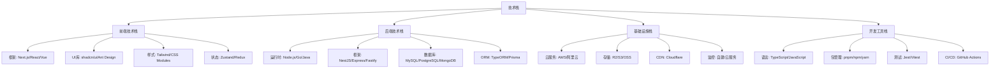
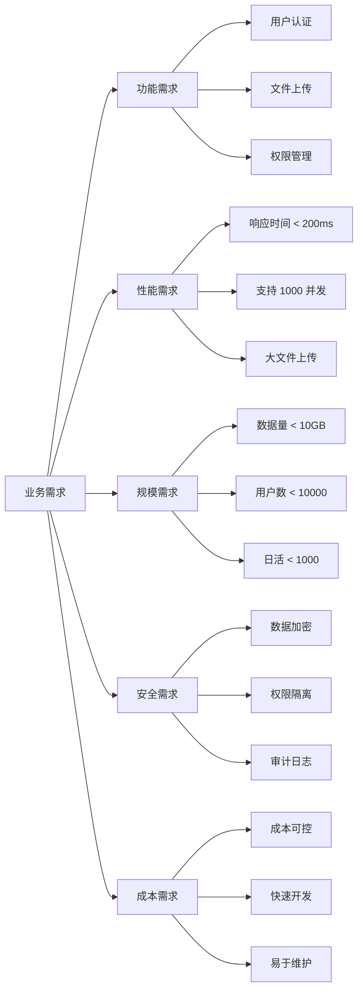
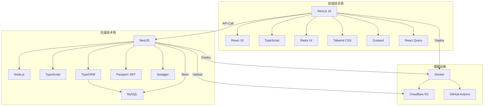

# 技术栈选型

> **所属阶段**：[项目规划与架构设计](./README.md)
> **预计时长**：1-2 小时
> **难度等级**：⭐⭐⭐☆☆

## 📋 章节大纲

### 第一部分：技术栈选型概述

- 什么是技术栈选型
- 为什么技术选型很重要
- 技术选型的核心原则
- 技术选型的决策框架

### 第二部分：SnapMatch 项目技术选型实战

- 后端技术栈选型
  - 为什么选择 NestJS
  - 为什么选择 TypeScript
  - 为什么选择 MySQL
- 前端技术栈选型
  - 为什么选择 Next.js
  - 为什么选择 shadcn/ui
  - 为什么选择 Tailwind CSS
- 存储与基础设施
  - 为什么选择 Cloudflare R2
  - 为什么选择 Docker
- 技术栈对比分析

### 第三部分：技术选型工具与方法

- 技术选型评估框架
- 决策矩阵工具
- PoC 验证方法
- 技术调研资源

### 第四部分：最佳实践与常见陷阱

- 技术选型最佳实践
- 常见陷阱与避免方法
- 技术债务管理
- 技术栈演进策略

---

## 🎯 学习目标

完成本节后，你将能够：

- [ ] 理解技术选型的重要性和核心原则
- [ ] 掌握技术选型的决策框架和评估方法
- [ ] 了解主流技术栈的优缺点和适用场景
- [ ] 能够独立完成项目技术选型决策
- [ ] 避免技术选型中的常见陷阱

## 💡 关键要点

- **技术选型决定项目成败**：合适的技术栈是项目成功的基础
- **没有银弹**：每个技术都有适用场景，没有绝对最好的选择
- **团队优先**：选择团队熟悉且能高效使用的技术
- **长期视角**：考虑技术栈的生态系统、维护成本、演进方向
- **务实决策**：基于实际需求和约束，而非盲目追求热门技术

---

## 第一部分：技术栈选型概述

### 1.1 什么是技术栈选型

**技术栈选型（Technology Stack Selection）** 是在项目启动阶段，通过系统的调研和评估，选择合适的技术组合来构建项目：

- **前端技术**：框架、UI 库、构建工具、状态管理
- **后端技术**：运行时、框架、数据库、消息队列
- **基础设施**：云服务、存储、CDN、监控
- **开发工具**：语言、包管理、测试框架、CI/CD

#### 技术栈的层次结构



### 1.2 为什么技术选型很重要

#### 真实案例：错误选型的代价

| 问题             | 影响                   | 代价              |
| ---------------- | ---------------------- | ----------------- |
| 选择不成熟的技术 | 社区支持差、问题难解决 | 开发效率降低 40%  |
| 技术栈过于复杂   | 学习成本高、维护困难   | 团队士气下降      |
| 忽视性能需求     | 后期性能瓶颈严重       | 重构成本增加 200% |
| 技术栈不匹配团队 | 开发效率低、Bug 多     | 项目延期 50%      |
| 忽视生态和工具链 | 开发体验差、集成困难   | 长期维护成本高    |

#### 技术选型的价值

✅ **决定开发效率**：熟悉的技术栈能快速开发
✅ **影响系统性能**：不同技术性能差异巨大
✅ **决定可维护性**：良好的架构和代码组织便于长期维护
✅ **影响招聘成本**：主流技术栈更容易招到人才
✅ **决定扩展性**：技术架构支持未来业务增长
✅ **影响开发体验**：好的工具链提升开发愉悦度

### 1.3 技术选型的核心原则

#### 原则 1：业务需求优先

**以业务需求为导向，而非技术驱动**

```markdown
✅ 正确做法：

1. 明确业务需求（性能、并发、数据量）
2. 评估技术是否满足需求
3. 考虑开发效率和成本
4. 选择最合适的技术

❌ 错误做法：

1. 看到热门技术就想用
2. 为了用技术而找场景
3. 盲目追求"高大上"技术
4. 忽视业务实际需求
```

#### 原则 2：团队能力匹配

**选择团队熟悉或能快速掌握的技术**

```markdown
评估维度：

- [ ] 团队现有技术栈
- [ ] 团队学习能力
- [ ] 技术的学习曲线
- [ ] 社区资源和文档质量
- [ ] 招聘市场人才储备
```

#### 原则 3：生态系统成熟

**选择生态成熟、社区活跃的技术**

| 评估指标       | 说明                     | 示例              |
| -------------- | ------------------------ | ----------------- |
| **社区规模**   | GitHub Stars、NPM 下载量 | React 200k+ Stars |
| **更新频率**   | 维护活跃度、Issue 响应   | 每月发布版本      |
| **生态丰富度** | 插件、工具、解决方案     | npm 包数量        |
| **文档质量**   | 官方文档、教程、示例     | 文档完整性        |
| **企业采用**   | 大型公司使用案例         | Facebook、Google  |

#### 原则 4：长期可维护

**考虑 3-5 年的技术演进和维护成本**

```markdown
长期考量：

- 技术的发展方向（上升趋势/衰退）
- 向后兼容性
- 版本升级成本
- 安全漏洞修复
- 长期支持计划（LTS）
```

#### 原则 5：务实不跟风

**避免盲目追求热门技术，选择成熟稳定的方案**

```markdown
✅ 务实选择：

- NestJS（成熟的企业级框架）
- React（经过验证的前端方案）
- MySQL（久经考验的关系数据库）
- TypeScript（增强的类型安全）

❌ 盲目跟风：

- 为新而新的实验性技术
- 缺乏文档的新兴框架
- 社区太小众的技术
- 过于复杂的技术栈
```

### 1.4 技术选型的决策框架

#### STEP 1：需求分析



#### STEP 2：技术调研

**调研清单**：

- [ ] 列出备选技术方案（3-5 个）
- [ ] 查阅官方文档和最佳实践
- [ ] 研究成功案例和失败教训
- [ ] 评估技术成熟度和生态
- [ ] 进行 PoC（概念验证）

#### STEP 3：评估对比

**使用决策矩阵进行量化评估**：

| 技术方案 | 业务匹配度 | 团队熟悉度 | 生态成熟度 | 学习成本 | 长期维护 | **总分** |
| -------- | ---------- | ---------- | ---------- | -------- | -------- | -------- |
| 方案 A   | 9          | 8          | 9          | 7        | 9        | **42**   |
| 方案 B   | 8          | 9          | 7          | 8        | 7        | **39**   |
| 方案 C   | 7          | 6          | 8          | 5        | 8        | **34**   |

**评分标准**：

- 1-3 分：不满足或很差
- 4-6 分：基本满足
- 7-9 分：很好满足
- 10 分：完美匹配

#### STEP 4：PoC 验证

**对入围方案进行小规模验证**：

```markdown
PoC 目标：

1. 验证核心功能可行性
2. 评估开发效率
3. 测试性能表现
4. 发现潜在问题
5. 评估学习曲线

PoC 范围：

- 用户认证流程
- 文件上传功能
- 数据库 CRUD
- API 开发体验
- 部署流程
```

#### STEP 5：决策与文档

**记录选型决策，方便后续回顾**：

```markdown
# 技术选型决策记录

## 备选方案

- 方案 A：XXX（推荐）
- 方案 B：XXX
- 方案 C：XXX

## 评估结果

| 维度     | 方案 A | 方案 B | 方案 C |
| -------- | ------ | ------ | ------ |
| 业务匹配 | 9/10   | 8/10   | 7/10   |
| 团队熟悉 | 8/10   | 9/10   | 6/10   |
| 生态成熟 | 9/10   | 7/10   | 8/10   |
| 学习成本 | 7/10   | 8/10   | 5/10   |
| 长期维护 | 9/10   | 7/10   | 8/10   |
| **总分** | **42** | **39** | **34** |

## 最终决策

**选择方案 A：XXX**

### 理由

1. 业务匹配度最高，满足核心需求
2. 生态系统成熟，社区活跃
3. 团队有一定基础，学习成本可控
4. 长期维护性好，有明确发展路线

### 风险与对策

- 风险 1：XXX → 对策：XXX
- 风险 2：XXX → 对策：XXX

### 决策人

@开发者A @开发者B @技术负责人

### 决策日期

2025-01-03
```

---

## 第二部分：SnapMatch 项目技术选型实战

### 2.1 后端技术栈选型

#### 2.1.1 为什么选择 NestJS

**备选方案**：

- NestJS ✅（最终选择）
- Express
- Fastify
- Koa

**选型对比**：

| 维度           | NestJS  | Express   | Fastify   | Koa       |
| -------------- | ------- | --------- | --------- | --------- |
| **架构模式**   | ✅ MVC  | ❌ 无     | ❌ 无     | ❌ 无     |
| **TypeScript** | ✅ 原生 | ⚠️ 需配置 | ⚠️ 需配置 | ⚠️ 需配置 |
| **依赖注入**   | ✅ 内置 | ❌ 无     | ❌ 无     | ❌ 无     |
| **模块化**     | ✅ 强大 | ⚠️ 弱     | ⚠️ 弱     | ⚠️ 弱     |
| **装饰器**     | ✅ 丰富 | ❌ 无     | ❌ 无     | ❌ 无     |
| **学习曲线**   | ⚠️ 陡峭 | ✅ 平缓   | ✅ 平缓   | ⚠️ 中等   |
| **生态**       | ✅ 丰富 | ✅ 丰富   | ⚠️ 一般   | ⚠️ 一般   |
| **性能**       | ⚠️ 中等 | ⚠️ 中等   | ✅ 高     | ⚠️ 中等   |
| **企业级**     | ✅ 是   | ⚠️ 需搭建 | ⚠️ 需搭建 | ⚠️ 需搭建 |

**最终选择：NestJS**

**理由**：

1. **企业级架构**：

   ```typescript
   @Controller('users')
   export class UsersController {
     constructor(private usersService: UsersService) {}

     @Get()
     @UseGuards(JwtAuthGuard, RolesGuard)
     @Roles('admin')
     findAll() {
       return this.usersService.findAll();
     }
   }
   ```

   - 内置 MVC 架构
   - 依赖注入（DI）容器
   - 模块化设计
   - 装饰器语法优雅

2. **TypeScript 原生支持**：
   - 类型安全
   - 智能提示
   - 编译时错误检查
   - 更好的代码组织

3. **丰富的功能模块**：
   - `@nestjs/swagger` - API 文档自动生成
   - `@nestjs/passport` - 认证授权
   - `@nestjs/config` - 配置管理
   - `@nestjs/typeorm` - 数据库集成

4. **可测试性强**：

   ```typescript
   describe('UsersController', () => {
     let controller: UsersController;

     beforeEach(async () => {
       const module: TestingModule = await Test.createTestingModule({
         controllers: [UsersController],
         providers: [UsersService],
       }).compile();

       controller = module.get<UsersController>(UsersController);
     });

     it('should be defined', () => {
       expect(controller).toBeDefined();
     });
   });
   ```

5. **优秀的开发体验**：
   - CLI 工具快速生成代码
   - 模块化开发便于协作
   - 清晰的代码结构
   - 完善的文档

**权衡**：

- ❌ 学习曲线陡峭 → ✅ 投资回报高，长期收益
- ❌ 性能略逊 Fastify → ✅ 对 SnapMatch 性能要求足够
- ❌ 代码量较多 → ✅ 可维护性大幅提升

#### 2.1.2 为什么选择 TypeScript

**备选方案**：

- TypeScript ✅（最终选择）
- JavaScript

**选型对比**：

| 维度         | TypeScript | JavaScript |
| ------------ | ---------- | ---------- |
| **类型安全** | ✅ 是      | ❌ 否      |
| **智能提示** | ✅ 强大    | ⚠️ 弱      |
| **重构友好** | ✅ 是      | ❌ 否      |
| **学习成本** | ⚠️ 有      | ✅ 无      |
| **编译步骤** | ❌ 需要    | ✅ 不需要  |
| **生态**     | ✅ 完整    | ✅ 完整    |

**最终选择：TypeScript**

**理由**：

1. **类型安全减少 Bug**：

   ```typescript
   // TypeScript - 编译时错误
   function getUser(id: number): User {
     return userService.find(id);
   }
   getUser('abc'); // ❌ Error: Argument of type 'string' is not assignable to parameter of type 'number'

   // JavaScript - 运行时错误
   function getUser(id) {
     return userService.find(id);
   }
   getUser('abc'); // 💥 Runtime Error
   ```

2. **更好的 IDE 支持**：
   - 自动补全
   - 参数提示
   - 重构安全
   - 跳转到定义

3. **代码可读性更高**：

   ```typescript
   interface CreateUserDto {
     username: string;
     email: string;
     password: string;
     role: 'admin' | 'photographer' | 'customer';
   }

   async create(dto: CreateUserDto): Promise<User> {
     // 一目了然
   }
   ```

4. **重构更安全**：
   - 修改函数签名时，所有调用点都会提示错误
   - 避免因类型错误导致的 Bug
   - 大型项目重构信心倍增

**权衡**：

- ❌ 需要编译 → ✅ 开发效率提升远超编译时间
- ❌ 学习成本 → ✅ 投资回报高
- ❌ 初期开发慢 → ✅ 长期维护更轻松

#### 2.1.3 为什么选择 MySQL

**备选方案**：

- MySQL ✅（最终选择）
- PostgreSQL
- MongoDB

**选型对比**：

| 维度         | MySQL     | PostgreSQL | MongoDB      |
| ------------ | --------- | ---------- | ------------ |
| **数据模型** | 关系型    | 关系型     | 文档型       |
| **事务支持** | ✅ ACID   | ✅ ACID    | ⚠️ 有限      |
| **复杂查询** | ✅ 强大   | ✅ 更强    | ⚠️ 较弱      |
| **Schema**   | ❌ 严格   | ✅ 灵活    | ✅ 无 Schema |
| **性能**     | ✅ 读取快 | ✅ 写入快  | ✅ 高并发    |
| **学习成本** | ✅ 低     | ⚠️ 中等    | ✅ 低        |
| **生态**     | ✅ 成熟   | ✅ 成熟    | ✅ 成熟      |
| **云支持**   | ✅ 广泛   | ✅ 广泛    | ✅ 广泛      |

**最终选择：MySQL**

**理由**：

1. **关系型数据适合 SnapMatch**：

   ```sql
   -- 用户角色关系需要 JOIN
   SELECT u.*, r.name as role
   FROM users u
   JOIN user_roles ur ON u.id = ur.user_id
   JOIN roles r ON ur.role_id = r.id
   WHERE u.id = ?;

   -- 统计分析需要聚合
   SELECT
     DATE(created_at) as date,
     COUNT(*) as upload_count
   FROM assets
   WHERE photographer_id = ?
   GROUP BY DATE(created_at);
   ```

2. **Docker 友好**：
   - 官方镜像支持完善
   - 容器化部署简单
   - 数据持久化方便
   - 易于扩展

3. **成熟稳定**：
   - 久经考验（20+ 年历史）
   - 大量成功案例
   - 丰富的工具链
   - 完善的文档

4. **事务安全可靠**：

   ```typescript
   // 确保数据一致性
   await transaction.run(async (manager) => {
     await manager.save(user);
     await manager.save(userRole);
     await manager.save(userPermission);
   });
   ```

5. **团队熟悉**：
   - 学习成本低
   - 快速上手
   - 减少犯错

**权衡**：

- ❌ Schema 严格 → ✅ 数据一致性有保障
- ❌ 扩展性不如 MongoDB → ✅ SnapMatch 数据规模可控

### 2.2 前端技术栈选型

#### 2.2.1 为什么选择 Next.js

**备选方案**：

- Next.js ✅（最终选择）
- React (Vite)
- Vue 3 + Nuxt
- SvelteKit

**选型对比**：

| 维度           | Next.js   | React (Vite) | Nuxt    | SvelteKit |
| -------------- | --------- | ------------ | ------- | --------- |
| **框架**       | React     | React        | Vue     | Svelte    |
| **SSR**        | ✅ 内置   | ❌ 需配置    | ✅ 内置 | ✅ 内置   |
| **SSG**        | ✅ 内置   | ❌ 需配置    | ✅ 内置 | ✅ 内置   |
| **API Routes** | ✅ 内置   | ❌ 需后端    | ✅ 内置 | ✅ 内置   |
| **文件路由**   | ✅ 是     | ❌ 需插件    | ✅ 是   | ✅ 是     |
| **性能**       | ✅ 优秀   | ✅ 优秀      | ✅ 优秀 | ✅ 优秀   |
| **SEO**        | ✅ 友好   | ⚠️ 较差      | ✅ 友好 | ✅ 友好   |
| **学习曲线**   | ⚠️ 陡峭   | ✅ 平缓      | ⚠️ 陡峭 | ⚠️ 中等   |
| **生态**       | ✅ 最丰富 | ✅ 最丰富    | ✅ 丰富 | ⚠️ 一般   |

**最终选择：Next.js**

**理由**：

1. **全栈能力**：

   ```typescript
   // app/api/users/route.ts
   export async function GET(request: Request) {
     const users = await prisma.user.findMany();
     return Response.json(users);
   }

   // app/users/page.tsx
   export default async function UsersPage() {
     const users = await fetch('/api/users').then(r => r.json());
     return <UserList users={users} />;
   }
   ```

2. **SSR/SSG 性能优异**：
   - 首屏加载快
   - SEO 友好
   - 用户体验好

3. **文件路由直观**：

   ```
   app/
   ├── (auth)/
   │   ├── login/
   │   │   └── page.tsx
   │   └── register/
   │       └── page.tsx
   ├── dashboard/
   │   ├── page.tsx
   │   ├── assets/
   │   │   └── page.tsx
   │   └── albums/
   │       └── page.tsx
   ```

4. **优秀的开发体验**：
   - 快速刷新（Fast Refresh）
   - TypeScript 原生支持
   - 自动代码分割
   - 图片优化

5. **Vercel 官方支持**：
   - 部署简单（`vercel deploy`）
   - 自动优化
   - 边缘网络
   - 分析工具

**权衡**：

- ❌ 学习曲线陡 → ✅ 功能强大，值得投资
- ❌ 某些限制（API Routes） → ✅ 满足大部分需求
- ❌ 版本更新快 → ✅ 持续改进，跟上最新标准

#### 2.2.2 为什么选择 shadcn/ui

**备选方案**：

- shadcn/ui ✅（最终选择）
- Ant Design
- Material-UI (MUI)
- Chakra UI

**选型对比**：

| 维度             | shadcn/ui   | Ant Design  | MUI         | Chakra UI   |
| ---------------- | ----------- | ----------- | ----------- | ----------- |
| **设计风格**     | ✅ 现代简洁 | ⚠️ 企业风格 | ⚠️ Material | ✅ 现代     |
| **可定制性**     | ✅ 完全控制 | ⚠️ 主题有限 | ⚠️ 主题有限 | ✅ 较好     |
| **代码所有权**   | ✅ 你的代码 | ❌ npm 包   | ❌ npm 包   | ❌ npm 包   |
| **Tree Shaking** | ✅ 是       | ⚠️ 部分     | ⚠️ 部分     | ⚠️ 部分     |
| **TypeScript**   | ✅ 原生     | ✅ 支持     | ✅ 支持     | ✅ 支持     |
| **依赖**         | ✅ 无依赖   | ❌ 重量级   | ❌ 重量级   | ⚠️ 中等     |
| **学习曲线**     | ⚠️ 需了解   | ✅ 文档完善 | ✅ 文档完善 | ✅ 文档完善 |
| **组件数量**     | ⚠️ 逐步增加 | ✅ 很多     | ✅ 很多     | ✅ 很多     |

**最终选择：shadcn/ui**

**理由**：

1. **完全控制代码**：

   ```typescript
   // components/ui/button.tsx - 你拥有完整代码
   import * as React from 'react';
   import { cva, type VariantProps } from 'class-variance-authority';

   const buttonVariants = cva(
     'inline-flex items-center justify-center rounded-md text-sm font-medium transition-colors focus-visible:outline-none focus-visible:ring-2 focus-visible:ring-ring focus-visible:ring-offset-2 disabled:opacity-50 disabled:pointer-events-none ring-offset-background',
     {
       variants: {
         variant: {
           default: 'bg-primary text-primary-foreground hover:bg-primary/90',
           destructive: 'bg-destructive text-destructive-foreground hover:bg-destructive/90',
           // 可以随意修改
         },
       },
     },
   );
   ```

2. **与 Tailwind 完美集成**：
   - 基于 Tailwind CSS
   - 设计系统一致
   - 样式灵活可定制

3. **现代化的设计**：
   - 干净简洁
   - 遵循 Radix UI 无障碍标准
   - 动画流畅

4. **按需复制**：

   ```bash
   npx shadcn-ui@latest add button
   npx shadcn-ui@latest add card
   npx shadcn-ui@latest add dialog
   # 只复制你需要的组件
   ```

5. **可扩展性强**：
   - 基于Radix UI primitives
   - 容易自定义
   - 无封装限制

**权衡**：

- ❌ 需要维护组件代码 → ✅ 完全控制，随时修改
- ❌ 组件数量有限 → ✅ 逐步添加，保持精简
- ❌ 需要理解实现 → ✅ 学习机会，代码透明

#### 2.2.3 为什么选择 Tailwind CSS

**备选方案**：

- Tailwind CSS ✅（最终选择）
- CSS Modules
- Styled Components
- Emotion

**选型对比**：

| 维度         | Tailwind CSS | CSS Modules | Styled Components | Emotion     |
| ------------ | ------------ | ----------- | ----------------- | ----------- |
| **开发速度** | ✅ 快        | ⚠️ 慢       | ⚠️ 慢             | ⚠️ 慢       |
| **样式复用** | ✅ @apply    | ⚠️ 困难     | ✅ 组件复用       | ✅ 组件复用 |
| **Bundle**   | ✅ 小        | ⚠️ 中等     | ❌ 大             | ❌ 大       |
| **运行时**   | ❌ 无        | ❌ 无       | ❌ 有             | ❌ 有       |
| **学习曲线** | ⚠️ 陡峭      | ✅ 平缓     | ✅ 平缓           | ✅ 平缓     |
| **可维护性** | ✅ 高        | ⚠️ 中等     | ✅ 高             | ✅ 高       |
| **类型安全** | ✅ 是        | ❌ 否       | ✅ 是             | ✅ 是       |

**最终选择：Tailwind CSS**

**理由**：

1. **开发速度快**：

   ```tsx
   // 不需要写 CSS 文件
   <button className="bg-blue-500 hover:bg-blue-700 text-white font-bold py-2 px-4 rounded">
     Click me
   </button>
   ```

2. **响应式设计简单**：

   ```tsx
   <div className="grid grid-cols-1 md:grid-cols-2 lg:grid-cols-3 gap-4">{/* 自动适配屏幕 */}</div>
   ```

3. **设计系统一致**：

   ```js
   // tailwind.config.js
   module.exports = {
     theme: {
       extend: {
         colors: {
           primary: '#3b82f6',
           secondary: '#64748b',
           // 全局一致
         },
       },
     },
   };
   ```

4. **生产环境体积小**：
   - 自动清除未使用的样式
   - CSS 文件通常 < 10KB

5. **与 shadcn/ui 完美配合**：
   - 设计系统统一
   - 样式可预测
   - 易于定制

**权衡**：

- ❌ 需要记忆类名 → ✅ IDE 自动补全
- ❌ HTML 冗长 → ✅ 开发速度快
- ❌ 学习曲线 → ✅ 长期收益高

### 2.3 存储与基础设施选型

#### 2.3.1 为什么选择 Cloudflare R2

**备选方案**：

- Cloudflare R2 ✅（最终选择）
- AWS S3
- 阿里云 OSS

**选型对比**：

| 维度         | Cloudflare R2 | AWS S3     | 阿里云 OSS  |
| ------------ | ------------- | ---------- | ----------- |
| **出口流量** | ✅ 免费       | ❌ 昂贵    | ❌ 昂贵     |
| **延迟**     | ✅ 全球低延迟 | ⚠️ 区域化  | ⚠️ 区域化   |
| **API**      | ✅ S3 兼容    | ✅ S3 原生 | ❌ 独立 API |
| **价格**     | ✅ 低廉       | ⚠️ 中等    | ⚠️ 中等     |
| **可靠性**   | ✅ 高         | ✅ 高      | ✅ 高       |
| **文档**     | ⚠️ 较简略     | ✅ 完善    | ✅ 完善     |
| **社区**     | ⚠️ 较小       | ✅ 庞大    | ✅ 庞大     |

**最终选择：Cloudflare R2**

**理由**：

1. **零出口费用**：

   ```typescript
   // 传统存储：出口流量费用高昂
   AWS S3: $0.09/GB (出口流量)

   // R2：完全免费
   Cloudflare R2: $0/GB (出口流量) ✅

   // 照片交付场景：客户下载照片 = 出口流量
   // 假设每月 1TB 下载量：
   AWS S3: $90 (仅出口流量)
   R2: $0 ✅
   ```

2. **全球 CDN 网络**：
   - 300+ 数据中心
   - 自动边缘缓存
   - 全球低延迟

3. **S3 兼容 API**：

   ```typescript
   import { S3Client, PutObjectCommand } from '@aws-sdk/client-s3';

   const r2Client = new S3Client({
     region: 'auto',
     endpoint: process.env.R2_ENDPOINT,
     credentials: {
       accessKeyId: process.env.R2_ACCESS_KEY_ID,
       secretAccessKey: process.env.R2_SECRET_ACCESS_KEY,
     },
   });

   // 标准 S3 API
   await r2Client.send(
     new PutObjectCommand({
       Bucket: 'snapmatch',
       Key: 'photos/2025/01/abc123.jpg',
       Body: fileBuffer,
     }),
   );
   ```

4. **分片上传支持**：

   ```typescript
   // 大文件分片上传
   const upload = new Upload({
     client: r2Client,
     params: {
       Bucket: 'snapmatch',
       Key: filename,
       Body: file,
     },
     partSize: 100 * 1024 * 1024, // 100MB per part
   });

   await upload.done();
   ```

5. **成本优势明显**：

   ```
   SnapMatch 预估存储成本（月）：

   存储：100GB
   - R2: $0.015/GB × 100 = $1.50
   - S3: $0.023/GB × 100 = $2.30

   请求：100万次
   - R3: $4.50 (Class A)
   - S3: $0.70 (PUT) + $0.24 (GET) = $9.40

   出口流量：1TB
   - R2: $0 ✅
   - S3: $90 ❌

   总成本对比：
   - R2: $6/月
   - S3: $101.7/月
   - 节省：94%
   ```

**权衡**：

- ❌ 文档较简单 → ✅ API 兼容 S3，资源丰富
- ❌ 功能相对少 → ✅ 核心功能完善
- ❌ 新产品 → ✅ Cloudflare 生态完善

#### 2.3.2 为什么选择 Docker

**备选方案**：

- Docker ✅（最终选择）
- Kubernetes
- AWS (EC2 + RDS)
- 阿里云 ECS
- 自建服务器

**选型对比**：

| 维度         | Docker  | Kubernetes | AWS     | 自建        |
| ------------ | ------- | ---------- | ------- | ----------- |
| **部署难度** | ✅ 简单 | ❌ 复杂    | ⚠️ 中等 | ❌ 非常复杂 |
| **运维成本** | ✅ 低   | ❌ 高      | ⚠️ 中等 | ❌ 高       |
| **学习曲线** | ✅ 平缓 | ❌ 陡峭    | ⚠️ 中等 | ⚠️ 高       |
| **扩展性**   | ⚠️ 手动 | ✅ 自动    | ✅ 自动 | ❌ 困难     |
| **成本**     | ✅ 低   | ❌ 高      | ⚠️ 中高 | ⚠️ 中等     |
| **灵活性**   | ✅ 高   | ✅ 高      | ⚠️ 受限 | ✅ 最高     |
| **便携性**   | ✅ 优秀 | ✅ 优秀    | ❌ 无   | ❌ 无       |

**最终选择：Docker**

**理由**：

1. **环境一致性**：

   ```dockerfile
   # 多阶段构建，确保环境一致
   FROM node:20-alpine AS deps
   FROM node:20-alpine AS build
   FROM node:20-alpine AS runner

   # 开发、测试、生产环境完全一致
   ```

   - 开发环境 = 测试环境 = 生产环境
   - 消除"在我机器上能跑"的问题
   - 依赖版本锁定

2. **部署简单**：

   ```bash
   # 构建镜像
   docker build -t snapmatch-backend .

   # 运行容器
   docker run -p 3000:3000 snapmatch-backend

   # 或使用 docker-compose
   docker-compose up -d
   ```

3. **资源隔离**：
   - CPU、内存限制
   - 独立文件系统
   - 网络隔离
   - 进程隔离

4. **快速回滚**：

   ```bash
   # 版本标记
   docker build -t snapmatch-backend:v1.0 .
   docker build -t snapmatch-backend:v1.1 .

   # 快速回滚
   docker stop snapmatch-v1.1
   docker run -d --name snapmatch-v1.0 snapmatch-backend:v1.0
   ```

5. **团队友好**：
   - 学习曲线平缓
   - 丰富的镜像资源
   - 社区支持强大
   - 文档完善

**权衡**：

- ❌ 手动扩展 → ✅ 小规模项目无需自动扩容
- ❌ 需要手动编排 → ✅ Docker Compose 足够使用
- ❌ 单机部署 → ✅ 可通过 Docker Swarm 或 Kubernetes 演进

### 2.4 技术栈全景图



### 2.5 技术栈总结表

| 层次         | 技术选型       | 理由总结                       | 备选方案            |
| ------------ | -------------- | ------------------------------ | ------------------- |
| **前端框架** | Next.js 16     | 全栈能力、性能优异、生态丰富   | React + Vite        |
| **UI 库**    | Radix UI       | 完全控制、现代设计、可访问性   | Ant Design, MUI     |
| **样式**     | Tailwind CSS   | 开发快、体积小、一致性高       | CSS Modules         |
| **状态管理** | Zustand        | 轻量、简单、TypeScript 友好    | Redux Toolkit       |
| **后端框架** | NestJS         | 企业级、TypeScript 原生        | Express, Fastify    |
| **运行时**   | Node.js 20     | 团队熟悉、生态成熟             | Bun, Deno           |
| **数据库**   | MySQL 8.0      | 关系型适合、事务支持           | PostgreSQL          |
| **ORM**      | TypeORM        | TypeScript 原生、装饰器语法    | Prisma              |
| **存储**     | Cloudflare R2  | 零出口费、全球 CDN、S3 兼容    | AWS S3, 阿里云 OSS  |
| **部署**     | Docker         | 环境一致性、部署简单、快速回滚 | Kubernetes, AWS ECS |
| **CI/CD**    | GitHub Actions | 免费、集成好、配置简单         | GitLab CI           |

---

## 第三部分：技术选型工具与方法

### 3.1 技术选型评估框架

#### SWOT 分析法

**适用于**：评估单个技术方案的优劣

```markdown
# NestJS SWOT 分析

## Strengths（优势）

- ✅ TypeScript 原生支持
- ✅ 企业级架构（MVC、DI、模块化）
- ✅ 装饰器语法优雅
- ✅ 依赖注入降低耦合
- ✅ 模块化便于协作
- ✅ 测试友好

## Weaknesses（劣势）

- ❌ 学习曲线陡峭
- ❌ 性能略逊 Fastify
- ❌ 代码量较多
- ❌ 抽象层次多

## Opportunities（机会）

- 🚀 NestJS 10 性能大幅提升
- 🚀 社区快速增长
- 🚀 企业采用率上升
- 🚀 教程和资源日益丰富

## Threats（威胁）

- ⚠️ Bun、Deno 等新运行时竞争
- ⚠️ Fastify 性能优势明显
- ⚠️ tRPC、TRPC 等新技术涌现

## 结论

✅ NestJS 是 SnapMatch 的最佳选择：

- 优势明显，劣势可接受
- 企业级特性满足需求
- 团队学习投资回报高
```

#### AHP 层次分析法

**适用于**：多方案多维度量化对比

**步骤 1：确定权重**

```markdown
# 技术选型评估维度权重

总目标：选择最佳后端框架

评估维度及权重：

1. 业务匹配度（30%）
   - 功能完整性
   - 性能满足度
   - 可扩展性

2. 团队适配度（25%）
   - 学习成本
   - 团队熟悉度
   - 招聘难度

3. 技术成熟度（20%）
   - 社区活跃度
   - 生态丰富度
   - 文档质量

4. 长期可维护性（15%）
   - 版本稳定性
   - 向后兼容性
   - 发展路线图

5. 开发效率（10%）
   - 开发工具链
   - 调试体验
   - 部署便捷性
```

**步骤 2：方案评分**

```markdown
# 方案评分表（满分 10 分）

| 评估维度     | NestJS | Express | Fastify |
| ------------ | ------ | ------- | ------- |
| 业务匹配度   | 9      | 7       | 8       |
| 团队适配度   | 8      | 9       | 7       |
| 技术成熟度   | 9      | 10      | 7       |
| 长期可维护性 | 9      | 6       | 7       |
| 开发效率     | 8      | 7       | 7       |
```

**步骤 3：加权计算**

```markdown
# 加权得分计算

NestJS 得分：
= 9×0.30 + 8×0.25 + 9×0.20 + 9×0.15 + 8×0.10
= 2.7 + 2.0 + 1.8 + 1.35 + 0.8
= **8.65**

Express 得分：
= 7×0.30 + 9×0.25 + 10×0.20 + 6×0.15 + 7×0.10
= 2.1 + 2.25 + 2.0 + 0.9 + 0.7
= **7.95**

Fastify 得分：
= 8×0.30 + 7×0.25 + 7×0.20 + 7×0.15 + 7×0.10
= 2.4 + 1.75 + 1.4 + 1.05 + 0.7
= **7.30**

**结论**：NestJS 得分最高（8.65），选择 NestJS
```

### 3.2 决策矩阵工具

#### Excel/Google Sheets 模板

```markdown
| 技术方案 | 业务匹配度(30%) | 团队适配度(25%) | 技术成熟度(20%) | 长期可维护性(15%) | 开发效率(10%) | 加权得分 | 排名 |
| -------- | --------------- | --------------- | --------------- | ----------------- | ------------- | -------- | ---- |
| NestJS   | 9               | 8               | 9               | 9                 | 8             | 8.65     | 1    |
| Express  | 7               | 9               | 10              | 6                 | 7             | 7.95     | 2    |
| Fastify  | 8               | 7               | 7               | 7                 | 7             | 7.30     | 3    |
```

#### 在线工具推荐

- **Notion**：协作决策记录
- **Miro**：可视化决策矩阵
- **Airtable**：结构化评估数据
- **Xmind**：技术选型思维导图

### 3.3 PoC（概念验证）方法

#### PoC 实施步骤

**Step 1：定义验证目标**

```markdown
# NestJS PoC 目标

验证目标：

1. 验证认证授权可行性
   - [ ] JWT Token 生成与验证
   - [ ] RBAC 权限控制
   - [ ] 会话管理

2. 评估开发效率
   - [ ] CRUD 接口开发时间
   - [ ] 代码组织清晰度
   - [ ] 调试体验

3. 测试性能表现
   - [ ] API 响应时间
   - [ ] 并发处理能力
   - [ ] 内存占用

4. 发现潜在问题
   - [ ] 学习难点
   - [ ] 生态限制
   - [ ] 调试困难
```

**Step 2：范围界定**

```markdown
# PoC 范围

包含功能：
✅ 用户注册/登录
✅ JWT 认证中间件
✅ RBAC 权限控制
✅ 文件上传（模拟）
✅ CRUD 操作

不包含：
❌ 完整前端
❌ 真实文件存储
❌ 完整业务逻辑
❌ 生产环境部署

时间预算：2-3 天
```

**Step 3：实施验证**

```typescript
// PoC 代码示例

// auth.module.ts
@Module({
  imports: [UsersModule],
  providers: [AuthService, JwtStrategy, LocalStrategy],
  controllers: [AuthController],
  exports: [AuthService],
})
export class AuthModule {}

// users.controller.ts
@Controller('users')
export class UsersController {
  constructor(private usersService: UsersService) {}

  @Post()
  @UseGuards(JwtAuthGuard, RolesGuard)
  @Roles('admin')
  create(@Body() createUserDto: CreateUserDto) {
    return this.usersService.create(createUserDto);
  }

  @Get()
  @UseGuards(JwtAuthGuard)
  findAll() {
    return this.usersService.findAll();
  }
}
```

**Step 4：评估总结**

```markdown
# NestJS PoC 评估报告

## 功能验证

| 功能       | 状态 | 说明                    |
| ---------- | ---- | ----------------------- |
| JWT 认证   | ✅   | Passport 集成顺畅       |
| RBAC 权限  | ✅   | 装饰器 + Guard 简洁优雅 |
| CRUD 开发  | ✅   | CLI 生成脚手架快速      |
| 文件上传   | ✅   | Multer 集成无问题       |
| 数据库集成 | ✅   | TypeORM 装饰器语法友好  |

## 开发效率

- 项目初始化：15 分钟（CLI）
- 用户模块开发：2 小时
- 认证模块开发：3 小时
- 权限模块开发：2 小时
- **总计：7 小时**

## 性能测试

- API 响应时间（P95）：50-150ms ✅
- 并发 100 请求：稳定 ✅
- 内存占用：~100MB ✅

## 问题发现

1. ❌ 学习曲线陡峭（2-3天上手）
2. ❌ 抽象层多（需理解 DI、Module、Guard）
3. ⚠️ 装饰器调试不够直观

## 结论

✅ **推荐使用 NestJS**

理由：

1. 功能验证全部通过
2. 开发效率高（7小时完成 PoC）
3. 性能满足要求（< 200ms）
4. 代码组织清晰，可维护性强

权衡：

- 学习成本高，但投资回报大
- 抽象层多，但架构清晰
```

### 3.4 技术调研资源

#### 官方文档（首选）

```markdown
## 后端框架

- NestJS: https://docs.nestjs.com/
- Express: https://expressjs.com/
- Fastify: https://www.fastify.io/docs/latest/

## 前端框架

- Next.js: https://nextjs.org/docs
- React: https://react.dev/
- Vue: https://vuejs.org/guide/

## 数据库

- MySQL: https://dev.mysql.com/doc/
- PostgreSQL: https://www.postgresql.org/docs/
- MongoDB: https://www.mongodb.com/docs/

## ORM

- TypeORM: https://typeorm.io/
- Prisma: https://www.prisma.io/docs
```

#### 社区资源

```markdown
## 技术对比文章

- State of JS: https://2023.stateofjs.com/
- StackShare: https://stackshare.io/
- Dev.to: #techcomparison

## 视频教程

- YouTube：搜索 "XXX vs YYY comparison"
- Bilibili：中文技术对比视频

## 问答社区

- Stack Overflow: 标签 + "vs"
- Reddit: r/webdev, r/node
- 知乎：技术选型话题
```

#### 成功案例

```markdown
## 开源项目

- GitHub 搜索："built with XXX"
- 技术栈分析：stackshare.io

## 企业案例

- NestJS: Adidas, Roche, Disney
- Next.js: Vercel, TikTok, Uber
- React: Facebook, Netflix, Airbnb

## 案例分析要点

- 为什么选择这个技术？
- 遇到了什么问题？
- 如何解决的？
- 是否推荐？
```

---

## 第四部分：最佳实践与常见陷阱

### 4.1 技术选型最佳实践

#### ✅ DO（推荐做法）

**1. 业务需求驱动**

```markdown
✅ 正确做法：

1. 明确业务需求（性能、并发、数据量）
2. 基于需求评估技术方案
3. 选择最匹配业务的技术
4. 记录决策理由

示例：

业务需求：

- 支持 1000 并发用户
- API 响应时间 < 200ms
- 数据量 < 10GB
- 团队 2 人，熟悉 Node.js

技术选择：

- ✅ NestJS + MySQL（满足需求，团队熟悉）
- ❌ Go + PostgreSQL（性能过剩，学习成本高）
```

**2. 团队能力优先**

```markdown
✅ 正确做法：

- 优先选择团队熟悉的技术
- 评估学习成本和时间投入
- 考虑人才招聘难度

示例：

场景：团队熟悉 React，新项目需要 SSR

方案对比：

- ✅ Next.js（基于 React，学习成本低）
- ⚠️ Nuxt（基于 Vue，需学习 Vue）
- ❌ 自己搭建 SSR（重复造轮子）

决策：选择 Next.js
```

**3. 选择成熟稳定的技术**

```markdown
✅ 正确做法：

评估技术成熟度：

- [ ] 发布 1.0 以上版本
- [ ] GitHub Stars > 10k
- [ ] 月下载量 > 100k (npm)
- [ ] 企业级应用案例
- [ ] 活跃的维护者
- [ ] 定期发布版本
- [ ] 完善的文档

示例：

✅ React（2013 发布，200k+ Stars，大量企业使用）
✅ NestJS（2017 发布，65k+ Stars，文档完善）
⚠️ Fresh（2022 发布，新兴技术，谨慎评估）
❌ 某某框架 0.3.0 版本（太新，避免生产使用）
```

**4. 务实不跟风**

```markdown
✅ 务实选型示例：

项目：小型 CRM 系统

- 数据量：< 1GB
- 用户：< 100 人
- 团队：2 人

❌ 盲目跟风：

"微服务架构"
"Kubernetes 部署"
"GraphQL + Apollo"
"Redis 集群"
"分布式追踪"

✅ 务实选择：

"单体应用（NestJS）"
"Docker 简单部署"
"REST API"
"无需缓存（数据量小）"
"简单日志监控"

结果：开发快、成本低、易维护
```

**5. 长期视角**

```markdown
✅ 长期考量：

示例：前端框架选择

React vs Svelte

短期视角：

- React：学习曲线陡，代码冗长
- Svelte：语法简洁，开发快

长期视角（3-5 年）：

- React：
  ✅ 生态成熟，问题易解决
  ✅ 人才储备充足
  ✅ 持续演进（React 19）
  ✅ 企业采用广泛

- Svelte：
  ⚠️ 生态仍在发展
  ⚠️ 企业采用较少
  ⚠️ 招聘难度较高

决策：选择 React（长期收益 > 短期便利）
```

**6. 做好 PoC 验证**

```markdown
✅ PoC 最佳实践：

1. 明确验证目标（不要什么都验证）
2. 缩小范围（只验证核心功能）
3. 控制时间（2-3 天）
4. 记录评估结果

PoC 清单：

- [ ] 核心功能可行性
- [ ] 开发效率评估
- [ ] 性能测试
- [ ] 学习曲线记录
- [ ] 潜在问题发现

示例：NestJS PoC

目标：验证 RBAC 权限系统

实现：

- ✅ 用户认证
- ✅ 角色管理
- ✅ 权限控制
- ❌ 完整前端（不必要）
- ❌ 生产部署（不必要）

结果：

- ✅ 功能验证通过
- ✅ 开发效率高
- ⚠️ 学习曲线陡

决策：✅ 推荐使用
```

**7. 记录决策理由**

```markdown
✅ 决策记录模板：

# 技术选型决策：XXX

## 背景

- 项目：SnapMatch
- 决策时间：2025-01-03
- 决策人：@开发团队

## 备选方案

1. 方案 A：XXX
2. 方案 B：YYY
3. 方案 C：ZZZ

## 评估维度

| 维度     | 方案 A | 方案 B | 方案 C |
| -------- | ------ | ------ | ------ |
| 业务匹配 | 9/10   | 7/10   | 8/10   |
| 团队熟悉 | 8/10   | 9/10   | 6/10   |
| 技术成熟 | 9/10   | 8/10   | 7/10   |

## 最终决策

**选择：方案 A（XXX）**

## 理由

1. 业务匹配度最高
2. 生态系统成熟
3. 团队学习成本可控

## 风险与对策

| 风险           | 对策                         |
| -------------- | ---------------------------- |
| 学习曲线陡     | 预留学习时间，进行培训       |
| 性能可能不足   | PoC 验证性能，必要时优化     |
| 社区资源相对少 | 参考官方文档，Stack Overflow |

## 复审时间

6 个月后复盘技术选型是否合理
```

### 4.2 常见陷阱与避免方法

#### ❌ DON'T（常见错误）

**1. 盲目追求热门技术**

```markdown
❌ 错误做法：

"区块链技术很火，我们用区块链存照片吧"
"元宇宙概念火热，我们做 VR 相册吧"
"Web3 是未来，我们集成 NFT 功能"

问题：

- 技术与业务无关
- 增加复杂度
- 用户不需要

✅ 正确做法：

- 明确核心业务需求
- 选择解决业务问题的技术
- 避免为了技术而技术

SnapMatch 案例：

核心需求：摄影师作品管理和交付

❌ 不需要：区块链、VR、NFT、AI 修图（初期）
✅ 需要：用户认证、文件上传、权限管理、数据库
```

**2. 忽视团队能力**

```markdown
❌ 错误做法：

团队：2 人，熟悉 React + Node.js
决策：使用 Rust + WebAssembly

问题：

- 学习周期长（3-6 个月）
- 开发效率低（初期）
- 招聘难度高

✅ 正确做法：

- 评估团队现有技能
- 选择团队熟悉或能快速掌握的技术
- 考虑招聘市场人才储备

SnapMatch 案例：

团队背景：

- 前端：熟悉 React
- 后端：熟悉 Node.js
- 数据库：使用过 MySQL

技术选择：

- ✅ Next.js（基于 React）
- ✅ NestJS（基于 Node.js）
- ✅ MySQL（团队熟悉）
- ❌ Go、Rust、PostgreSQL（学习成本高）
```

**3. 过度设计**

```markdown
❌ 错误做法：

项目：小型 CMS（10 万 PV/月）

技术栈：

- 微服务架构（8 个服务）
- Kubernetes 部署
- Service Mesh（Istio）
- 分布式追踪（Jaeger）
- 消息队列（Kafka）
- 缓存集群（Redis Sentinel）
- 数据库分库分表

问题：

- 复杂度爆炸
- 运维成本高
- 团队难以维护

✅ 正确做法：

根据规模选择架构：

小型项目（< 10 万 PV/月）：

- ✅ 单体应用
- ✅ 单机部署
- ✅ 简单监控
- ✅ 无需缓存/队列

中型项目（10-100 万 PV/月）：

- ✅ 单体应用 + 模块化
- ✅ Docker 部署
- ✅ Redis 缓存
- ✅ Nginx 负载均衡

大型项目（> 100 万 PV/月）：

- ✅ 微服务架构
- ✅ Kubernetes
- ✅ 完整监控体系

SnapMatch 案例（初期 MVP）：

目标用户：< 100 人
PV：< 1 万/月

✅ 选择：

- 单体应用（NestJS）
- Docker 部署
- MySQL 单实例
- 简单日志监控

❌ 避免：

- 微服务架构
- Kubernetes
- 复杂监控体系
```

**4. 忽视技术成熟度**

```markdown
❌ 错误做法：

选择技术：

- 0.x 版本（未发布稳定版）
- GitHub Stars < 1k
- 没有企业案例
- 文档不完整
- 最后更新 1 年前

风险：

- API 不稳定（频繁 breaking changes）
- Bug 无人修复
- 遇到问题无解决方案
- 项目被遗弃

✅ 正确做法：

评估技术成熟度：

成熟度检查清单：

- [ ] 发布 1.0 以上版本
- [ ] GitHub Stars > 10k
- [ ] npm 周下载量 > 100k
- [ ] 至少 3 个企业案例
- [ ] 活跃的维护者（近 3 个月有提交）
- [ ] 完善的官方文档
- [ ] Stack Overflow 有问答

示例：

✅ 成熟技术：

- React（200k+ Stars，2013 发布）
- NestJS（65k+ Stars，2017 发布）
- MySQL（20+ 年历史）

⚠️ 谨慎评估：

- Fresh（新兴技术，待验证）
- Bun（新兴运行时，稳定性待验证）

❌ 避免使用：

- 某某框架 v0.3.0（太新）
- 6 个月未更新的项目（可能遗弃）
```

**5. 忽视长期维护**

```markdown
❌ 错误做法：

只考虑短期开发，忽视长期维护：

- 选择小众技术（招聘难）
- 选择被遗弃的项目（无人维护）
- 选择 API 频繁变更的技术（升级痛苦）

案例：某项目选择 Redux-Saga

开发初期：

- ✅ 功能强大
- ✅ 代码优雅

2 年后：

- ❌ 社区转向 Redux Toolkit
- ❌ 新人不会用 Saga
- ❌ 难以招聘
- ❌ 文档过时

✅ 正确做法：

长期视角评估：

1. 技术发展趋势
   - ✅ 上升趋势：React, Next.js, NestJS
   - ⚠️ 稳定：MySQL, PostgreSQL
   - ❌ 衰退：Angular, jQuery, Redux-Saga

2. 招聘难度
   - ✅ 容易：React, Node.js, MySQL
   - ⚠️ 中等：NestJS, Next.js
   - ❌ 困难：小众技术

3. 版本升级成本
   - ✅ 向后兼容：React, Next.js
   - ⚠️ 谨慎：NestJS（大版本有 breaking changes）
   - ❌ 频繁 breaking changes：某些库

4. 社区活跃度
   - ✅ 活跃：定期发布，Issue 响应快
   - ❌ 低活跃：数月未更新

决策记录：

"选择 Next.js 的原因：

- ✅ Vercel 官方维护，持续更新
- ✅ 社区活跃，生态完善
- ✅ 向后兼容性好
- ✅ 人才储备充足
- ✅ 长期支持可期"
```

**6. 忽视生态和工具链**

```markdown
❌ 错误做法：

只关注框架本身，忽视生态：

选择某框架 X：

- 框架本身很好 ✅
- 但生态很差 ❌
  - 缺少常用库
  - 没有现成解决方案
  - 需要自己造轮子

结果：

- 开发效率低
- 遇到问题无解
- 维护成本高

✅ 正确做法：

评估技术生态：

1. 常用功能是否有现成方案？

   示例：React vs 某框架 X

   功能需求：表单管理

   React：
   ✅ React Hook Form（成熟方案）
   ✅ Formik（成熟方案）
   ✅ React Final Form

   某框架 X：
   ❌ 需要自己实现

2. 第三方集成是否完善？

   示例：NestJS vs Express

   功能需求：API 文档生成

   NestJS：
   ✅ @nestjs/swagger（装饰器自动生成）

   Express：
   ⚠️ 需要手动配置 Swagger

3. 开发工具是否完善？

   检查清单：
   - [ ] CLI 工具（快速生成代码）
   - [ ] 调试工具
   - [ ] 测试工具
   - [ ] 构建工具
   - [ ] 部署工具
   - [ ] IDE 插件

4. 社区资源是否丰富？
   - [ ] Stack Overflow 问答
   - [ ] GitHub Issues 解决
   - [ ] 博客教程
   - [ ] 视频教程
   - [ ] 开源项目参考
```

**7. 频繁更换技术栈**

```markdown
❌ 错误做法：

"听说 XXX 技术更好，我们换了吧"
"YYY 现在很火，我们也用"

结果：

- 技术栈混乱
- 代码不统一
- 学习成本高
- 维护困难

案例：某公司 3 年换 4 个前端框架

Year 1: Angular 1
Year 2: Vue 2
Year 3: React + Redux
Year 4: Next.js

问题：

- ❌ 旧代码无人维护
- ❌ 新人需要学多个框架
- ❌ 技术债务累积
- ❌ 开发效率下降

✅ 正确做法：

坚持技术栈，除非：

1. 技术已被遗弃（如 Angular 1）
2. 业务需求无法满足
3. 性能无法满足（且无法优化）
4. 维护成本过高

更换流程：

1. 评估必要性（真的需要换吗？）
2. PoC 验证新方案
3. 渐进式迁移（不要全部重写）
4. 团队培训
5. 记录决策理由

SnapMatch 案例：

技术栈锁定：

**前端**：Next.js 14 + React 18 + TypeScript
**后端**：NestJS + Node.js 20 + TypeScript
**数据库**：MySQL 8.0

**承诺**：至少使用 2 年，除非：

- 技术被遗弃
- 无法满足核心需求
- 严重的性能问题（且无法优化）
```

### 4.3 技术债务管理

#### 什么是技术债务

```markdown
技术债务定义：

为了短期目标（快速开发、MVP 上线）
而选择的技术妥协（不完美方案）
导致未来需要额外的开发时间来偿还

示例：

场景：MVP 需要快速上线

❌ 完美方案（3 周）：

- 完善的错误处理
- 单元测试覆盖 80%
- 完善的日志系统
- 性能优化

✅ MVP 方案（1 周）：

- 基础错误处理
- 关键路径测试
- 简单日志
- 暂不优化

**产生技术债务**：2 周开发时间的节省
**未来需要偿还**：添加测试、优化性能、完善日志
```

#### 技术债务分类

```markdown
# 第一类： deliberate（故意债务）

**定义**：为了快速上线而做的有意识的妥协

示例：

- MVP 暂不写单元测试
- 暂时使用简单的算法（知道不够优）
- 暂时忽略部分性能优化

**管理**：

- ✅ 记录债务清单
- ✅ 评估偿还成本
- ✅ 制定偿还计划
- ✅ 设置偿还优先级

---

# 第二类： inadvertent（无意图债务）

**定义**：由于知识不足、时间压力、理解偏差导致的

示例：

- 选择了错误的技术栈
- 架构设计不合理
- 代码质量问题

**管理**：

- ⚠️ 早期发现（Code Review）
- ⚠️ 及时重构（不要拖延）
- ⚠️ 团队培训（避免重犯）
```

#### 技术债务管理策略

**1. 债务记录**

```markdown
# 技术债务清单

| ID  | 债务描述             | 产生原因     | 产生时间   | 预估偿还成本 | 优先级 | 状态   |
| --- | -------------------- | ------------ | ---------- | ------------ | ------ | ------ |
| D1  | 缺少单元测试         | MVP 快速上线 | 2025-01-01 | 5 人天       | P1     | 待偿还 |
| D2  | 图片上传未做压缩优化 | 时间紧张     | 2025-01-03 | 2 人天       | P2     | 待偿还 |
| D3  | 用户表未建立索引     | 遗漏         | 2025-01-05 | 0.5 人天     | P0     | 待偿还 |
| D4  | 认证中间件代码冗余   | 架构设计     | 2025-01-07 | 3 人天       | P2     | 待偿还 |

优先级定义：

- P0: 严重影响（性能、安全、稳定性），立即偿还
- P1: 重要影响（开发效率、可维护性），近期偿还
- P2: 一般影响（代码质量），可延后
```

**2. 定期复盘**

```markdown
# 技术债务复盘会

频率：每 2 周 1 次

参会人员：开发团队 + 技术负责人

议程：

1. 回顾新增债务
   - 哪些债务产生了？
   - 为什么会产生？
   - 是否可以避免？

2. 评估债务优先级
   - 哪些债务需要立即偿还？
   - 哪些可以延后？

3. 制定偿还计划
   - 下个迭代偿还哪些债务？
   - 分配多少时间？

4. 记录决策
   - 更新债务清单
   - 通知相关人员

示例：

**2025-01-15 债务复盘会**

新增债务：

- D5: 临时使用环境变量存储配置（应使用配置中心）

偿还债务：

- ✅ D3: 用户表索引已添加（0.5 人天）
- ✅ D1: 核心模块单元测试已补充（3 人天）

下个计划：

- D2: 图片压缩优化（优先级提升至 P1）
- D4: 重构认证中间件（优先级保持 P2）
```

**3. 偿还策略**

```markdown
# 技术债务偿还策略

## 20% 时间原则

每个迭代预留 20% 时间偿还技术债务

示例：

- 2 周迭代（10 个工作日）
- 预留 2 天偿还债务
- 其余 8 天开发新功能

## 债务偿还优先级

**P0（立即偿还）**：

- 严重性能问题（API 响应 > 1s）
- 安全漏洞（SQL 注入、XSS）
- 数据丢失风险（未备份）

**P1（近期偿还）**：

- 影响开发效率（缺少测试、代码冗余）
- 可维护性问题（代码混乱、命名不规范）

**P2（可延后）**：

- 代码优化（命名、格式）
- 文档完善

## 渐进式重构

❌ 避免：大规模重写（Big Rewrite）

问题：

- 风险高
- 周期长
- 可能引入新问题

✅ 推荐：小步快跑，持续重构

- 每次重构一个模块
- 保证测试覆盖
- 逐步优化

示例：

重构计划（4 周）：

Week 1: 重构认证模块

- ✅ 编写单元测试
- ✅ 重构代码结构
- ✅ 验证功能正常

Week 2: 重构用户模块

- ...

Week 3: 重构资产模块

- ...

Week 4: 重构权限模块

- ...
```

### 4.4 技术栈演进策略

#### 何时需要升级技术栈

```markdown
# 升级信号检查清单

出现以下情况时，考虑升级技术栈：

## 性能瓶颈

- [ ] API 响应时间持续增长（> 500ms）
- [ ] 数据库查询缓慢（> 1s）
- [ ] 内存占用过高（> 1GB）
- [ ] CPU 使用率过高（> 80%）

## 功能限制

- [ ] 当前技术无法实现新需求
- [ ] 扩展功能困难
- [ ] 集成第三方服务困难

## 维护困难

- [ ] 技术已停止维护（1 年未更新）
- [ ] 社区活跃度下降
- [ ] 招聘困难（人才市场稀缺）
- [ ] 文档过时

## 安全问题

- [ ] 存在安全漏洞且无法修复
- [ ] 依赖库存在高危漏洞
- [ ] 不符合新的安全标准

## 成本问题

- [ ] 运维成本过高
- [ ] 资源浪费（性能过剩）
- [ ] 扩展成本过高
```

#### 渐进式升级策略

```markdown
# 技术栈升级最佳实践

## 原则 1：小步快跑

❌ 避免：一次性升级所有技术

- ❌ 风险太高
- ❌ 问题难定位
- ❌ 回滚困难

✅ 推荐：分阶段升级

- ✅ 一次升级一个技术
- ✅ 充分测试后再升级下一个
- ✅ 降低风险

示例：

错误的升级计划：

Week 1: 升级所有依赖

- Next.js 13 → 14
- React 17 → 18
- Node.js 16 → 20
- NestJS 8 → 10
- MySQL 5.7 → 8.0

风险：太高，任何环节出问题都难定位

正确的升级计划：

Month 1:
Week 1: Next.js 13 → 14
Week 2: React 17 → 18
Week 3: Node.js 16 → 20
Week 4: 观察稳定性

Month 2:
Week 1: NestJS 8 → 10
Week 2: 测试和修复
Week 3: MySQL 5.7 → 8.0
Week 4: 全面测试

---

## 原则 2：充分测试

升级前：

- [ ] 阅读 Breaking Changes 文档
- [ ] 创建升级分支
- [ ] 编写/更新测试
- [ ] 本地环境验证

升级后：

- [ ] 运行所有测试
- [ ] 手动测试核心功能
- [ ] 性能测试
- [ ] 压力测试

---

## 原则 3：预留回滚方案

升级前准备：

- [ ] 备份数据库
- [ ] 记录当前版本
- [ ] 准备回滚脚本
- [ ] 测试回滚流程

升级失败时：

- [ ] 立即回滚
- [ ] 分析失败原因
- [ ] 修复问题后重新升级

---

## 原则 4：生产环境分批上线

1. 开发环境（全部用户）
2. 测试环境（QA 团队）
3. 预发布环境（部分真实用户）
4. 生产环境（灰度发布 10% → 50% → 100%）
```

#### SnapMatch 技术演进规划

```markdown
# SnapMatch 技术路线图

## 第一阶段：MVP（0-3 个月）

**技术栈**：

- 前端：Next.js 16 + React 19 + Radix UI
- 后端：NestJS + Node.js 20
- 数据库：MySQL 8.0
- 存储：Cloudflare R2
- 部署：Docker

**目标**：

- ✅ 验证核心价值
- ✅ 快速上线
- ✅ 获取用户反馈

---

## 第二阶段：优化（3-6 个月）

**技术优化**：

- 添加 Redis 缓存
- CDN 优化
- 图片压缩和格式转换
- 数据库索引优化
- API 响应优化

**性能目标**：

- API 响应时间 < 100ms（P95）
- 页面加载时间 < 1s
- 并发支持 > 1000

---

## 第三阶段：扩展（6-12 个月）

**技术升级**：

- 引入消息队列（BullMQ）
- 添加全文搜索（Meilisearch）
- 日志系统（Winston + ELK）
- 监控系统（Prometheus + Grafana）
- CI/CD 优化

**功能扩展**：

- 实时通知（WebSocket）
- 批量操作
- 数据导出
- 高级统计

---

## 第四阶段：规模化（12+ 个月）

**架构演进**：

- 数据库读写分离
- 数据库分库分表
- 微服务拆分（如需要）
- CDN 全球加速
- 多区域部署

**条件**：

- 用户数 > 10,000
- 日活 > 1,000
- 数据量 > 100GB
- 并发 > 5,000
```

---

## 📚 参考资源

### 推荐书籍

1. **《软件架构实战》** - Richard N. Taylor
   - 架构设计原则
   - 技术选型方法

2. **《深入浅出微服务》** - Sam Newman
   - 技术栈演进
   - 架构拆分策略

3. **《凤凰项目》** - Gene Kim
   - 技术债务管理
   - 运维最佳实践

### 技术对比资源

- **State of JS**: https://2023.stateofjs.com/
  - JavaScript 生态技术对比
  - 开发者满意度调查

- **State of CSS**: https://2023.stateofcss.com/
  - CSS 技术对比
  - 框架和工具趋势

- **StackShare**: https://stackshare.io/
  - 知名公司技术栈
  - 技术选型参考

- **Dev.to**: https://dev.to/t/technology
  - 技术文章
  - 实战经验分享

### 在线工具

- **Tech Stack Generator**: 自动生成技术栈图
- **LibHunter**: 发现最佳技术库
- **Svelte vs React**: 框架对比
- **Bundlephobia**: npm 包体积对比

---

## 📝 练习题

### 练习 1：为电商项目选择技术栈

**任务**：为一个中型电商项目选择技术栈

**项目需求**：

1. 功能需求：
   - 商品浏览、搜索、分类
   - 购物车、下单、支付
   - 用户中心、订单管理
   - 后台管理系统

2. 性能需求：
   - 支持 5000 并发用户
   - API 响应时间 < 200ms
   - 页面加载时间 < 2s

3. 数据规模：
   - 商品数：10 万 SKU
   - 用户数：10 万注册
   - 日活：5000

4. 团队情况：
   - 5 人团队
   - 前端熟悉 React
   - 后端熟悉 Node.js

**要求**：

1. 选择前端技术栈（框架、UI 库、状态管理）
2. 选择后端技术栈（框架、数据库、缓存）
3. 说明选择理由
4. 评估可能的风险

**提示**：

- 考虑 SEO（商品详情页）
- 考虑缓存策略（商品数据）
- 考虑搜索方案
- 考虑支付集成

### 练习 2：技术选型决策矩阵

**任务**：使用决策矩阵选择状态管理库

**备选方案**：

1. Zustand
2. Redux Toolkit
3. Jotai
4. Recoil

**评估维度**：

1. 学习成本（20%）
2. Bundle 大小（15%）
3. 性能（15%）
4. TypeScript 支持（20%）
5. 生态成熟度（15%）
6. 开发体验（15%）

**要求**：

1. 为每个方案评分（1-10 分）
2. 计算加权得分
3. 做出最终选择
4. 说明选择理由

### 练习 3：技术债务管理

**任务**：分析项目的技术债务并制定偿还计划

**场景**：

你的项目 SnapMatch 已经运行 3 个月，为了快速 MVP 上线，产生了一些技术债务：

1. 单元测试覆盖率仅 30%（目标 80%）
2. 部分接口未做参数验证
3. 图片上传未做压缩
4. 日志系统简陋（只有 console.log）
5. 缺少 API 文档
6. 部分代码重复度高

**要求**：

1. 评估每个债务的偿还成本
2. 评估每个债务的优先级（P0/P1/P2）
3. 制定 4 周的偿还计划（每 2 周预留 20% 时间）
4. 说明优先级排序理由

**提示**：

- P0: 安全、性能、严重 Bug
- P1: 影响开发效率、可维护性
- P2: 代码优化、文档完善

---

## ⏭️ 下一节

完成技术栈选型后，下一步是[架构设计](./03-architecture-design.md)

在下一节中，我们将学习：

- 如何设计系统架构
- 分层架构与模块化
- API 设计原则
- 数据流设计
- 安全架构设计

---

**返回阶段目录**：[README](./README.md)
**返回教程首页**：[教程目录](../README.md)
