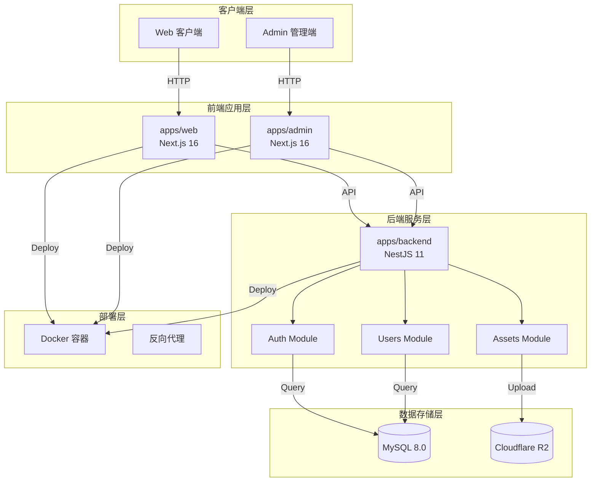
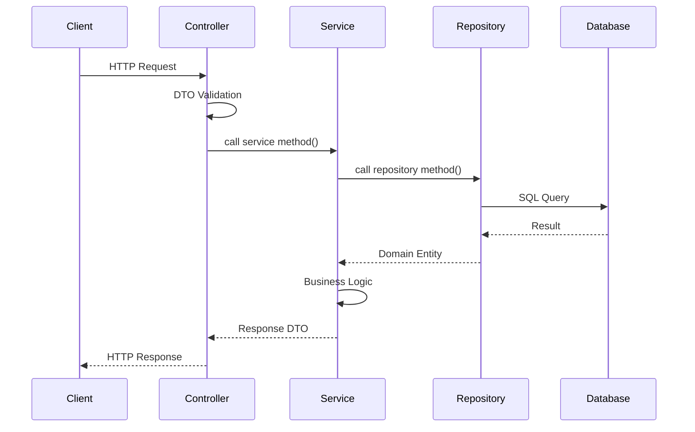
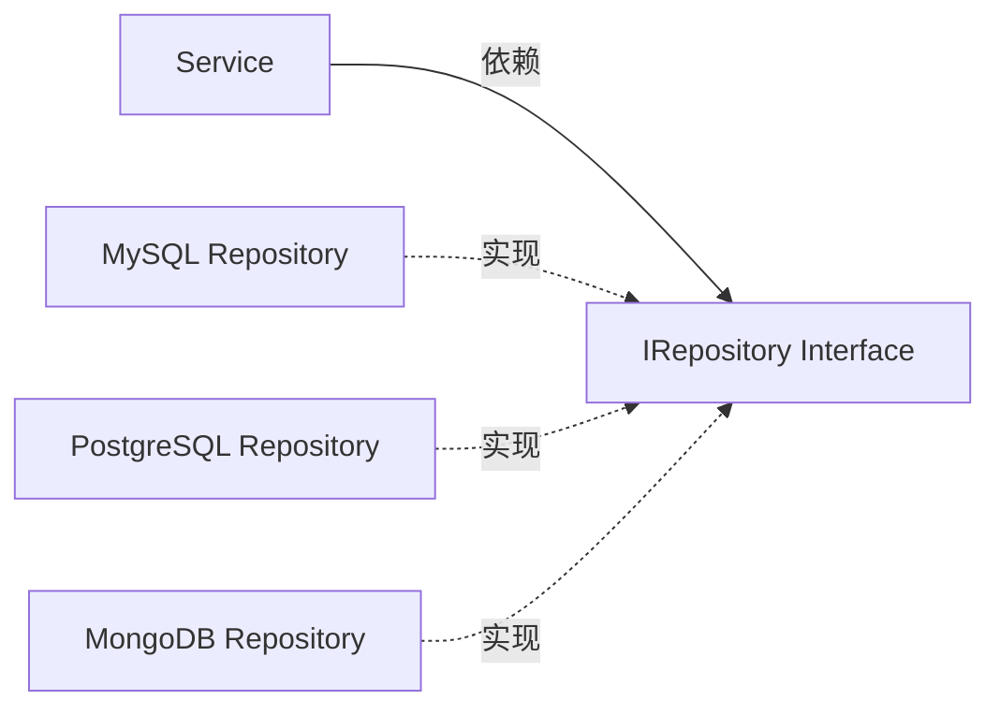
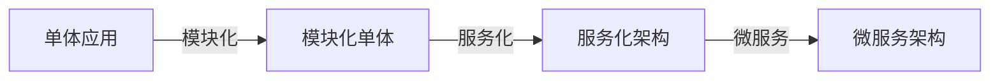

# 架构设计

> **所属阶段**：[项目规划与架构设计](./README.md)
> **预计时长**：2-3 小时
> **难度等级**：⭐⭐⭐☆☆

## 📋 章节大纲

### 第一部分：架构设计概述

- 什么是架构设计
- 为什么架构设计很重要
- 架构设计的核心原则
- 架构视图与维度

### 第二部分：SnapMatch 项目架构设计实战

- 整体架构设计
- 后端架构设计（NestJS）
- 前端架构设计（Next.js）
- 数据架构设计
- 部署架构设计

### 第三部分：架构模式与实践

- 分层架构
- 模块化设计
- 依赖注入
- 仓储模式
- 策略模式

### 第四部分：最佳实践与常见陷阱

- 架构设计最佳实践
- 常见架构陷阱
- 架构演进策略
- 架构评审方法

---

## 🎯 学习目标

完成本节后，你将能够：

- [ ] 理解架构设计的重要性和核心原则
- [ ] 掌握分层架构和模块化设计方法
- [ ] 能够设计清晰、可维护的系统架构
- [ ] 学会使用常见架构模式
- [ ] 避免架构设计中的常见陷阱

## 💡 关键要点

- **架构是基础**：良好的架构是项目长期演进的基础
- **分层解耦**：清晰的层次划分降低系统复杂度
- **模块化设计**：高内聚、低耦合的模块易于维护
- **面向接口**：依赖抽象而非具体实现
- **持续演进**：架构是演化的，不是一成不变的

---

## 第一部分：架构设计概述

### 1.1 什么是架构设计

**架构设计（Architecture Design）** 是在系统开发早期，通过系统的规划和设计，明确系统的：

- **整体结构**（系统组成和关系）
- **技术选型**（技术栈和框架）
- **模块划分**（功能边界和职责）
- **交互方式**（通信协议和数据流）
- **部署策略**（运行环境和扩展方式）

#### 架构设计 vs 详细设计

| 维度         | 架构设计                   | 详细设计                   |
| ------------ | -------------------------- | -------------------------- |
| **关注点**   | 系统整体结构、模块关系     | 具体实现、算法逻辑         |
| **抽象层次** | 高层抽象                   | 低层详细                   |
| **时间点**   | 项目早期                   | 架构设计后                 |
| **输出物**   | 架构图、模块划分、接口定义 | 类图、流程图、详细设计文档 |
| **受众**     | 架构师、技术负责人         | 开发工程师                 |

### 1.2 为什么架构设计很重要

#### 真实案例：架构混乱的代价

| 问题         | 影响                 | 代价                 |
| ------------ | -------------------- | -------------------- |
| 模块边界不清 | 代码修改牵一发动全身 | 开发效率降低 60%     |
| 缺乏抽象     | 难以替换底层实现     | 重构成本增加 3 倍    |
| 循环依赖     | 测试困难、部署复杂   | 测试覆盖率低 30%     |
| 技术债务累积 | 新功能开发越来越慢   | 每个功能耗时增加 50% |

#### 架构设计的价值

✅ **降低复杂度**：通过分层和模块化，分解复杂问题
✅ **提高可维护性**：清晰的边界让修改更加安全
✅ **支持团队协作**：模块化支持多人并行开发
✅ **便于扩展**：良好的架构支持功能扩展
✅ **降低风险**：早期发现架构问题，避免后期大改

### 1.3 架构设计的核心原则

#### SOLID 原则在架构中的应用

**1. Single Responsibility（单一职责）**

每个模块/组件只负责一个功能领域。

```markdown
✅ 好的架构：

- UsersController：处理用户相关的 HTTP 请求
- UsersService：处理用户业务逻辑
- UsersRepository：处理用户数据访问

❌ 差的架构：

- UserManager：同时处理请求、业务逻辑、数据访问
```

**2. Open/Closed（开闭原则）**

对扩展开放，对修改关闭。

```typescript
// ✅ 好的设计：通过接口扩展
interface IStorageProvider {
  upload(file: File): Promise<string>;
  download(url: string): Promise<Stream>;
}

// 新增存储方式时，只需添加新的 Provider
class R2StorageProvider implements IStorageProvider {}
class S3StorageProvider implements IStorageProvider {}

// ❌ 差的设计：每次新增都要修改现有代码
class StorageService {
  upload(file: File, provider: 'r2' | 's3' | 'oss') {
    if (provider === 'r2') {
      /* ... */
    } else if (provider === 's3') {
      /* ... */
    }
    // 每次新增存储方式都要修改这里
  }
}
```

**3. Liskov Substitution（里氏替换）**

子类可以替换父类而不影响程序正确性。

```typescript
// ✅ 好的设计
abstract class BaseController {
  abstract findAll(): Promise<any[]>;
}

class UsersController extends BaseController {
  async findAll(): Promise<User[]> {
    /* ... */
  }
}

// 父类能用的地方，子类一定能用
const controller: BaseController = new UsersController();
```

**4. Interface Segregation（接口隔离）**

客户端不应该依赖它不需要的接口。

```typescript
// ✅ 好的设计：接口细粒度
interface IReadable {
  findById(id: string): Promise<any>;
  findAll(): Promise<any[]>;
}

interface IWritable {
  create(data: any): Promise<any>;
  update(id: string, data: any): Promise<any>;
  delete(id: string): Promise<void>;
}

// 只读操作只需依赖 IReadable
class ReadOnlyService {
  constructor(private readonly repo: IReadable) {}
}

// ❌ 差的设计：接口过于庞大
interface IRepository {
  findById(id: string): Promise<any>;
  findAll(): Promise<any[]>;
  create(data: any): Promise<any>;
  update(id: string, data: any): Promise<any>;
  delete(id: string): Promise<void>;
  // ... 100 more methods
}
```

**5. Dependency Inversion（依赖倒置）**

依赖抽象而非具体实现。

```typescript
// ✅ 好的设计：依赖接口
class UsersService {
  constructor(private readonly usersRepo: IUsersRepository) {}
}

// ❌ 差的设计：依赖具体实现
class UsersService {
  constructor(private readonly usersRepo: MysqlUsersRepository) {}
}
```

#### 其他核心原则

**1. 分层原则（Layered Architecture）**

```
┌─────────────────────────┐
│   Presentation Layer    │  ← 接口层（Controller）
├─────────────────────────┤
│   Business Logic Layer  │  ← 业务层（Service）
├─────────────────────────┤
│   Data Access Layer     │  ← 数据层（Repository）
├─────────────────────────┤
│   Database / Storage    │  ← 存储层
└─────────────────────────┘
```

**2. 模块化原则（Modularization）**

```markdown
- 高内聚（High Cohesion）：相关功能聚集在一起
- 低耦合（Low Coupling）：模块间依赖尽可能少
- 明确边界（Clear Boundary）：每个模块有清晰的职责
```

**3. DRY 原则（Don't Repeat Yourself）**

```markdown
✅ 好的做法：

- 提取公共逻辑到工具函数
- 使用基类减少重复代码
- 通过组合复用行为

❌ 差的做法：

- 复制粘贴代码
- 相似逻辑在多处实现
```

### 1.4 架构视图与维度

#### 4+1 架构视图

**Philippe Krutchen 的 4+1 视图模型**：

1. **逻辑视图（Logical View）**
   - 功能需求分解
   - 关键类和对象
   - 接口和职责

2. **实现视图（Implementation View）**
   - 代码组织结构
   - 模块划分
   - 依赖关系

3. **进程视图（Process View）**
   - 运行时行为
   - 进程和线程
   - 并发和同步

4. **部署视图（Deployment View）**
   - 物理部署
   - 网络拓扑
   - 硬件配置

5. **用例视图（Use Case View）**
   - 用户场景
   - 功能需求
   - 系统边界

---

## 第二部分：SnapMatch 项目架构设计实战

### 2.1 整体架构设计

#### 系统架构图



#### 架构特点

**1. 前后端分离**

```markdown
**优势**：

- 前后端独立开发、部署
- 技术栈选择灵活
- 职责清晰

**实现**：

- 前端：Next.js（Web + Admin）
- 后端：NestJS RESTful API
- 通信：HTTP/JSON
```

**2. 多应用架构**

```markdown
**应用划分**：

- apps/web：面向客户的 Web 应用
- apps/admin：管理后台应用
- apps/backend：后端 API 服务

**优势**：

- 独立部署和扩展
- 代码隔离
- 团队并行开发
```

**3. 模块化后端**

```markdown
**模块划分**：

- auth：认证授权模块
- users：用户管理模块
- assets：资源管理模块
- common：公共模块

**模块特性**：

- 独立的业务逻辑
- 清晰的模块边界
- 可独立测试
```

### 2.2 后端架构设计（NestJS）

#### 目录结构

```
apps/backend/src/
├── main.ts                      # 应用入口
├── app.module.ts                # 根模块
│
├── auth/                        # 认证授权模块
│   ├── auth.module.ts
│   ├── auth.controller.ts
│   ├── auth.service.ts
│   ├── guards/                  # 守卫
│   │   ├── jwt-auth.guard.ts
│   │   ├── roles.guard.ts
│   │   └── permissions.guard.ts
│   ├── strategies/              # 策略
│   │   └── jwt.strategy.ts
│   ├── decorators/              # 装饰器
│   │   ├── current-user.decorator.ts
│   │   ├── roles.decorator.ts
│   │   └── permissions.decorator.ts
│   ├── dto/                     # 数据传输对象
│   │   ├── login.dto.ts
│   │   └── auth-user.dto.ts
│   └── sessions/                # 会话管理
│       ├── auth-sessions.service.ts
│       └── auth-sessions.repository.ts
│
├── users/                       # 用户管理模块
│   ├── users.module.ts
│   ├── users.admin.controller.ts
│   ├── users.service.ts
│   ├── users.repository.ts
│   └── dto/                     # 数据传输对象
│       ├── create-user.dto.ts
│       ├── update-user.dto.ts
│       └── list-users.query.ts
│
├── assets/                      # 资源管理模块
│   ├── assets.module.ts
│   ├── assets.controller.ts
│   └── assets.service.ts
│
├── common/                      # 公共模块
│   ├── storage/                 # 存储抽象
│   │   ├── storage.module.ts
│   │   ├── storage.service.ts
│   │   ├── storage.interface.ts
│   │   └── providers/
│   │       └── r2.provider.ts
│   ├── filters/                 # 异常过滤器
│   │   └── api-exception.filter.ts
│   ├── interceptors/            # 拦截器
│   │   └── response-envelope.interceptor.ts
│   └── types/                   # 公共类型
│       └── api-response.ts
│
├── database/                    # 数据库模块
│   ├── mysql.module.ts
│   └── entities/                # 实体定义
│       ├── rbac-user.entity.ts
│       ├── rbac-role.entity.ts
│       ├── rbac-permission.entity.ts
│       └── auth-session.entity.ts
│
└── health/                      # 健康检查
    └── health.controller.ts
```

#### 分层架构详解

**1. Controller 层（表现层）**

```typescript
// apps/backend/src/auth/auth.controller.ts
@Controller('auth')
export class AuthController {
  constructor(private readonly authService: AuthService) {}

  @Post('login')
  async login(@Body() loginDto: LoginDto) {
    // 只负责处理 HTTP 请求
    // 不包含业务逻辑
    return this.authService.login(loginDto);
  }
}
```

**职责**：

- 接收 HTTP 请求
- 参数验证
- 调用 Service 层
- 返回 HTTP 响应

**2. Service 层（业务逻辑层）**

```typescript
// apps/backend/src/auth/auth.service.ts
@Injectable()
export class AuthService {
  constructor(
    private readonly usersService: UsersService,
    private readonly sessionsService: AuthSessionsService,
  ) {}

  async login(loginDto: LoginDto) {
    // 1. 验证用户
    const user = await this.usersService.findByUsername(loginDto.username);

    // 2. 验证密码
    const isValid = await bcrypt.compare(loginDto.password, user.password);
    if (!isValid) {
      throw new UnauthorizedException('Invalid credentials');
    }

    // 3. 生成 Token
    const tokens = await this.generateTokens(user);

    // 4. 创建会话
    await this.sessionsService.create(user.id, tokens.refreshToken);

    return tokens;
  }
}
```

**职责**：

- 实现业务逻辑
- 事务管理
- 调用 Repository 层
- 数据转换

**3. Repository 层（数据访问层）**

```typescript
// apps/backend/src/users/users.repository.mysql.ts
@Injectable()
export class UsersRepository implements IUsersRepository {
  constructor(@InjectDataSource() private readonly dataSource: DataSource) {}

  async findById(id: string): Promise<User | null> {
    const result = await this.dataSource.query('SELECT * FROM rbac_users WHERE id = ?', [id]);
    return result[0] || null;
  }

  async create(userData: CreateUserData): Promise<User> {
    // 纯数据操作，不包含业务逻辑
    // ...
  }
}
```

**职责**：

- 数据库操作
- SQL 执行
- 结果映射
- 不包含业务逻辑

#### 依赖注入架构

**NestJS 的 DI 容器**：

```typescript
// 1. 定义接口（抽象）
export interface IUsersRepository {
  findById(id: string): Promise<User | null>;
  create(data: CreateUserData): Promise<User>;
}

// 2. 实现接口（具体）
@Injectable()
export class UsersRepository implements IUsersRepository {
  // MySQL 实现
}

// 3. 在 Module 中注册
@Module({
  controllers: [UsersController],
  providers: [
    UsersService,
    {
      provide: 'IUsersRepository',
      useClass: UsersRepository,
    },
  ],
})
export class UsersModule {}

// 4. 在 Service 中注入（依赖抽象）
export class UsersService {
  constructor(
    @Inject('IUsersRepository')
    private readonly usersRepo: IUsersRepository, // 依赖接口
  ) {}
}
```

**优势**：

- 低耦合：Service 不依赖具体实现
- 可测试：易于注入 Mock 对象
- 可替换：切换实现只需修改 Module 配置

### 2.3 前端架构设计（Next.js）

#### 应用结构

```
apps/admin/
├── app/                          # App Router
│   ├── (guest)/                  # 路由组：访客
│   │   ├── login/
│   │   ├── register/
│   │   └── layout.tsx
│   ├── dashboard/                # 路由组：仪表盘
│   │   ├── analytics/
│   │   ├── portfolio/
│   │   ├── crm/
│   │   ├── delivery/
│   │   ├── settings/
│   │   └── layout.tsx
│   ├── api/                      # API Routes
│   │   ├── auth/
│   │   └── [...path]/
│   ├── layout.tsx                # 根布局
│   └── globals.css
│
├── components/                   # 组件库
│   ├── ui/                       # Radix UI 组件
│   ├── forms/                    # 表单组件
│   └── layouts/                  # 布局组件
│
├── lib/                          # 工具库
│   ├── api.ts                    # API 客户端
│   ├── auth.ts                   # 认证工具
│   └── utils.ts
│
├── hooks/                        # 自定义 Hooks
│   ├── use-auth.ts
│   └── use-api.ts
│
└── middleware.ts                 # 中间件
```

#### Next.js App Router 特性

**1. 文件系统路由**

```typescript
app/
├── (guest)/
│   ├── login/
│   │   └── page.tsx              # → /login
│   └── register/
│       └── page.tsx              # → /register
├── dashboard/
│   ├── portfolio/
│   │   └── page.tsx              # → /dashboard/portfolio
│   └── layout.tsx                # 共享布局
└── layout.tsx                    # 根布局
```

**2. 路由组（Route Groups）**

```typescript
// (guest) 路由组 - 不影响 URL
app/(guest)/
├── login/page.tsx        # URL: /login
├── register/page.tsx     # URL: /register
└── layout.tsx            # 共享布局：无需认证

// dashboard 路由组
app/dashboard/
├── portfolio/page.tsx    # URL: /dashboard/portfolio
├── settings/page.tsx     # URL: /dashboard/settings
└── layout.tsx            # 共享布局：需要认证
```

**3. Server Actions**

```typescript
// app/actions/auth.ts
'use server';

export async function loginAction(formData: FormData) {
  const username = formData.get('username');
  const password = formData.get('password');

  // 直接调用后端 API
  const response = await fetch('http://localhost:3000/api/auth/login', {
    method: 'POST',
    body: JSON.stringify({ username, password }),
  });

  // 服务端设置 Cookie
  // ...
}
```

#### 状态管理架构

**使用 Zustand 进行状态管理**：

```typescript
// hooks/use-auth.ts
interface AuthState {
  user: User | null;
  token: string | null;
  isAuthenticated: boolean;

  login: (credentials: LoginDto) => Promise<void>;
  logout: () => void;
  refresh: () => Promise<void>;
}

export const useAuth = create<AuthState>((set, get) => ({
  user: null,
  token: null,
  isAuthenticated: false,

  login: async (credentials) => {
    const response = await api.post('/auth/login', credentials);
    set({
      user: response.user,
      token: response.accessToken,
      isAuthenticated: true,
    });
  },

  logout: () => {
    set({
      user: null,
      token: null,
      isAuthenticated: false,
    });
  },

  refresh: async () => {
    const { refreshToken } = get();
    const response = await api.post('/auth/refresh', { refreshToken });
    set({ token: response.accessToken });
  },
}));
```

### 2.4 数据架构设计

#### 数据流图



#### 数据传输对象（DTO）设计

**1. 请求 DTO**

```typescript
// apps/backend/src/auth/dto/login.dto.ts
export class LoginDto {
  @IsString()
  @MinLength(3)
  username: string;

  @IsString()
  @MinLength(6)
  password: string;
}
```

**2. 响应 DTO**

```typescript
// apps/backend/src/auth/dto/auth-login-response.dto.ts
export class AuthLoginResponseDto {
  user: {
    id: string;
    username: string;
    role: string;
  };
  tokens: {
    accessToken: string;
    refreshToken: string;
    expiresIn: number;
  };
}
```

**3. 查询 DTO**

```typescript
// apps/backend/src/users/dto/list-users.query.ts
export class ListUsersQuery {
  @IsOptional()
  @Type(() => Number)
  page?: number = 1;

  @IsOptional()
  @Type(() => Number)
  limit?: number = 10;

  @IsOptional()
  @IsString()
  search?: string;

  @IsOptional()
  @IsString()
  role?: string;
}
```

#### 数据库设计原则

**1. 命名规范**

```sql
-- 表名：小写 + 下划线
rbac_users
rbac_roles
auth_sessions

-- 字段名：小写 + 下划线
user_id
created_at
is_active

-- 索引名：idx_表名_字段名
idx_rbac_users_username
idx_auth_sessions_user_id
```

**2. 字段类型**

```sql
-- 主键：使用 BIGINT
id BIGINT UNSIGNED NOT NULL AUTO_INCREMENT PRIMARY KEY

-- 时间：统一使用 DATETIME 或 TIMESTAMP
created_at TIMESTAMP DEFAULT CURRENT_TIMESTAMP
updated_at TIMESTAMP DEFAULT CURRENT_TIMESTAMP ON UPDATE CURRENT_TIMESTAMP

-- 状态：使用 TINYINT
is_active TINYINT(1) DEFAULT 1
is_deleted TINYINT(1) DEFAULT 0

-- 金额：使用 DECIMAL
amount DECIMAL(10, 2) NOT NULL
```

**3. 索引策略**

```sql
-- 1. 主键索引
PRIMARY KEY (id)

-- 2. 唯一索引
UNIQUE KEY uk_username (username)

-- 3. 普通索引
KEY idx_email (email)

-- 4. 复合索引
KEY idx_user_created (user_id, created_at)

-- 5. 全文索引
FULLTEXT KEY ft_content (title, content)
```

### 2.5 部署架构设计

#### Docker 容器化部署

**Dockerfile 设计**：

```dockerfile
# ========== 阶段 1: 依赖安装 ==========
FROM node:20-alpine AS deps
WORKDIR /app
RUN corepack enable pnpm
COPY package.json pnpm-lock.yaml ./
RUN pnpm install --frozen-lockfile

# ========== 阶段 2: 构建 ==========
FROM node:20-alpine AS build
WORKDIR /app
RUN corepack enable pnpm
COPY --from=deps /app/node_modules ./node_modules
COPY . .
RUN pnpm build

# ========== 阶段 3: 运行时 ==========
FROM node:20-alpine AS runner
WORKDIR /app

RUN addgroup --system --gid 1001 nodejs
RUN adduser --system --uid 1001 nestjs
USER nestjs

COPY --from=build --chown=nestjs:nodejs /app/dist ./dist
COPY --from=build --chown=nestjs:nodejs /app/node_modules ./node_modules
COPY --from=build --chown=nestjs:nodejs /app/package.json ./

ENV NODE_ENV=production
ENV PORT=3000

EXPOSE 3000
CMD ["node", "dist/main.js"]
```

**优势**：

- 环境一致性：开发、测试、生产环境一致
- 快速部署：镜像构建后可在任意环境运行
- 资源隔离：容器级别资源隔离
- 易于扩展：快速创建新实例

#### 多阶段部署策略

**开发环境**：

```yaml
# docker-compose.dev.yml
version: '3.8'
services:
  backend:
    build: .
    command: pnpm run start:dev
    volumes:
      - ./apps/backend/src:/app/src
    environment:
      - NODE_ENV=development
    ports:
      - '3000:3000'
```

**生产环境**：

```yaml
# docker-compose.prod.yml
version: '3.8'
services:
  backend:
    image: snapmatch-backend:latest
    restart: always
    environment:
      - NODE_ENV=production
      - DATABASE_URL=mysql://...
    ports:
      - '3000:3000'
    depends_on:
      - mysql
      - redis

  mysql:
    image: mysql:8.0
    restart: always
    environment:
      - MYSQL_ROOT_PASSWORD=${DB_PASSWORD}
    volumes:
      - mysql_data:/var/lib/mysql

  redis:
    image: redis:7-alpine
    restart: always
    volumes:
      - redis_data:/data

volumes:
  mysql_data:
  redis_data:
```

---

## 第三部分：架构模式与实践

### 3.1 分层架构

#### 三层架构模式

```
┌─────────────────────────────────────┐
│     Presentation Layer              │  ← 处理用户交互
│     (Controller/Components)         │
├─────────────────────────────────────┤
│     Business Logic Layer            │  ← 处理业务逻辑
│     (Service/Domain)                │
├─────────────────────────────────────┤
│     Data Access Layer               │  ← 处理数据持久化
│     (Repository/DAO)                │
└─────────────────────────────────────┘
```

**优势**：

- 职责分离：每层有明确的职责
- 易于测试：可以单独测试每一层
- 可替换：更换底层实现不影响上层

**SnapMatch 中的应用**：

```typescript
// Controller 层
@Controller('users')
export class UsersController {
  constructor(private readonly usersService: UsersService) {}

  @Get()
  findAll() {
    return this.usersService.findAll();
  }
}

// Service 层
@Injectable()
export class UsersService {
  constructor(private readonly usersRepo: UsersRepository) {}

  async findAll() {
    // 业务逻辑
    return await this.usersRepo.findAll();
  }
}

// Repository 层
@Injectable()
export class UsersRepository {
  async findAll() {
    // 数据访问
    return await this.dataSource.query('SELECT * FROM users');
  }
}
```

### 3.2 模块化设计

#### 模块划分原则

**1. 按业务功能划分**

```
apps/backend/src/
├── auth/              # 认证授权模块
├── users/             # 用户管理模块
├── assets/            # 资源管理模块
└── common/            # 公共模块
```

**2. 按技术层次划分**

```
common/
├── storage/           # 存储技术模块
├── filters/           # 过滤器模块
├── interceptors/      # 拦截器模块
└── types/             # 类型定义模块
```

**3. 模块独立性**

```typescript
// auth.module.ts - 独立模块
@Module({
  imports: [DatabaseModule],
  controllers: [AuthController],
  providers: [AuthService, AuthSessionsService],
  exports: [AuthService], // 导出供其他模块使用
})
export class AuthModule {}

// users.module.ts - 依赖 Auth 模块
@Module({
  imports: [AuthModule], // 导入 Auth 模块
  controllers: [UsersController],
  providers: [UsersService, UsersRepository],
})
export class UsersModule {}
```

### 3.3 仓储模式（Repository Pattern）

#### 什么是仓储模式

**仓储模式**：将数据访问逻辑封装在单独的仓储对象中，业务层通过仓储接口访问数据。



**优势**：

- 解耦：业务逻辑与数据访问解耦
- 可测试：易于 Mock 仓储进行单元测试
- 可替换：切换数据库只需实现新仓储

**SnapMatch 实现**：

```typescript
// 1. 定义仓储接口
// users/users.repository.ts
export interface IUsersRepository {
  findById(id: string): Promise<User | null>;
  findByUsername(username: string): Promise<User | null>;
  create(data: CreateUserData): Promise<User>;
  update(id: string, data: UpdateUserData): Promise<User>;
  delete(id: string): Promise<void>;
}

// 2. MySQL 实现
// users/users.repository.mysql.ts
@Injectable()
export class UsersRepository implements IUsersRepository {
  constructor(@InjectDataSource() private readonly dataSource: DataSource) {}

  async findById(id: string): Promise<User | null> {
    const result = await this.dataSource.query('SELECT * FROM rbac_users WHERE id = ?', [id]);
    return result[0] || null;
  }

  // 其他方法...
}

// 3. 在 Service 中使用
// users/users.service.ts
@Injectable()
export class UsersService {
  constructor(
    // 依赖接口，而非具体实现
    @Inject('IUsersRepository')
    private readonly usersRepo: IUsersRepository,
  ) {}

  async findOne(id: string) {
    return await this.usersRepo.findById(id);
  }
}

// 4. 在 Module 中注册
// users/users.module.ts
@Module({
  providers: [
    UsersService,
    {
      provide: 'IUsersRepository',
      useClass: UsersRepository, // 可以轻松切换实现
    },
  ],
})
export class UsersModule {}
```

### 3.4 策略模式（Strategy Pattern）

#### 存储提供商策略

**应用场景**：支持多种云存储（R2、S3、OSS）

```typescript
// 1. 定义策略接口
// common/storage/storage.interface.ts
export interface IMultipartUploadProvider {
  generatePresignedUploadUrl(key: string, options?: UploadOptions): Promise<string>;

  completeMultipartUpload(key: string, uploadId: string): Promise<void>;
}

// 2. R2 策略实现
// common/storage/providers/r2.provider.ts
@Injectable()
export class R2StorageProvider implements IMultipartUploadProvider {
  private client: S3Client;

  async generatePresignedUploadUrl(key: string) {
    // R2 特定实现
    const command = new PutObjectCommand({
      /* ... */
    });
    return await getSignedUrl(this.client, command);
  }
}

// 3. S3 策略实现
// common/storage/providers/s3.provider.ts
@Injectable()
export class S3StorageProvider implements IMultipartUploadProvider {
  private client: S3Client;

  async generatePresignedUploadUrl(key: string) {
    // S3 特定实现
    const command = new PutObjectCommand({
      /* ... */
    });
    return await getSignedUrl(this.client, command);
  }
}

// 4. Storage Service 使用策略
// common/storage/storage.service.ts
@Injectable()
export class StorageService {
  private provider: IMultipartUploadProvider;

  constructor() {
    // 根据配置选择策略
    const providerType = process.env.STORAGE_PROVIDER;
    if (providerType === 'r2') {
      this.provider = new R2StorageProvider();
    } else if (providerType === 's3') {
      this.provider = new S3StorageProvider();
    }
  }

  async uploadFile(key: string, file: File) {
    // 使用统一的接口，不关心具体实现
    return await this.provider.generatePresignedUploadUrl(key);
  }
}
```

**优势**：

- 开闭原则：新增存储方式无需修改现有代码
- 运行时切换：可根据配置动态选择策略
- 易于测试：可以注入 Mock 策略

### 3.5 依赖注入（Dependency Injection）

#### NestJS DI 系统

**1. Provider 注册**

```typescript
@Module({
  providers: [
    // 方式 1：直接注册类
    UsersService,

    // 方式 2：使用字符串 Token
    {
      provide: 'USERS_REPOSITORY',
      useClass: UsersRepository,
    },

    // 方式 3：使用值
    {
      provide: 'APP_CONFIG',
      useValue: { apiUrl: 'http://localhost:3000' },
    },

    // 方式 4：使用工厂
    {
      provide: 'DATABASE_CONNECTION',
      useFactory: async (configService: ConfigService) => {
        return await createConnection(configService.get('DATABASE_URL'));
      },
      inject: [ConfigService],
    },
  ],
})
export class UsersModule {}
```

**2. 依赖注入**

```typescript
// 构造函数注入
@Injectable()
export class UsersService {
  constructor(
    private readonly usersRepo: IUsersRepository,
    private readonly configService: ConfigService,
  ) {}
}

// 属性注入（不推荐）
@Injectable()
export class UsersService {
  @Inject('USERS_REPOSITORY')
  private readonly usersRepo: IUsersRepository;
}
```

**3. 生命周期**

```typescript
@Injectable()
export class UsersService implements OnModuleInit, OnModuleDestroy {
  async onModuleInit() {
    // 模块初始化时调用
    console.log('UsersService initialized');
  }

  async onModuleDestroy() {
    // 模块销毁时调用
    console.log('UsersService destroyed');
  }
}
```

---

## 第四部分：最佳实践与常见陷阱

### 4.1 架构设计最佳实践

#### ✅ DO（推荐做法）

**1. 从简到繁，渐进演进**

```markdown
✅ 正确做法：

- MVP 阶段：单体架构，清晰分层
- 成长阶段：模块化，服务化
- 成熟阶段：微服务（如需要）

❌ 错误做法：

- 一开始就上微服务
- 过度设计，增加不必要的复杂度
```

**2. 接口隔离，依赖抽象**

```typescript
✅ 好的设计：
interface IUsersRepository {
  findById(id: string): Promise<User>;
}

class UsersService {
  constructor(private repo: IUsersRepository) { }
}

❌ 差的设计：
class UsersService {
  constructor(private repo: MysqlUsersRepository) { }
}
```

**3. 单一职责，边界清晰**

```typescript
✅ 好的设计：
class UsersController {
  // 只处理 HTTP 请求
  async findAll() {
    return this.usersService.findAll();
  }
}

class UsersService {
  // 只处理业务逻辑
  async findAll() {
    return this.usersRepo.findAll();
  }
}

❌ 差的设计：
class UsersController {
  async findAll() {
    // 直接在 Controller 中操作数据库
    const result = await db.query('SELECT * FROM users');
    return result;
  }
}
```

**4. 提前考虑扩展性**

```typescript
✅ 好的设计：
// 使用策略模式，易于扩展
interface IStorageProvider {
  upload(file: File): Promise<string>;
}

// 未来可以轻松添加新的存储提供商
class OSSStorageProvider implements IStorageProvider { }
class MinioStorageProvider implements IStorageProvider { }

❌ 差的设计：
// 硬编码，难以扩展
class StorageService {
  async upload(file: File) {
    if (provider === 'r2') {
      // R2 特定代码
    } else if (provider === 's3') {
      // S3 特定代码
    }
    // 每次新增都要修改这里
  }
}
```

**5. 架构文档化**

```markdown
✅ 推荐做法：

- 绘制架构图（C4 Model）
- 编写架构决策记录（ADR）
- 维护 API 文档（Swagger）
- 记录数据流和关键流程

❌ 错误做法：

- 只有代码，没有文档
- 架构决策不记录原因
- API 变更不更新文档
```

### 4.2 常见架构陷阱

#### ❌ DON'T（常见错误）

**1. 过度分层（Over-Engineering）**

```typescript
❌ 差的做法：
Controller → Service → Manager → Handler → DAO → Database
// 层次过多，增加复杂度，降低性能

✅ 好的做法：
Controller → Service → Repository → Database
// 三层架构足够清晰
```

**2. 循环依赖**

```typescript
❌ 差的做法：
// A 依赖 B
class ModuleA {
  constructor(private readonly b: ModuleB) { }
}

// B 又依赖 A
class ModuleB {
  constructor(private readonly a: ModuleA) { }
}

✅ 好的做法：
// 提取公共依赖到 Module C
class ModuleA {
  constructor(private readonly c: ModuleC) { }
}

class ModuleB {
  constructor(private readonly c: ModuleC) { }
}
```

**3. 上帝对象（God Object）**

```typescript
❌ 差的做法：
class UserManager {
  // 包含所有用户相关功能
  login() { }
  register() { }
  uploadAvatar() { }
  updateProfile() { }
  deleteAccount() { }
  resetPassword() { }
  changeEmail() { }
  // ... 100 more methods
}

✅ 好的做法：
// 职责分离
class AuthService {
  login() { }
  register() { }
}

class ProfileService {
  updateProfile() { }
  uploadAvatar() { }
}

class AccountService {
  deleteAccount() { }
  resetPassword() { }
}
```

**4. 贫血模型（Anemic Domain Model）**

```typescript
❌ 差的做法：
// Entity 只有 getter/setter，没有行为
class User {
  id: string;
  username: string;
  password: string;
  email: string;
}

// 所有业务逻辑都在 Service 中
class UsersService {
  async changePassword(userId: string, newPassword: string) {
    const user = await this.repo.findById(userId);
    user.password = newPassword;  // 直接修改
    await this.repo.update(user);
  }
}

✅ 好的做法：
// Entity 包含业务行为
class User {
  id: string;
  private _password: string;

  changePassword(newPassword: string, oldPassword: string) {
    if (!this.verifyPassword(oldPassword)) {
      throw new Error('Invalid old password');
    }
    this._password = this.hashPassword(newPassword);
  }
}

class UsersService {
  async changePassword(userId: string, newPassword: string) {
    const user = await this.repo.findById(userId);
    user.changePassword(newPassword, oldPassword);  // 封装在 Entity 中
    await this.repo.update(user);
  }
}
```

**5. 忽视非功能性需求**

```markdown
❌ 错误做法：

- 只关注功能实现
- 忽略性能、安全、可维护性
- 技术债务不记录

✅ 正确做法：

- 早期定义性能目标
- 安全设计从开始
- 架构评审包含非功能性需求
```

### 4.3 架构演进策略

#### 演进路径



**阶段 1：单体应用（MVP）**

```markdown
特点：

- 单一代码库
- 单一数据库
- 统一部署

适用场景：

- 团队规模 < 5 人
- 用户量 < 10,000
- 功能简单
```

**阶段 2：模块化单体**

```markdown
特点：

- 模块边界清晰
- 共享数据库
- 独立部署（可选）

SnapMatch 当前阶段：
✅ 清晰的模块划分（auth、users、assets）
✅ 分层架构（Controller → Service → Repository）
✅ 依赖注入，接口隔离
```

**阶段 3：服务化架构**

```markdown
特点：

- 前后端分离
- API 网关
- 服务独立部署

触发条件：

- 团队规模 > 10 人
- 用户量 > 100,000
- 性能瓶颈出现
```

**阶段 4：微服务架构**

```markdown
特点：

- 服务拆分
- 独立数据库
- 独立部署和扩展

⚠️ 谨慎使用：

- 增加复杂度
- 分布式事务
- 运维成本高
```

### 4.4 架构评审方法

#### 评审清单

**1. 功能性**

- [ ] 是否满足业务需求？
- [ ] 是否有清晰的模块划分？
- [ ] 接口设计是否合理？

**2. 非功能性**

- [ ] 性能：是否满足性能指标？
- [ ] 安全：是否有安全设计？
- [ ] 可扩展性：是否支持功能扩展？
- [ ] 可维护性：代码是否易于理解？

**3. 技术选型**

- [ ] 技术栈是否合理？
- [ ] 是否有备选方案？
- [ ] 团队是否熟悉？

**4. 架构原则**

- [ ] 是否符合 SOLID 原则？
- [ ] 是否有循环依赖？
- [ ] 是否过度设计？

#### 架构决策记录（ADR）

**模板**：

```markdown
# ADR-001: 选择 NestJS 作为后端框架

## 状态

已接受

## 上下文

我们需要选择一个后端框架来构建 SnapMatch 的 API 服务。

## 决策

使用 NestJS 框架。

## 原因

1. **TypeScript 原生**：类型安全，开发体验好
2. **企业级架构**：内置 DI、模块化、守卫等
3. **生态丰富**：与 TypeORM、GraphQL 等集成良好
4. **团队熟悉**：团队有 Express/NestJS 经验

## 后果

**正面**：

- 开发效率高
- 代码结构清晰
- 易于测试

**负面**：

- 学习曲线较陡
- 相对较重（对简单项目）
```

---

## 📚 参考资源

### 推荐书籍

1. **《软件架构模式》** - Kent Beck
   - 分层架构
   - 微服务架构
   - 事件驱动架构

2. **《整洁架构》** - Robert C. Martin
   - 依赖倒置原则
   - 边界划分
   - 数据库无关

3. **《企业应用架构模式》** - Martin Fowler
   - 分层架构
   - 仓储模式
   - 领域模型

### 在线资源

- [NestJS 官方文档](https://docs.nestjs.com/)
- [Next.js 官方文档](https://nextjs.org/docs)
- [C4 模型架构图](https://c4model.com/)
- [架构决策记录（ADR）](https://adr.github.io/)

### 工具推荐

- **架构图**：Mermaid、Draw.io、Lucidchart
- **API 文档**：Swagger/OpenAPI
- **代码分析**：SonarQube、Dependency Cruiser
- **性能分析**：Clinic.js、Chrome DevTools

---

## 📝 练习题

### 练习 1：设计模块化架构

**任务**：为一个"在线教育平台"设计模块化架构

**要求**：

1. 识别核心业务模块（至少 5 个）
2. 设计模块之间的关系
3. 画出模块依赖图
4. 定义每个模块的职责

**提示**：

- 考虑用户、课程、订单、支付、评价等模块
- 思考模块之间的依赖关系
- 避免循环依赖

### 练习 2：实现仓储模式

**任务**：为"产品管理"功能实现仓储模式

**要求**：

1. 定义 `IProductsRepository` 接口
2. 实现 `MysqlProductsRepository`
3. 在 `ProductsService` 中使用仓储
4. 编写单元测试

**提示**：

- 接口应包含 CRUD 方法
- Repository 只负责数据访问
- Service 包含业务逻辑

### 练习 3：架构评审

**任务**：评审以下架构设计

**场景**：

一个电商系统，所有业务逻辑都在 Controller 中，没有 Service 层，直接在 Controller 中操作数据库。

**要求**：

1. 指出架构问题（至少 3 个）
2. 说明为什么这样设计不好
3. 提出改进方案
4. 画出改进后的架构图

---

## ⏭️ 下一节

完成架构设计后，下一步是[数据库设计](./04-database-design.md)

在下一节中，我们将学习：

- 如何设计数据库表结构
- 规范化与反规范化
- 索引设计策略
- 数据库性能优化

---

**返回阶段目录**：[README](./README.md)
**返回教程首页**：[教程目录](../README.md)
