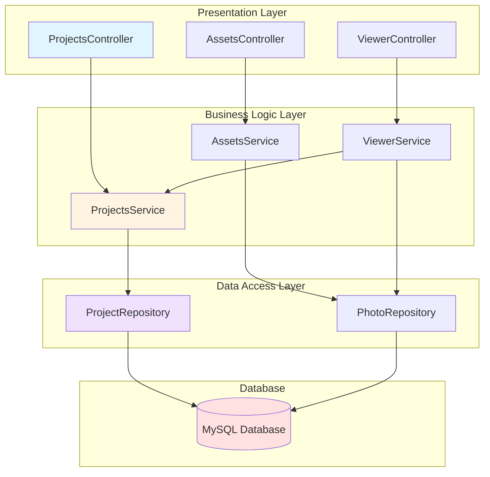
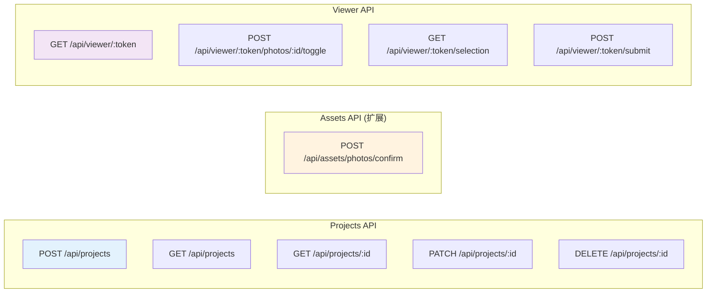
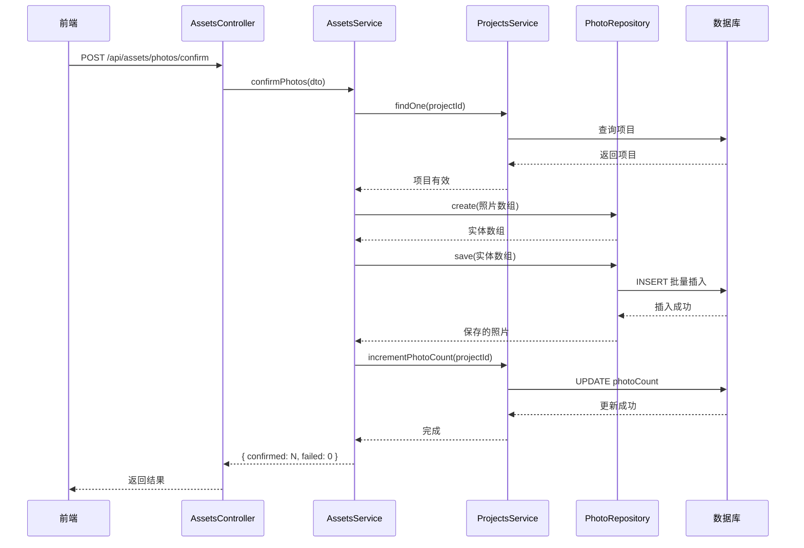
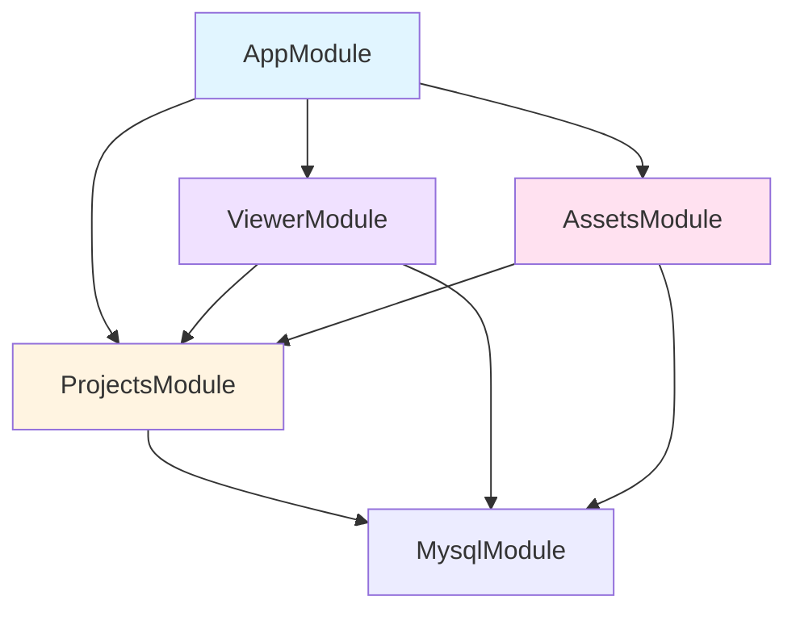

# 项目管理模块开发

> **所属阶段**：[后端开发](./README.md)
> **预计时长**：2-3 小时
> **难度等级**：⭐⭐⭐⭐☆

## 📋 章节大纲

### 第一部分：概述

- 业务场景与需求分析
- 技术架构设计
- 数据模型设计
- API 接口规划

### 第二部分：详细说明

- 数据库实体定义
- DTO 与验证规则
- Projects 模块实现
- Assets 模块扩展
- Viewer 模块实现
- 模块注册与集成

### 第三部分：实践示例

- 完整的项目创建流程
- 照片上传与确认流程
- 客户选片访问流程

### 第四部分：总结与最佳实践

- 关键设计决策回顾
- 性能优化建议
- 安全注意事项
- 扩展方向

---

## 🎯 学习目标

通过本教程，你将学会：

- [ ] 设计并实现复杂业务实体（Project、Photo）
- [ ] 使用 TypeORM 处理一对多关系
- [ ] 实现 NestJS 的完整 CRUD 模块
- [ ] 使用 nanoid 生成安全随机 Token
- [ ] 实现基于 Token 的访问控制
- [ ] 扩展现有模块功能

## 💡 关键要点

- **项目（Project）**是组织照片的核心实体，每个项目有唯一的访问 Token
- **照片（Photo）**通过 `projectId` 关联到项目，存储 R2 对象存储的元数据
- **Viewer** 是客户访问界面，通过 Token 验证身份，无需登录
- 使用 **TypeORM 的 transformer** 处理时间戳字段
- 应用层维护 **photoCount** 冗余字段以提升查询性能

---

## 第一部分：概述

### 1.1 业务场景

在摄影服务业务中，摄影师需要：

1. **创建项目**：为每次拍摄创建一个项目容器，填写项目名称、描述
2. **上传照片**：将拍摄的照片批量上传到项目中
3. **生成访问链接**：每个项目有唯一的访问 Token，生成选片链接发送给客户
4. **客户选片**：客户通过链接访问项目，浏览照片并标记喜欢的照片
5. **查看选片结果**：摄影师查看客户提交的选片结果

### 1.2 技术架构

项目管理模块采用经典的 **NestJS 分层架构**：



**模块职责**：

- **Projects 模块**：项目的 CRUD 管理，Token 生成与验证
- **Assets 模块（扩展）**：照片上传确认，创建 Photo 记录
- **Viewer 模块**：客户访问控制，照片选片逻辑

### 1.3 数据模型设计

我们使用 **两张表** 支撑整个业务：

#### Project 表（项目）

| 字段名        | 类型         | 说明                             |
| ------------- | ------------ | -------------------------------- |
| `_id`         | varchar(34)  | 主键，格式 `set_{nanoid(16)}`    |
| `name`        | varchar(256) | 项目名称                         |
| `description` | text         | 项目描述（可选）                 |
| `token`       | varchar(64)  | 访问 Token（唯一，32位随机字符） |
| `expiresAt`   | bigint       | 过期时间戳（毫秒，可选）         |
| `status`      | varchar(50)  | 状态：active/revoked/submitted   |
| `photoCount`  | int          | 照片数量（冗余字段）             |
| `createdAt`   | bigint       | 创建时间                         |
| `updatedAt`   | bigint       | 更新时间                         |

#### Photo 表（照片）

| 字段名        | 类型         | 说明                            |
| ------------- | ------------ | ------------------------------- |
| `_id`         | varchar(34)  | 主键，格式 `photo_{nanoid(16)}` |
| `projectId`   | varchar(34)  | 关联项目 ID                     |
| `filename`    | varchar(512) | 原始文件名                      |
| `originalKey` | varchar(512) | R2 原图 key                     |
| `previewKey`  | varchar(512) | R2 预览图 key                   |
| `thumbKey`    | varchar(512) | R2 缩略图 key（可选）           |
| `fileSize`    | bigint       | 文件大小                        |
| `width`       | int          | 图片宽度                        |
| `height`      | int          | 图片高度                        |
| `status`      | varchar(50)  | 状态：processing/ready          |
| `selected`    | boolean      | 是否被客户选中                  |
| `selectedAt`  | bigint       | 选中时间                        |
| `createdAt`   | bigint       | 创建时间                        |

### 1.4 API 接口规划



**接口说明**：

- **Projects API**：标准 CRUD，用于管理员管理项目
- **Assets API**：扩展现有模块，处理照片上传确认
- **Viewer API**：客户访问接口，通过 Token 验证身份

---

## 第二部分：详细说明

### 2.1 数据库实体定义

#### 2.1.1 Project 实体

**文件**：`apps/backend/src/database/entities/project.entity.ts`

```typescript
import { Entity, Column, PrimaryColumn, OneToMany } from 'typeorm';
import { bigintMsTransformer } from './bigint-ms.transformer';
import { PhotoEntity } from './photo.entity';

@Entity({ name: 'projects' })
export class ProjectEntity {
  @PrimaryColumn({ name: '_id', type: 'varchar', length: 34 })
  id!: string;

  @Column({ name: 'name', type: 'varchar', length: 256 })
  name!: string;

  @Column({ name: 'description', type: 'text', nullable: true })
  description!: string | null;

  @Column({ name: 'token', type: 'varchar', length: 64, unique: true })
  token!: string;

  @Column({ name: 'expiresAt', type: 'bigint', nullable: true })
  expiresAt!: number | null;

  @Column({ name: 'status', type: 'varchar', length: 50, default: 'active' })
  status!: string;

  @Column({ name: 'photoCount', type: 'int', default: 0 })
  photoCount!: number;

  @Column({ name: 'createdAt', type: 'bigint', transformer: bigintMsTransformer })
  createdAt!: number;

  @Column({ name: 'updatedAt', type: 'bigint', transformer: bigintMsTransformer })
  updatedAt!: number;

  @OneToMany(() => PhotoEntity, (photo) => photo.project)
  photos!: PhotoEntity[];
}
```

**关键设计点**：

1. **主键使用 varchar(34)**：不暴露记录数量，分布式友好
   - 格式：`set_{nanoid(16)}`，例如 `set_V1StGXR8_Z5jdHi6B-myT`
2. **Token 唯一索引**：确保访问链接唯一性
3. **Transformer 处理时间戳**：自动转换 JavaScript Date 对象与毫秒时间戳
4. **OneToOne 关系**：通过 `@OneToMany` 定义一对多关系

#### 2.1.2 Photo 实体

**文件**：`apps/backend/src/database/entities/photo.entity.ts`

```typescript
import { Entity, Column, PrimaryColumn, ManyToOne, JoinColumn } from 'typeorm';
import { bigintMsTransformer } from './bigint-ms.transformer';
import { ProjectEntity } from './project.entity';

@Entity({ name: 'photos' })
export class PhotoEntity {
  @PrimaryColumn({ name: '_id', type: 'varchar', length: 34 })
  id!: string;

  @Column({ name: 'projectId', type: 'varchar', length: 34 })
  projectId!: string;

  @Column({ name: 'filename', type: 'varchar', length: 512 })
  filename!: string;

  @Column({ name: 'originalKey', type: 'varchar', length: 512 })
  originalKey!: string;

  @Column({ name: 'previewKey', type: 'varchar', length: 512 })
  previewKey!: string;

  @Column({ name: 'thumbKey', type: 'varchar', length: 512, nullable: true })
  thumbKey!: string | null;

  @Column({ name: 'fileSize', type: 'bigint', nullable: true })
  fileSize!: number | null;

  @Column({ name: 'width', type: 'int', nullable: true })
  width!: number | null;

  @Column({ name: 'height', type: 'int', nullable: true })
  height!: number | null;

  @Column({ name: 'status', type: 'varchar', length: 50, default: 'processing' })
  status!: string;

  @Column({ name: 'selected', type: 'boolean', default: false })
  selected!: boolean;

  @Column({ name: 'selectedAt', type: 'bigint', nullable: true })
  selectedAt!: number | null;

  @Column({ name: 'createdAt', type: 'bigint', transformer: bigintMsTransformer })
  createdAt!: number;

  @ManyToOne(() => ProjectEntity, (project) => project.photos)
  @JoinColumn({ name: 'projectId' })
  project!: ProjectEntity;
}
```

**关键设计点**：

1. **R2 存储分离**：只存储元数据和对象 key，不存储文件内容
2. **三个图片 key**：
   - `originalKey`：原图，用于下载
   - `previewKey`：预览图，用于在线查看
   - `thumbKey`：缩略图，用于网格展示（可选）
3. **selected 字段**：直接在照片表记录选中状态，简化 MVP 实现

#### 2.1.3 注册实体到模块

**文件**：`apps/backend/src/database/mysql.module.ts`

```typescript
import { Module } from '@nestjs/common';
import { TypeOrmModule } from '@nestjs/typeorm';
import { ProjectEntity } from './entities/project.entity';
import { PhotoEntity } from './entities/photo.entity';

@Module({
  imports: [
    TypeOrmModule.forFeature([
      // ... 现有的 RBAC 实体
      AuthSessionEntity,
      RbacUserEntity,
      RbacRoleEntity,

      // 新增的业务实体
      ProjectEntity,
      PhotoEntity,
    ]),
  ],
  exports: [TypeOrmModule],
})
export class MysqlModule {}
```

**执行 SQL 创建表**：

1. 打开数据库工具（Navicat、DBeaver、MySQL Workbench等）
2. 连接到 `snapmatch` 数据库
3. 查看 `docs/modules/photo-selection-mvp/01-database-schema.sql.md` 文档
4. 复制文档中的建表 SQL 语句
5. 粘贴到数据库工具中执行

> **说明**：本项目使用 SQL 脚本而非迁移系统，适合个人快速开发。
> 详细文档：`docs/modules/photo-selection-mvp/01-database-schema.sql.md`

---

### 2.2 DTO 与验证规则

#### 2.2.1 CreateProjectDto

**文件**：`apps/backend/src/projects/dto/create-project.dto.ts`

```typescript
import { ApiProperty } from '@nestjs/swagger';
import { IsString, IsNotEmpty, MaxLength, IsOptional, IsNumber } from 'class-validator';

export class CreateProjectDto {
  @ApiProperty({ description: '项目名称', example: '李四婚纱照选片' })
  @IsString()
  @IsNotEmpty()
  @MaxLength(256)
  name!: string;

  @ApiProperty({ description: '项目描述', required: false })
  @IsString()
  @IsOptional()
  description?: string;

  @ApiProperty({
    description: '过期时间戳（毫秒）',
    required: false,
    example: Date.now() + 30 * 24 * 60 * 60 * 1000, // 30天后
  })
  @IsNumber()
  @IsOptional()
  expiresAt?: number;
}
```

**验证规则说明**：

- `@IsString()` + `@IsNotEmpty()`：确保名称非空字符串
- `@MaxLength(256)`：数据库字段长度限制
- `@IsOptional()`：可选字段，允许不传
- `@IsNumber()`：时间戳必须是数字

#### 2.2.2 UpdateProjectDto

**文件**：`apps/backend/src/projects/dto/update-project.dto.ts`

```typescript
import { PartialType } from '@nestjs/swagger';
import { CreateProjectDto } from './create-project.dto';

export class UpdateProjectDto extends PartialType(CreateProjectDto) {}
```

**使用 PartialType**：继承 CreateProjectDto，所有字段变为可选，简化代码。

#### 2.2.3 ProjectResponseDto

**文件**：`apps/backend/src/projects/dto/project-response.dto.ts`

```typescript
import { ApiProperty } from '@nestjs/swagger';
import { ProjectEntity } from '../../../database/entities/project.entity';

export class ProjectResponseDto {
  @ApiProperty({ description: '项目ID' })
  id!: string;

  @ApiProperty({ description: '项目名称' })
  name!: string;

  @ApiProperty({ description: '项目描述', required: false })
  description?: string;

  @ApiProperty({ description: '访问令牌' })
  token!: string;

  @ApiProperty({ description: '访问URL（客户端使用）' })
  viewerUrl!: string;

  @ApiProperty({ description: '过期时间', required: false })
  expiresAt?: number;

  @ApiProperty({ description: '状态' })
  status!: string;

  @ApiProperty({ description: '照片数量' })
  photoCount!: number;

  @ApiProperty({ description: '创建时间' })
  createdAt!: number;

  @ApiProperty({ description: '更新时间' })
  updatedAt!: number;

  static fromEntity(entity: ProjectEntity, baseUrl: string): ProjectResponseDto {
    return {
      id: entity.id,
      name: entity.name,
      description: entity.description,
      token: entity.token,
      viewerUrl: `${baseUrl}/viewer/${entity.token}`,
      expiresAt: entity.expiresAt,
      status: entity.status,
      photoCount: entity.photoCount,
      createdAt: entity.createdAt,
      updatedAt: entity.updatedAt,
    };
  }
}
```

**静态方法 fromEntity**：统一处理实体到 DTO 的转换，包含业务逻辑（生成 viewerUrl）。

---

### 2.3 Projects 模块实现

#### 2.3.1 ProjectsService

**文件**：`apps/backend/src/projects/projects.service.ts`

```typescript
import { Injectable, NotFoundException, BadRequestException } from '@nestjs/common';
import { InjectRepository } from '@nestjs/typeorm';
import { Repository } from 'typeorm';
import { nanoid } from 'nanoid';
import { ProjectEntity } from '../database/entities/project.entity';
import { CreateProjectDto } from './dto/create-project.dto';
import { UpdateProjectDto } from './dto/update-project.dto';
import { ProjectResponseDto } from './dto/project-response.dto';

@Injectable()
export class ProjectsService {
  constructor(
    @InjectRepository(ProjectEntity)
    private readonly projectRepository: Repository<ProjectEntity>,
  ) {}

  /**
   * 创建项目
   * - 生成唯一 ID：set_{nanoid(16)}
   * - 生成访问 Token：32位随机字符
   * - 初始化状态为 active
   */
  async create(createDto: CreateProjectDto): Promise<ProjectResponseDto> {
    const project = this.projectRepository.create({
      id: `set_${nanoid(16)}`,
      token: nanoid(32),
      name: createDto.name,
      description: createDto.description,
      expiresAt: createDto.expiresAt,
      status: 'active',
      photoCount: 0,
      createdAt: Date.now(),
      updatedAt: Date.now(),
    });

    const saved = await this.projectRepository.save(project);
    return ProjectResponseDto.fromEntity(saved, process.env.BASE_URL || '');
  }

  /**
   * 获取项目列表
   * - 按创建时间倒序排列
   */
  async findAll(): Promise<ProjectResponseDto[]> {
    const projects = await this.projectRepository.find({
      order: { createdAt: 'DESC' },
    });
    return projects.map((p) => ProjectResponseDto.fromEntity(p, process.env.BASE_URL || ''));
  }

  /**
   * 获取单个项目
   * - 不存在时抛出 404
   */
  async findOne(id: string): Promise<ProjectResponseDto> {
    const project = await this.projectRepository.findOne({ where: { id } });
    if (!project) {
      throw new NotFoundException('Project not found');
    }
    return ProjectResponseDto.fromEntity(project, process.env.BASE_URL || '');
  }

  /**
   * 更新项目
   * - 使用 Object.assign 合并更新
   * - 自动更新 updatedAt
   */
  async update(id: string, updateDto: UpdateProjectDto): Promise<ProjectResponseDto> {
    const project = await this.projectRepository.findOne({ where: { id } });
    if (!project) {
      throw new NotFoundException('Project not found');
    }

    Object.assign(project, updateDto, { updatedAt: Date.now() });
    const saved = await this.projectRepository.save(project);
    return ProjectResponseDto.fromEntity(saved, process.env.BASE_URL || '');
  }

  /**
   * 删除项目
   * - 检查影响行数
   */
  async remove(id: string): Promise<void> {
    const result = await this.projectRepository.delete(id);
    if (result.affected === 0) {
      throw new NotFoundException('Project not found');
    }
  }

  /**
   * 通过 Token 查找项目（用于 Viewer 访问）
   * - 验证 Token 有效性
   * - 检查是否过期
   * - 检查是否被撤销
   */
  async findByToken(token: string): Promise<ProjectEntity> {
    const project = await this.projectRepository.findOne({ where: { token } });
    if (!project) {
      throw new NotFoundException('Invalid token');
    }

    // 检查是否过期
    if (project.expiresAt && project.expiresAt < Date.now()) {
      throw new BadRequestException('Project has expired');
    }

    // 检查是否撤销
    if (project.status === 'revoked') {
      throw new BadRequestException('Project has been revoked');
    }

    return project;
  }

  /**
   * 增加 photoCount（上传照片后调用）
   * - 使用 TypeORM 的 increment 方法
   */
  async incrementPhotoCount(projectId: string): Promise<void> {
    await this.projectRepository.increment({ id: projectId }, 'photoCount', 1);
  }

  /**
   * 减少 photoCount（删除照片后调用）
   * - 使用 TypeORM 的 decrement 方法
   */
  async decrementPhotoCount(projectId: string): Promise<void> {
    await this.projectRepository.decrement({ id: projectId }, 'photoCount', 1);
  }
}
```

**关键方法解析**：

1. **create**：使用 `nanoid` 生成唯一 ID 和 Token
   - ID 格式：`set_{nanoid(16)}`，例如 `set_V1StGXR8_Z5jdHi6B-myT`
   - Token：`nanoid(32)`，例如 `V1StGXR8_Z5jdHi6B-myT8LIM1q`

2. **findByToken**：实现三层验证
   - **存在性**：Token 是否存在
   - **时效性**：是否过期
   - **状态性**：是否被撤销

3. **incrementPhotoCount**：使用原子操作避免并发问题

#### 2.3.2 ProjectsController

**文件**：`apps/backend/src/projects/projects.controller.ts`

```typescript
import {
  Controller,
  Get,
  Post,
  Body,
  Patch,
  Param,
  Delete,
  HttpCode,
  HttpStatus,
} from '@nestjs/common';
import { ApiTags, ApiOperation, ApiResponse } from '@nestjs/swagger';
import { ProjectsService } from './projects.service';
import { CreateProjectDto } from './dto/create-project.dto';
import { UpdateProjectDto } from './dto/update-project.dto';
import { ProjectResponseDto } from './dto/project-response.dto';

@ApiTags('Projects')
@Controller('projects')
export class ProjectsController {
  constructor(private readonly projectsService: ProjectsService) {}

  @Post()
  @ApiOperation({ summary: '创建项目' })
  @ApiResponse({ status: 201, type: ProjectResponseDto })
  create(@Body() createDto: CreateProjectDto) {
    return this.projectsService.create(createDto);
  }

  @Get()
  @ApiOperation({ summary: '获取项目列表' })
  @ApiResponse({ status: 200, type: [ProjectResponseDto] })
  findAll() {
    return this.projectsService.findAll();
  }

  @Get(':id')
  @ApiOperation({ summary: '获取项目详情' })
  @ApiResponse({ status: 200, type: ProjectResponseDto })
  findOne(@Param('id') id: string) {
    return this.projectsService.findOne(id);
  }

  @Patch(':id')
  @ApiOperation({ summary: '更新项目' })
  @ApiResponse({ status: 200, type: ProjectResponseDto })
  update(@Param('id') id: string, @Body() updateDto: UpdateProjectDto) {
    return this.projectsService.update(id, updateDto);
  }

  @Delete(':id')
  @HttpCode(HttpStatus.NO_CONTENT)
  @ApiOperation({ summary: '删除项目' })
  @ApiResponse({ status: 204 })
  remove(@Param('id') id: string) {
    return this.projectsService.remove(id);
  }
}
```

**RESTful 设计**：

- `POST /projects`：创建项目，返回 201
- `GET /projects`：获取列表，返回数组
- `GET /projects/:id`：获取详情，返回单个对象
- `PATCH /projects/:id`：部分更新
- `DELETE /projects/:id`：删除，返回 204 No Content

#### 2.3.3 ProjectsModule

**文件**：`apps/backend/src/projects/projects.module.ts`

```typescript
import { Module } from '@nestjs/common';
import { TypeOrmModule } from '@nestjs/typeorm';
import { ProjectsController } from './projects.controller';
import { ProjectsService } from './projects.service';
import { ProjectEntity } from '../database/entities/project.entity';

@Module({
  imports: [TypeOrmModule.forFeature([ProjectEntity])],
  controllers: [ProjectsController],
  providers: [ProjectsService],
  exports: [ProjectsService],
})
export class ProjectsModule {}
```

**模块职责**：

- `imports`：导入 TypeORM 模块以访问 ProjectEntity
- `controllers`：注册控制器
- `providers`：注册服务
- `exports`：导出服务供其他模块使用（Viewer 模块需要）

---

### 2.4 Assets 模块扩展

#### 2.4.1 创建 PhotoConfirmDto

**文件**：`apps/backend/src/assets/dto/photo-confirm.dto.ts`

```typescript
import { ApiProperty } from '@nestjs/swagger';
import { IsString, IsNotEmpty, ArrayNotEmpty } from 'class-validator';

export class PhotoConfirmItem {
  @ApiProperty({ description: '原始文件名' })
  @IsString()
  @IsNotEmpty()
  filename!: string;

  @ApiProperty({ description: '原图R2 key' })
  @IsString()
  @IsNotEmpty()
  originalKey!: string;

  @ApiProperty({ description: '预览图R2 key' })
  @IsString()
  @IsNotEmpty()
  previewKey!: string;

  @ApiProperty({ description: '缩略图R2 key', required: false })
  @IsString()
  thumbKey?: string;

  @ApiProperty({ description: '文件大小', required: false })
  fileSize?: number;

  @ApiProperty({ description: '图片宽度', required: false })
  width?: number;

  @ApiProperty({ description: '图片高度', required: false })
  height?: number;
}

export class PhotoConfirmDto {
  @ApiProperty({ description: '项目ID' })
  @IsString()
  @IsNotEmpty()
  projectId!: string;

  @ApiProperty({ description: '照片列表', type: [PhotoConfirmItem] })
  @ArrayNotEmpty()
  photos!: PhotoConfirmItem[];
}
```

**批量确认设计**：

- 一次请求可以确认多张照片
- 每张照片包含 R2 对象 key 和元数据
- 前端直传 R2 完成后，调用此接口创建数据库记录

#### 2.4.2 扩展 AssetsService

**文件**：`apps/backend/src/assets/assets.service.ts`

在现有服务中添加 `confirmPhotos` 方法：

```typescript
import { Injectable } from '@nestjs/common';
import { InjectRepository } from '@nestjs/typeorm';
import { Repository } from 'typeorm';
import { nanoid } from 'nanoid';
import { ProjectsService } from '../projects/projects.service';
import { PhotoEntity } from '../database/entities/photo.entity';
import { PhotoConfirmDto } from './dto/photo-confirm.dto';

@Injectable()
export class AssetsService {
  constructor(
    @InjectRepository(PhotoEntity)
    private readonly photoRepository: Repository<PhotoEntity>,
    private readonly projectsService: ProjectsService,
  ) {}

  /**
   * 确认照片上传
   * - 批量创建 Photo 记录
   * - 更新项目 photoCount
   * - 返回成功和失败数量
   */
  async confirmPhotos(confirmDto: PhotoConfirmDto): Promise<{ confirmed: number; failed: number }> {
    // 1. 验证项目存在
    await this.projectsService.findOne(confirmDto.projectId);

    // 2. 批量创建 Photo 记录
    const photoEntities = confirmDto.photos.map((photo) =>
      this.photoRepository.create({
        id: `photo_${nanoid(16)}`,
        projectId: confirmDto.projectId,
        filename: photo.filename,
        originalKey: photo.originalKey,
        previewKey: photo.previewKey,
        thumbKey: photo.thumbKey,
        fileSize: photo.fileSize,
        width: photo.width,
        height: photo.height,
        status: 'ready',
        selected: false,
        createdAt: Date.now(),
      }),
    );

    // 3. 保存到数据库
    const saved = await this.photoRepository.save(photoEntities);

    // 4. 更新 photoCount
    await this.projectsService.incrementPhotoCount(confirmDto.projectId);

    return {
      confirmed: saved.length,
      failed: 0,
    };
  }
}
```

**业务流程**：



#### 2.4.3 添加 Controller 路由

**文件**：`apps/backend/src/assets/assets.controller.ts`

在现有控制器中添加路由：

```typescript
import { Controller, Post, Body } from '@nestjs/common';
import { ApiOperation, ApiResponse } from '@nestjs/swagger';
import { AssetsService } from './assets.service';
import { PhotoConfirmDto } from './dto/photo-confirm.dto';

@Controller('assets')
export class AssetsController {
  constructor(private readonly assetsService: AssetsService) {}

  @Post('photos/confirm')
  @ApiOperation({ summary: '确认照片上传' })
  @ApiResponse({
    status: 200,
    schema: {
      type: 'object',
      properties: {
        confirmed: { type: 'number' },
        failed: { type: 'number' },
      },
    },
  })
  async confirmPhotos(@Body() confirmDto: PhotoConfirmDto) {
    return this.assetsService.confirmPhotos(confirmDto);
  }
}
```

---

### 2.5 Viewer 模块实现

#### 2.5.1 ViewerService

**文件**：`apps/backend/src/viewer/viewer.service.ts`

```typescript
import { Injectable, NotFoundException } from '@nestjs/common';
import { InjectRepository } from '@nestjs/typeorm';
import { Repository } from 'typeorm';
import { ProjectEntity } from '../database/entities/project.entity';
import { PhotoEntity } from '../database/entities/photo.entity';
import { ProjectsService } from '../projects/projects.service';

@Injectable()
export class ViewerService {
  constructor(
    @InjectRepository(PhotoEntity)
    private readonly photoRepository: Repository<PhotoEntity>,
    private readonly projectsService: ProjectsService,
  ) {}

  /**
   * 获取 Viewer 项目信息和照片列表
   * - 验证 Token
   * - 只返回 ready 状态的照片
   * - 按创建时间升序排列
   */
  async getProjectByToken(token: string): Promise<{
    project: ProjectEntity;
    photos: PhotoEntity[];
  }> {
    const project = await this.projectsService.findByToken(token);
    const photos = await this.photoRepository.find({
      where: { projectId: project.id, status: 'ready' },
      order: { createdAt: 'ASC' },
    });

    return { project, photos };
  }

  /**
   * 切换照片选择状态
   * - 验证 Token
   * - 切换 selected 布尔值
   * - 记录或清除 selectedAt
   */
  async togglePhotoSelection(token: string, photoId: string): Promise<PhotoEntity> {
    // 验证 token
    await this.projectsService.findByToken(token);

    const photo = await this.photoRepository.findOne({ where: { id: photoId } });
    if (!photo) {
      throw new NotFoundException('Photo not found');
    }

    photo.selected = !photo.selected;
    photo.selectedAt = photo.selected ? Date.now() : null;
    return this.photoRepository.save(photo);
  }

  /**
   * 获取已选照片列表
   * - 验证 Token
   * - 只返回 selected=true 的照片
   * - 按选中时间升序排列
   */
  async getSelectedPhotos(token: string): Promise<PhotoEntity[]> {
    const { project } = await this.projectsService.findByToken(token);

    return this.photoRepository.find({
      where: { projectId: project.id, selected: true },
      order: { selectedAt: 'ASC' },
    });
  }

  /**
   * 提交选片
   * - 验证 Token
   * - 统计已选照片数量
   * - 更新项目状态为 submitted
   */
  async submitSelection(token: string): Promise<{
    submitted: number;
    projectId: string;
  }> {
    const { project } = await this.projectsService.findByToken(token);

    const count = await this.photoRepository.count({
      where: { projectId: project.id, selected: true },
    });

    // 更新项目状态为已提交
    await this.projectsService.update(project.id, { status: 'submitted' });

    return {
      submitted: count,
      projectId: project.id,
    };
  }
}
```

**业务流程**：

1. **getProjectByToken**：Viewer 页面加载时调用
   - 返回项目信息和照片列表
   - 只显示 `status='ready'` 的照片

2. **togglePhotoSelection**：用户点击照片时调用
   - 切换 `selected` 状态
   - 记录 `selectedAt` 时间戳

3. **getSelectedPhotos**：查看已选照片面板
   - 返回所有 `selected=true` 的照片

4. **submitSelection**：提交选片
   - 统计选中数量
   - 更新项目状态为 `submitted`

#### 2.5.2 ViewerController

**文件**：`apps/backend/src/viewer/viewer.controller.ts`

```typescript
import { Controller, Get, Post, Param, Body } from '@nestjs/common';
import { ApiTags, ApiOperation, ApiResponse } from '@nestjs/swagger';
import { ViewerService } from './viewer.service';
import { PhotoEntity } from '../database/entities/photo.entity';

@ApiTags('Viewer')
@Controller('viewer')
export class ViewerController {
  constructor(private readonly viewerService: ViewerService) {}

  @Get(':token')
  @ApiOperation({ summary: '获取选片信息' })
  @ApiResponse({
    status: 200,
    schema: {
      type: 'object',
      properties: {
        project: { type: 'object' },
        photos: { type: 'array', items: { type: 'object' } },
      },
    },
  })
  getViewer(@Param('token') token: string) {
    return this.viewerService.getProjectByToken(token);
  }

  @Post(':token/photos/:id/toggle')
  @ApiOperation({ summary: '切换照片选择状态' })
  @ApiResponse({ status: 200, type: PhotoEntity })
  toggleSelection(@Param('token') token: string, @Param('id') id: string) {
    return this.viewerService.togglePhotoSelection(token, id);
  }

  @Get(':token/selection')
  @ApiOperation({ summary: '获取已选照片' })
  @ApiResponse({ status: 200, type: [PhotoEntity] })
  getSelection(@Param('token') token: string) {
    return this.viewerService.getSelectedPhotos(token);
  }

  @Post(':token/submit')
  @ApiOperation({ summary: '提交选片' })
  @ApiResponse({
    status: 200,
    schema: {
      type: 'object',
      properties: {
        submitted: { type: 'number' },
        projectId: { type: 'string' },
      },
    },
  })
  submitSelection(@Param('token') token: string) {
    return this.viewerService.submitSelection(token);
  }
}
```

#### 2.5.3 ViewerModule

**文件**：`apps/backend/src/viewer/viewer.module.ts`

```typescript
import { Module } from '@nestjs/common';
import { TypeOrmModule } from '@nestjs/typeorm';
import { ViewerController } from './viewer.controller';
import { ViewerService } from './viewer.service';
import { PhotoEntity } from '../database/entities/photo.entity';
import { ProjectsModule } from '../projects/projects.module';

@Module({
  imports: [
    TypeOrmModule.forFeature([PhotoEntity]),
    ProjectsModule, // 导入 ProjectsModule 以使用 ProjectsService
  ],
  controllers: [ViewerController],
  providers: [ViewerService],
})
export class ViewerModule {}
```

**依赖注入**：

- ViewerService 需要：
  - PhotoEntity Repository（直接注入）
  - ProjectsService（通过导入 ProjectsModule）

---

### 2.6 模块注册与集成

#### 2.6.1 更新 AppModule

**文件**：`apps/backend/src/app.module.ts`

```typescript
import { Module } from '@nestjs/common';
import { ProjectsModule } from './projects/projects.module';
import { ViewerModule } from './viewer/viewer.module';

@Module({
  imports: [
    // ... 现有模块
    AuthModule,
    RbacModule,
    AssetsModule,

    // 新增模块
    ProjectsModule,
    ViewerModule,
  ],
})
export class AppModule {}
```

**模块依赖关系**：



**依赖说明**：

- ProjectsModule：独立模块，可单独使用
- ViewerModule：依赖 ProjectsModule（需要 findByToken、update 等方法）
- AssetsModule：依赖 ProjectsModule（需要 incrementPhotoCount）

---

## 第三部分：实践示例

### 3.1 完整的项目创建流程

**场景**：摄影师创建一个"李四婚纱照选片"项目

**步骤 1：调用创建接口**

```bash
curl -X POST http://localhost:3002/api/projects \
  -H "Content-Type: application/json" \
  -H "Authorization: Bearer YOUR_JWT_TOKEN" \
  -d '{
    "name": "李四婚纱照选片",
    "description": "2024年1月1日拍摄，室外场景",
    "expiresAt": 1706745600000
  }'
```

**响应**：

```json
{
  "id": "set_V1StGXR8_Z5jdHi6B-myT",
  "name": "李四婚纱照选片",
  "description": "2024年1月1日拍摄，室外场景",
  "token": "V1StGXR8_Z5jdHi6B-myT8LIM1q",
  "viewerUrl": "http://localhost:3000/viewer/V1StGXR8_Z5jdHi6B-myT8LIM1q",
  "expiresAt": 1706745600000,
  "status": "active",
  "photoCount": 0,
  "createdAt": 1704067200000,
  "updatedAt": 1704067200000
}
```

**步骤 2：验证数据库记录**

```sql
mysql> SELECT _id, name, token, photoCount, status FROM projects;
+----------------------------------+--------------------------+----------------------------------+------------+--------+
| _id                              | name                     | token                            | photoCount | status |
+----------------------------------+--------------------------+----------------------------------+------------+--------+
| set_V1StGXR8_Z5jdHi6B-myT        | 李四婚纱照选片           | V1StGXR8_Z5jdHi6B-myT8LIM1q      |          0 | active |
+----------------------------------+--------------------------+----------------------------------+------------+--------+
```

### 3.2 照片上传与确认流程

**场景**：摄影师上传 10 张照片到项目

**步骤 1：前端获取上传签名**

```typescript
// 前端代码
const response = await fetch('/api/assets/sign', {
  method: 'POST',
  headers: { 'Content-Type': 'application/json' },
  body: JSON.stringify({
    purpose: 'photo_original',
    filename: 'IMG_001.jpg',
    contentType: 'image/jpeg',
    size: 5242880,
    projectId: 'set_V1StGXR8_Z5jdHi6B-myT',
  }),
});

const { uploadUrl, objectKey } = await response.json();
```

**步骤 2：前端直传 R2**

```typescript
// 使用 uploadUrl 直传
await fetch(uploadUrl, {
  method: 'PUT',
  body: file,
  headers: { 'Content-Type': 'image/jpeg' },
});
```

**步骤 3：前端确认上传**

```bash
curl -X POST http://localhost:3002/api/assets/photos/confirm \
  -H "Content-Type: application/json" \
  -H "Authorization: Bearer YOUR_JWT_TOKEN" \
  -d '{
    "projectId": "set_V1StGXR8_Z5jdHi6B-myT",
    "photos": [
      {
        "filename": "IMG_001.jpg",
        "originalKey": "photos/set_V1StGXR8_Z5jdHi6B-myT/original/IMG_001.jpg",
        "previewKey": "photos/set_V1StGXR8_Z5jdHi6B-myT/preview/IMG_001.jpg",
        "thumbKey": "photos/set_V1StGXR8_Z5jdHi6B-myT/thumb/IMG_001.jpg",
        "fileSize": 5242880,
        "width": 4032,
        "height": 3024
      }
    ]
  }'
```

**响应**：

```json
{
  "confirmed": 1,
  "failed": 0
}
```

**步骤 4：验证 photoCount 更新**

```sql
mysql> SELECT _id, name, photoCount FROM projects WHERE _id = 'set_V1StGXR8_Z5jdHi6B-myT';
+----------------------------------+------------------+------------+
| _id                              | name             | photoCount |
+----------------------------------+------------------+------------+
| set_V1StGXR8_Z5jdHi6B-myT        | 李四婚纱照选片   |         10 |
+----------------------------------+------------------+------------+
```

### 3.3 客户选片访问流程

**场景**：客户通过链接访问项目并选片

**步骤 1：获取项目信息**

```bash
curl http://localhost:3002/api/viewer/V1StGXR8_Z5jdHi6B-myT8LIM1q
```

**响应**：

```json
{
  "project": {
    "id": "set_V1StGXR8_Z5jdHi6B-myT",
    "name": "李四婚纱照选片",
    "description": "2024年1月1日拍摄，室外场景",
    "token": "V1StGXR8_Z5jdHi6B-myT8LIM1q",
    "photoCount": 10,
    "status": "active"
  },
  "photos": [
    {
      "id": "photo_abc123",
      "filename": "IMG_001.jpg",
      "previewKey": "photos/set_V1StGXR8_Z5jdHi6B-myT/preview/IMG_001.jpg",
      "selected": false
    }
  ]
}
```

**步骤 2：标记照片**

```bash
curl -X POST http://localhost:3002/api/viewer/V1StGXR8_Z5jdHi6B-myT8LIM1q/photos/photo_abc123/toggle
```

**响应**：

```json
{
  "id": "photo_abc123",
  "selected": true,
  "selectedAt": 1704067260000
}
```

**步骤 3：提交选片**

```bash
curl -X POST http://localhost:3002/api/viewer/V1StGXR8_Z5jdHi6B-myT8LIM1q/submit
```

**响应**：

```json
{
  "submitted": 5,
  "projectId": "set_V1StGXR8_Z5jdHi6B-myT"
}
```

**步骤 4：验证项目状态更新**

```sql
mysql> SELECT _id, name, status FROM projects WHERE _id = 'set_V1StGXR8_Z5jdHi6B-myT';
+----------------------------------+------------------+-----------+
| _id                              | name             | status    |
+----------------------------------+------------------+-----------+
| set_V1StGXR8_Z5jdHi6B-myT        | 李四婚纱照选片   | submitted |
+----------------------------------+------------------+-----------+
```

---

## 第四部分：总结与最佳实践

### 4.1 关键设计决策回顾

#### 决策1：为什么使用 varchar(34) 作为主键？

**选择**：`varchar(34)` 而不是自增 ID

**优势**：

- ✅ **安全性**：不暴露系统记录数量
- ✅ **分布式友好**：可以提前生成，无需数据库往返
- ✅ **语义化**：`set_` 前缀便于日志追踪和调试
- ✅ **兼容性**：与现有 RBAC 表保持一致

**权衡**：

- ⚠️ 存储空间略大于自增 INT（34 字节 vs 4 字节）
- ⚠️ 索引性能略低于数字类型（但在可接受范围内）

**结论**：对于中小规模应用（< 100万项目），安全性和语义化的收益远大于性能损失。

#### 决策2：为什么 photoCount 冗余存储？

**选择**：在 `projects` 表添加 `photoCount` 字段

**优势**：

- ✅ **查询性能**：避免每次列表页都 `COUNT(*)`
- ✅ **用户体验**：快速显示照片数量，无需额外查询
- ✅ **缓存友好**：ProjectResponseDto 包含 count，减少数据库访问

**维护策略**：

- 上传照片后：`projectsService.incrementPhotoCount(projectId)`
- 删除照片后：`projectsService.decrementPhotoCount(projectId)`
- 定期校准：通过定时任务对比实际 count（可选）

**权衡**：

- ⚠️ 需要应用层维护一致性
- ⚠️ 可能出现数据不一致（理论上）

**结论**：对于高频查询字段，冗余存储是常见的性能优化手段。

#### 决策3：为什么不使用数据库外键约束？

**选择**：应用层保证数据一致性

**优势**：

- ✅ **性能**：避免外键检查开销
- ✅ **灵活性**：便于级联删除和数据重组
- ✅ **分布式友好**：便于分库分表

**风险控制**：

- 应用层严格校验（如创建 Photo 时验证 projectId 存在）
- 重要操作添加事务（如批量删除照片时更新 count）
- 定期数据一致性检查（通过脚本或定时任务）

**结论**：现代互联网应用普遍采用应用层约束，牺牲部分数据一致性换取灵活性和性能。

#### 决策4：为什么 selected 字段直接存在 photos 表？

**选择**：在 `photos` 表添加 `selected` 和 `selectedAt` 字段

**优势**：

- ✅ **简单直接**：一张表搞定，无需 JOIN
- ✅ **查询高效**：`WHERE selected=true` 性能极佳
- ✅ **满足 MVP**：当前只需支持"选/不选"两种状态

**局限**：

- ❌ 不支持多选类型（如喜欢/入册/精修）
- ❌ 不支持修改历史（无法回溯选片变化）

**后续扩展**：
如需多选类型，创建 `selections` 表：

```typescript
@Entity({ name: 'selections' })
export class SelectionEntity {
  @PrimaryColumn()
  id!: string;

  @Column()
  photoId!: string;

  @Column()
  type!: string; // 'favorite' | 'album' | 'retouch'

  @Column()
  selectedAt!: number;
}
```

**结论**：对于 MVP，单表字段足够；后续可平滑升级到关联表。

### 4.2 性能优化建议

#### 数据库层面

**1. 添加必要索引**

```sql
-- projects 表
CREATE UNIQUE INDEX idx_projects_token ON projects(token);
CREATE INDEX idx_projects_status ON projects(status);
CREATE INDEX idx_projects_createdAt ON projects(createdAt);

-- photos 表
CREATE INDEX idx_photos_projectId ON photos(projectId);
CREATE INDEX idx_photos_selected ON photos(selected);
CREATE INDEX idx_photos_selectedAt ON photos(selectedAt);
CREATE INDEX idx_photos_status ON photos(status);
```

**2. 优化查询**

```typescript
// ❌ 不推荐：N+1 查询
const projects = await projectRepository.find();
for (const project of projects) {
  project.photos = await photoRepository.find({ where: { projectId: project.id } });
}

// ✅ 推荐：使用 relations
const projects = await projectRepository.find({
  relations: ['photos'],
});

// ✅ 推荐：只查询需要的字段
const projects = await projectRepository.find({
  select: ['id', 'name', 'photoCount', 'status'],
});
```

**3. 使用查询缓存**

```typescript
// 对于不常变化的数据（如已提交的项目）
const cacheKey = `project:${id}`;
let project = await this.cacheManager.get(cacheKey);

if (!project) {
  project = await this.projectRepository.findOne({ where: { id } });
  await this.cacheManager.set(cacheKey, project, 300); // 缓存5分钟
}
```

#### API 层面

**1. 分页返回**

```typescript
// DTO
export class PaginationDto {
  @IsNumber()
  @IsOptional()
  page?: number = 1;

  @IsNumber()
  @IsOptional()
  limit?: number = 20;
}

// Service
async findAll(dto: PaginationDto) {
  const [items, total] = await this.projectRepository.findAndCount({
    skip: (dto.page - 1) * dto.limit,
    take: dto.limit,
    order: { createdAt: 'DESC' },
  });

  return { items, total, page: dto.page, limit: dto.limit };
}
```

**2. 减少 response 数据量**

```typescript
// ❌ 不推荐：返回完整实体
return project;

// ✅ 推荐：只返回前端需要的字段
return {
  id: project.id,
  name: project.name,
  photoCount: project.photoCount,
  viewerUrl: `${baseUrl}/viewer/${project.token}`,
};
```

**3. 启用 gzip 压缩**

```typescript
// main.ts
app.use(compression());
```

### 4.3 安全注意事项

#### Token 安全

**1. Token 长度与随机性**

```typescript
// ✅ 推荐：32位 nanoid（熵 ~190 bits）
token: nanoid(32);

// ❌ 不推荐：UUID（熵 ~122 bits）
token: uuidv4();

// ❌ 不推荐：短 ID（熵 ~40 bits）
token: nanoid(8);
```

**2. Token 过期机制**

```typescript
// 创建项目时设置过期时间
const project = this.projectRepository.create({
  expiresAt: Date.now() + 30 * 24 * 60 * 60 * 1000, // 30天后
});

// 访问时验证
if (project.expiresAt && project.expiresAt < Date.now()) {
  throw new BadRequestException('Project has expired');
}
```

**3. Token 撤销机制**

```typescript
// 撤销项目
await this.projectRepository.update(id, { status: 'revoked' });

// 访问时验证
if (project.status === 'revoked') {
  throw new BadRequestException('Project has been revoked');
}
```

#### 数据隔离

**1. 项目级隔离**

```typescript
// ViewerService 中确保只返回当前项目的照片
async getProjectByToken(token: string) {
  const project = await this.projectsService.findByToken(token);

  // ✅ 明确指定 projectId，避免越权
  const photos = await this.photoRepository.find({
    where: { projectId: project.id }, // 关键：使用 project.id 而不是 token
  });

  return { project, photos };
}
```

**2. 权限验证**

```typescript
// ProjectsController 添加权限守卫
@Controller('projects')
@UseGuards(JwtAuthGuard) // 管理员需要登录
export class ProjectsController {}

// ViewerController 不添加守卫（通过 Token 验证）
@Controller('viewer')
export class ViewerController {}
```

#### 输入验证

**1. DTO 验证**

```typescript
export class CreateProjectDto {
  @IsString()
  @IsNotEmpty()
  @MaxLength(256)
  name!: string;

  @IsOptional()
  @IsNumber()
  expiresAt?: number;
}
```

**2. 防止 SQL 注入**

TypeORM 自动参数化查询，无需额外处理：

```typescript
// ✅ 安全：TypeORM 自动转义
const project = await this.repository.findOne({ where: { id: userInputId } });

// ❌ 危险：永远不要拼接 SQL
const project = await this.repository.query(`SELECT * FROM projects WHERE _id = '${userInputId}'`);
```

### 4.4 扩展方向

#### Phase 2 功能

**1. 客户管理（CRM）**

```typescript
@Entity({ name: 'customers' })
export class CustomerEntity {
  @PrimaryColumn()
  id!: string;

  @Column()
  name!: string;

  @Column()
  phone!: string;

  @Column()
  email!: string;
}

// Project 添加 customerId
@Column({ name: 'customerId', type: 'varchar', length: 34 })
customerId!: string;
```

**2. 套餐限制（精修张数）**

```typescript
@Entity({ name: 'packages' })
export class PackageEntity {
  @PrimaryColumn()
  id!: string;

  @Column()
  name!: string; // "基础套餐", "豪华套餐"

  @Column()
  includedPhotos!: number; // 包含精修张数
}

// Project 添加 packageId 和 includedPhotosCount
@Column({ name: 'packageId', type: 'varchar', length: 34 })
packageId!: string;

@Column({ name: 'includedPhotosCount', type: 'int' })
includedPhotosCount!: number;
```

**3. 多相册分组**

```typescript
@Entity({ name: 'albums' })
export class AlbumEntity {
  @PrimaryColumn()
  id!: string;

  @Column()
  projectId!: string;

  @Column()
  name!: string; // "室外场景", "室内场景"

  @Column()
  sortOrder!: number;
}

// Photo 添加 albumId
@Column({ name: 'albumId', type: 'varchar', length: 34, nullable: true })
albumId!: string | null;
```

**4. 精修交付流程**

```typescript
@Entity({ name: 'deliveries' })
export class DeliveryEntity {
  @PrimaryColumn()
  id!: string;

  @Column()
  projectId!: string;

  @Column()
  photoIds!: string; // JSON 数组：["photo_1", "photo_2"]

  @Column()
  downloadUrl!: string; // R2 预签名 URL

  @Column()
  expiresAt!: number; // 下载链接7天有效
}
```

**5. 加片订单与支付**

```typescript
@Entity({ name: 'orders' })
export class OrderEntity {
  @PrimaryColumn()
  id!: string;

  @Column()
  projectId!: string;

  @Column()
  customerName!: string;

  @Column()
  amount!: number; // 加片费用

  @Column()
  status!: string; // 'pending' | 'paid' | 'delivered'

  @Column()
  paymentMethod!: string; // 'wechat' | 'alipay'
}
```

**6. 通知系统**

```typescript
@Entity({ name: 'notifications' })
export class NotificationEntity {
  @PrimaryColumn()
  id!: string;

  @Column()
  projectId!: string;

  @Column()
  type!: string; // 'project_created' | 'photos_uploaded' | 'selection_submitted'

  @Column()
  content!: string;

  @Column()
  read!: boolean;

  @Column()
  createdAt!: number;
}
```

#### 技术优化

**1. 图片处理自动化**

```typescript
// 使用云函数自动生成缩略图
import { R2Service } from '../services/r2.service';

async generateThumbnails(originalKey: string) {
  // 1. 下载原图
  const originalBuffer = await this.r2Service.download(originalKey);

  // 2. 使用 sharp 处理图片
  const previewBuffer = await sharp(originalBuffer)
    .resize(1920, 1080, { fit: 'inside' })
    .toBuffer();

  const thumbBuffer = await sharp(originalBuffer)
    .resize(400, 300, { fit: 'cover' })
    .toBuffer();

  // 3. 上传到 R2
  const [previewKey, thumbKey] = await Promise.all([
    this.r2Service.upload(previewBuffer, 'preview/'),
    this.r2Service.upload(thumbBuffer, 'thumb/'),
  ]);

  return { previewKey, thumbKey };
}
```

**2. 实时协作（WebSocket）**

```typescript
// Gateway
@WebSocketGateway()
export class ProjectGateway {
  @WebSocketServer()
  server: Server;

  // 当客户选片时，实时通知管理员
  async notifySelection(projectId: string, photoId: string) {
    this.server.emit(`project:${projectId}:selection`, {
      photoId,
      timestamp: Date.now(),
    });
  }
}
```

**3. 移动端 App**

```typescript
// React Native 使用 HTTP API
import axios from 'axios';

const api = axios.create({
  baseURL: 'https://api.example.com',
});

// 获取项目
const { data } = await api.get(`/viewer/${token}`);
```

---

## 🏆 总结

通过本教程，我们完整实现了项目管理模块，涵盖：

### 核心成果

✅ **两张数据库表**：`projects` 和 `photos`
✅ **三个 NestJS 模块**：Projects、Assets（扩展）、Viewer
✅ **10 个 API 端点**：完整的 CRUD 和业务逻辑
✅ **基于 Token 的访问控制**：安全且用户友好

### 关键技能

- 🎯 TypeORM 实体设计与关系映射
- 🎯 NestJS 模块化架构
- 🎯 DTO 验证与 Swagger 文档
- 🎯 业务逻辑分层设计
- 🎯 安全性与性能优化

### 下一步

1. **前端实现**：参考 [`docs/tutorial/04-frontend-admin/XX-project-management-ui.md`](../04-frontend-admin/)（待创建）
2. **测试验证**：参考 [`docs/modules/photo-selection-mvp/05-testing.md`](../../modules/photo-selection-mvp/05-testing.md)
3. **扩展功能**：根据业务需求实现 Phase 2 功能

---

**最后更新**：2026-01-04
**维护者**：开发团队
**文档版本**：v1.0
