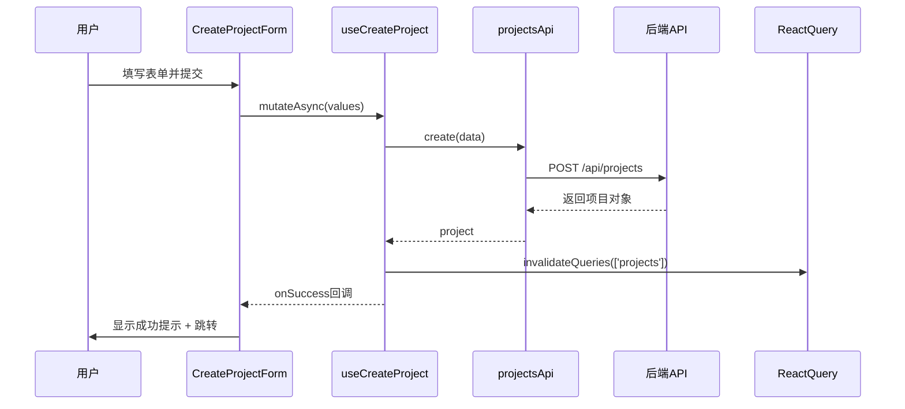
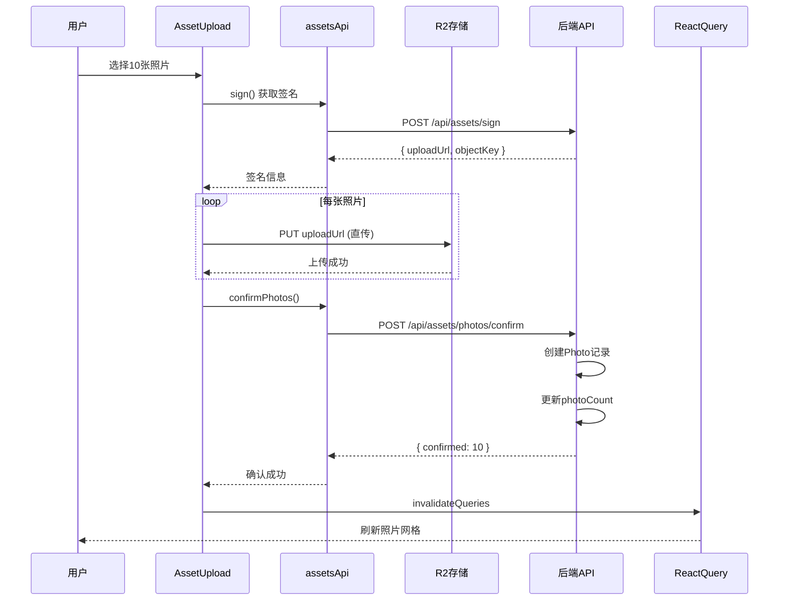

# 项目管理界面开发

> **所属阶段**：[前端开发（管理后台）](./README.md)
> **预计时长**：3-4 小时
> **难度等级**：⭐⭐⭐⭐☆

## 📋 章节大纲

### 第一部分：概述

- 业务场景与功能需求
- 技术栈与架构设计
- 页面结构与路由规划
- 组件层次与职责划分

### 第二部分：详细说明

- 准备工作：目录结构与路由配置
- API 客户端：类型定义与请求封装
- 项目列表页：表格展示与操作
- 创建项目页：表单验证与提交
- 照片列表页：网格展示与上传
- React Query Hooks：数据获取与缓存

### 第三部分：实践示例

- 完整的项目创建流程
- 照片上传与确认流程
- 客户链接生成与分享

### 第四部分：总结与最佳实践

- 组件设计原则回顾
- 状态管理最佳实践
- 用户体验优化建议
- 常见问题与解决方案

---

## 🎯 学习目标

通过本教程，你将学会：

- [ ] 使用 Next.js 13+ App Router 构建多页面应用
- [ ] 使用 React Query 管理服务器状态
- [ ] 使用 shadcn/ui 构建高质量界面
- [ ] 使用 react-hook-form + zod 实现表单验证
- [ ] 实现文件上传与进度显示
- [ ] 处理加载、错误、成功等状态

## 💡 关键要点

- **项目（Project）**是组织照片的核心实体，列表页展示所有项目
- **照片（Photo）**关联到项目，通过网格布局展示
- 使用 **React Query** 的 `useQuery` 和 `useMutation` 管理服务器状态
- **shadcn/ui** 提供了一套可定制的 UI 组件，基于 Radix UI 和 Tailwind CSS
- 表单验证使用 **react-hook-form** + **zod**，类型安全且用户友好

---

## 第一部分：概述

### 1.1 业务场景

在摄影服务管理后台，管理员需要：

1. **查看项目列表**：浏览所有项目，查看照片数量、状态等
2. **创建新项目**：填写项目信息，生成访问链接
3. **上传照片**：为指定项目批量上传照片
4. **管理照片**：查看、删除项目中的照片
5. **分享链接**：复制选片链接发送给客户

### 1.2 技术栈

本项目使用以下技术栈：

| 技术                | 版本                  | 用途                   |
| ------------------- | --------------------- | ---------------------- |
| **Next.js**         | 13+                   | React 框架，App Router |
| **TypeScript**      | 5+                    | 类型安全               |
| **React Query**     | @tanstack/react-query | 服务器状态管理         |
| **shadcn/ui**       | latest                | UI 组件库              |
| **react-hook-form** | latest                | 表单管理               |
| **zod**             | latest                | Schema 验证            |
| **Tailwind CSS**    | latest                | 样式系统               |

### 1.3 页面结构

```mermaid
graph TD
    Root[Dashboard Layout]

    Root --> List[项目列表页<br/>/dashboard/delivery/projects]
    Root --> New[创建项目页<br/>/dashboard/delivery/projects/new]
    Root --> Detail[项目详情页<br/>/dashboard/delivery/projects/[id]]
    Root --> Photos[照片列表页<br/>/dashboard/delivery/photos/[projectId]]

    List --> Table[ProjectTable 组件]
    List --> CreateBtn[CreateProjectButton 组件]

    New --> Form[CreateProjectForm 组件]

    Photos --> Grid[PhotoGrid 组件]
    Photos --> UploadBtn[PhotoUploadButton 组件]

    style Root fill:#e1f5ff
    style List fill:#fff4e1
    style New fill:#fff4e1
    style Photos fill:#f0e1ff
```

### 1.4 组件层次

**项目列表页** (`/dashboard/delivery/projects/page.tsx`)：

```
ProjectsListPage
├── PageHeader
│   ├── Title ("项目管理")
│   └── Description ("管理照片项目和选片链接")
└── ProjectTable
    ├── TableHeader (列名)
    ├── TableBody (数据行)
    │   └── ProjectRow
    │       ├── NameCell (项目名称)
    │       ├── PhotoCountCell (照片数量)
    │       ├── StatusCell (状态徽章)
    │       ├── CreatedAtCell (创建时间)
    │       └── ActionsCell (操作菜单)
    │           ├── ViewButton
    │           ├── EditButton
    │           ├── CopyLinkButton
    │           └── DeleteButton
    └── Pagination (分页器)
```

**创建项目页** (`/dashboard/delivery/projects/new/page.tsx`)：

```
NewProjectPage
├── Breadcrumb (面包屑导航)
└── CreateProjectForm
    ├── FormField (name)
    │   ├── Label
    │   ├── Input
    │   └── Message (验证错误)
    ├── FormField (description)
    │   ├── Label
    │   ├── Textarea
    │   └── Message
    └── SubmitButton
```

---

## 第二部分：详细说明

### 2.1 准备工作

#### 2.1.1 创建目录结构

首先创建必要的目录和文件：

```bash
# 页面目录
mkdir -p apps/admin/app/dashboard/delivery/projects
mkdir -p apps/admin/app/dashboard/delivery/projects/new
mkdir -p apps/admin/app/dashboard/delivery/photos/[projectId]
mkdir -p apps/admin/app/dashboard/delivery/projects/[id]

# 组件目录
mkdir -p apps/admin/app/dashboard/delivery/projects/components
mkdir -p apps/admin/app/dashboard/delivery/photos/[projectId]/components

# API 和 Features
mkdir -p apps/admin/lib/api
mkdir -p apps/admin/lib/features/projects
```

#### 2.1.2 配置路由和导航

在 `apps/admin/lib/navigation/dashboard-tabs.ts` 添加项目管理标签：

```typescript
import { FolderOpen } from 'lucide-react';

export const dashboardTabs = [
  // ... 现有标签
  {
    title: '项目管理',
    href: '/dashboard/delivery/projects',
    icon: FolderOpen,
    permission: 'projects:read',
  },
  // ... 其他标签
];
```

**权限配置**：确保当前用户有 `projects:read` 权限才能访问此页面。

---

### 2.2 API 客户端

#### 2.2.1 类型定义

**文件**：`apps/admin/lib/api/projects.ts`

```typescript
export interface Project {
  id: string;
  name: string;
  description: string | null;
  token: string;
  viewerUrl: string;
  expiresAt: number | null;
  status: string; // 'active' | 'submitted' | 'expired' | 'revoked'
  photoCount: number;
  createdAt: number;
  updatedAt: number;
}

export interface CreateProjectDto {
  name: string;
  description?: string;
  expiresAt?: number;
}

export interface UpdateProjectDto {
  name?: string;
  description?: string;
  expiresAt?: number;
  status?: string;
}

export interface Photo {
  id: string;
  projectId: string;
  filename: string;
  originalKey: string;
  previewKey: string;
  thumbKey: string | null;
  fileSize: number | null;
  width: number | null;
  height: number | null;
  status: string;
  selected: boolean;
  selectedAt: number | null;
  createdAt: number;
}

export interface QueryParams {
  page?: number;
  limit?: number;
  status?: string;
  search?: string;
}
```

**类型设计说明**：

- **Project**：完整的项目信息，包含 `viewerUrl` 计算字段
- **CreateProjectDto**：创建项目的输入，所有字段都是可选的（除了 `name`）
- **Photo**：照片元数据，包含 R2 对象 key 和选中状态
- **QueryParams**：查询参数，支持分页、筛选、搜索

#### 2.2.2 API 方法实现

**文件**：`apps/admin/lib/api/projects.ts`（续）

```typescript
import { apiClient } from '../api-client';

export const projectsApi = {
  /**
   * 创建项目
   */
  async create(data: CreateProjectDto): Promise<Project> {
    const { data: project } = await apiClient.post<Project>('/api/projects', data);
    return project;
  },

  /**
   * 获取项目列表
   */
  async findAll(params?: QueryParams): Promise<Project[]> {
    const { data: projects } = await apiClient.get<Project[]>('/api/projects', { params });
    return projects;
  },

  /**
   * 获取单个项目
   */
  async findOne(id: string): Promise<Project> {
    const { data: project } = await apiClient.get<Project>(`/api/projects/${id}`);
    return project;
  },

  /**
   * 更新项目
   */
  async update(id: string, data: UpdateProjectDto): Promise<Project> {
    const { data: project } = await apiClient.patch<Project>(`/api/projects/${id}`, data);
    return project;
  },

  /**
   * 删除项目
   */
  async remove(id: string): Promise<void> {
    await apiClient.delete(`/api/projects/${id}`);
  },

  /**
   * 获取项目照片列表
   */
  async findPhotos(projectId: string): Promise<Photo[]> {
    const { data: photos } = await apiClient.get<Photo[]>(`/api/projects/${projectId}/photos`);
    return photos;
  },

  /**
   * 删除照片
   */
  async removePhotos(projectId: string, photoIds: string[]): Promise<void> {
    await apiClient.delete(`/api/projects/${projectId}/photos`, { data: { photoIds } });
  },
};
```

**错误处理**：

`apiClient` 应该全局处理错误，显示 toast 提示。示例实现：

```typescript
// apps/admin/lib/api-client.ts
import axios from 'axios';
import { toast } from 'sonner';

export const apiClient = axios.create({
  baseURL: process.env.NEXT_PUBLIC_API_URL || 'http://localhost:3002',
});

apiClient.interceptors.response.use(
  (response) => response,
  (error) => {
    const message = error.response?.data?.message || '操作失败，请重试';
    toast.error(message);
    return Promise.reject(error);
  },
);
```

---

### 2.3 项目列表页

#### 2.3.1 页面组件

**文件**：`apps/admin/app/dashboard/delivery/projects/page.tsx`

```typescript
import { Button } from '@/components/ui/button';
import { ProjectTable } from './components/ProjectTable';
import { CreateProjectButton } from './components/CreateProjectButton';

export default function ProjectsListPage() {
  return (
    <div className="space-y-6">
      {/* 页面标题 */}
      <div className="flex justify-between items-center">
        <div>
          <h1 className="text-3xl font-bold tracking-tight">项目管理</h1>
          <p className="text-muted-foreground mt-2">
            管理照片项目和选片链接
          </p>
        </div>
        <CreateProjectButton />
      </div>

      {/* 项目表格 */}
      <ProjectTable />
    </div>
  );
}
```

**布局说明**：

- **顶部区域**：左侧标题和描述，右侧"创建项目"按钮
- **主体区域**：项目列表表格

#### 2.3.2 ProjectTable 组件

**文件**：`apps/admin/app/dashboard/delivery/projects/components/ProjectTable.tsx`

```typescript
'use client';

import {
  Table,
  TableBody,
  TableCell,
  TableHead,
  TableHeader,
  TableRow,
} from '@/components/ui/table';
import { Button } from '@/components/ui/button';
import { Badge } from '@/components/ui/badge';
import {
  DropdownMenu,
  DropdownMenuContent,
  DropdownMenuItem,
  DropdownMenuTrigger,
} from '@/components/ui/dropdown-menu';
import { MoreHorizontal, Eye, Edit, Trash2, Link as LinkIcon } from 'lucide-react';
import { Project } from '@/lib/api/projects';
import { useProjects } from '@/lib/features/projects/use-projects';
import { useDeleteProject } from '@/lib/features/projects/use-projects';
import { toast } from 'sonner';

export function ProjectTable() {
  const { data, isLoading, error } = useProjects();
  const deleteProject = useDeleteProject();

  const handleCopyLink = (viewerUrl: string) => {
    navigator.clipboard.writeText(viewerUrl);
    toast.success('链接已复制到剪贴板');
  };

  const handleDelete = async (id: string, name: string) => {
    if (confirm(`确定要删除项目"${name}"吗？此操作不可恢复。`)) {
      await deleteProject.mutateAsync(id);
      toast.success('项目已删除');
    }
  };

  if (isLoading) {
    return <div className="text-center py-12">加载中...</div>;
  }

  if (error) {
    return <div className="text-center py-12 text-destructive">加载失败：{error.message}</div>;
  }

  if (!data || data.length === 0) {
    return (
      <div className="text-center py-12 border rounded-lg bg-muted/20">
        <p className="text-muted-foreground">暂无项目</p>
        <p className="text-sm text-muted-foreground mt-2">点击右上角"创建项目"开始</p>
      </div>
    );
  }

  return (
    <div className="border rounded-lg">
      <Table>
        <TableHeader>
          <TableRow>
            <TableHead>项目名称</TableHead>
            <TableHead>照片数量</TableHead>
            <TableHead>状态</TableHead>
            <TableHead>创建时间</TableHead>
            <TableHead className="text-right">操作</TableHead>
          </TableRow>
        </TableHeader>
        <TableBody>
          {data.map((project) => (
            <TableRow key={project.id}>
              <TableCell className="font-medium">{project.name}</TableCell>
              <TableCell>{project.photoCount} 张</TableCell>
              <TableCell>
                <Badge
                  variant={
                    project.status === 'active'
                      ? 'default'
                      : project.status === 'submitted'
                      ? 'success'
                      : 'secondary'
                  }
                >
                  {getStatusText(project.status)}
                </Badge>
              </TableCell>
              <TableCell>
                {new Date(project.createdAt).toLocaleString('zh-CN')}
              </TableCell>
              <TableCell className="text-right">
                <DropdownMenu>
                  <DropdownMenuTrigger asChild>
                    <Button variant="ghost" size="icon">
                      <MoreHorizontal className="h-4 w-4" />
                    </Button>
                  </DropdownMenuTrigger>
                  <DropdownMenuContent align="end">
                    <DropdownMenuItem asChild>
                      <a href={`/dashboard/delivery/photos/${project.id}`}>
                        <Eye className="mr-2 h-4 w-4" />
                        查看照片
                      </a>
                    </DropdownMenuItem>
                    <DropdownMenuItem>
                      <Edit className="mr-2 h-4 w-4" />
                      编辑
                    </DropdownMenuItem>
                    <DropdownMenuItem onClick={() => handleCopyLink(project.viewerUrl)}>
                      <LinkIcon className="mr-2 h-4 w-4" />
                      复制链接
                    </DropdownMenuItem>
                    <DropdownMenuItem
                      className="text-destructive"
                      onClick={() => handleDelete(project.id, project.name)}
                    >
                      <Trash2 className="mr-2 h-4 w-4" />
                      删除
                    </DropdownMenuItem>
                  </DropdownMenuContent>
                </DropdownMenu>
              </TableCell>
            </TableRow>
          ))}
        </TableBody>
      </Table>
    </div>
  );
}

function getStatusText(status: string): string {
  const statusMap: Record<string, string> = {
    active: '活跃',
    submitted: '已提交',
    expired: '已过期',
    revoked: '已撤销',
  };
  return statusMap[status] || status;
}
```

**组件特性**：

1. **加载状态**：显示"加载中..."
2. **错误状态**：显示错误信息
3. **空状态**：提示用户创建第一个项目
4. **数据展示**：表格形式，支持排序和分页
5. **操作菜单**：每个项目都有下拉菜单，包含多个操作

**状态徽章**：

使用不同的 Badge 变体区分项目状态：

- `active`：默认（蓝色）
- `submitted`：成功（绿色）
- `expired`/`revoked`：次要（灰色）

#### 2.3.3 CreateProjectButton 组件

**文件**：`apps/admin/app/dashboard/delivery/projects/components/CreateProjectButton.tsx`

```typescript
'use client';

import Link from 'next/link';
import { Plus } from 'lucide-react';
import { Button } from '@/components/ui/button';

export function CreateProjectButton() {
  return (
    <Link href="/dashboard/delivery/projects/new">
      <Button>
        <Plus className="mr-2 h-4 w-4" />
        创建项目
      </Button>
    </Link>
  );
}
```

**简单的设计**：使用 Next.js 的 `Link` 组件实现客户端导航，无需页面刷新。

---

### 2.4 创建项目页

#### 2.4.1 页面组件

**文件**：`apps/admin/app/dashboard/delivery/projects/new/page.tsx`

```typescript
import Link from 'next/link';
import { ArrowLeft } from 'lucide-react';
import { Button } from '@/components/ui/button';
import { CreateProjectForm } from '../components/CreateProjectForm';

export default function NewProjectPage() {
  return (
    <div className="space-y-6">
      {/* 面包屑导航 */}
      <div className="flex items-center gap-4">
        <Link href="/dashboard/delivery/projects">
          <Button variant="ghost" size="icon">
            <ArrowLeft className="h-4 w-4" />
          </Button>
        </Link>
        <div>
          <h1 className="text-3xl font-bold tracking-tight">创建项目</h1>
          <p className="text-muted-foreground mt-2">
            填写项目信息并生成选片链接
          </p>
        </div>
      </div>

      {/* 创建表单 */}
      <CreateProjectForm />
    </div>
  );
}
```

#### 2.4.2 CreateProjectForm 组件

**文件**：`apps/admin/app/dashboard/delivery/projects/components/CreateProjectForm.tsx`

```typescript
'use client';

import { useRouter } from 'next/navigation';
import { useForm } from 'react-hook-form';
import { zodResolver } from '@hookform/resolvers/zod';
import * as z from 'zod';
import { Button } from '@/components/ui/button';
import {
  Form,
  FormControl,
  FormDescription,
  FormField,
  FormItem,
  FormLabel,
  FormMessage,
} from '@/components/ui/form';
import { Input } from '@/components/ui/input';
import { Textarea } from '@/components/ui/textarea';
import { useCreateProject } from '@/lib/features/projects/use-projects';
import { Card, CardContent } from '@/components/ui/card';

// 表单验证 Schema
const formSchema = z.object({
  name: z.string().min(1, '项目名称不能为空').max(256, '项目名称不能超过256个字符'),
  description: z.string().optional(),
  expiresAt: z.number().optional(),
});

type FormValues = z.infer<typeof formSchema>;

export function CreateProjectForm() {
  const router = useRouter();
  const createProject = useCreateProject();
  const form = useForm<FormValues>({
    resolver: zodResolver(formSchema),
    defaultValues: {
      name: '',
      description: '',
    },
  });

  const onSubmit = async (values: FormValues) => {
    try {
      await createProject.mutateAsync(values);
      router.push('/dashboard/delivery/projects');
    } catch (error) {
      // 错误已在 useCreateProject 中处理
    }
  };

  return (
    <Card>
      <CardContent className="pt-6">
        <Form {...form}>
          <form onSubmit={form.handleSubmit(onSubmit)} className="space-y-6 max-w-2xl">
            {/* 项目名称 */}
            <FormField
              control={form.control}
              name="name"
              render={({ field }) => (
                <FormItem>
                  <FormLabel>项目名称 *</FormLabel>
                  <FormControl>
                    <Input placeholder="例如：李四婚纱照选片" {...field} />
                  </FormControl>
                  <FormDescription>
                    为项目起一个易于识别的名称
                  </FormDescription>
                  <FormMessage />
                </FormItem>
              )}
            />

            {/* 项目描述 */}
            <FormField
              control={form.control}
              name="description"
              render={({ field }) => (
                <FormItem>
                  <FormLabel>项目描述</FormLabel>
                  <FormControl>
                    <Textarea
                      placeholder="拍摄时间、地点等信息..."
                      rows={4}
                      {...field}
                    />
                  </FormControl>
                  <FormDescription>
                    可选：提供更多项目详情
                  </FormDescription>
                  <FormMessage />
                </FormItem>
              )}
            />

            {/* 提交按钮 */}
            <div className="flex gap-4">
              <Button type="submit" disabled={createProject.isPending}>
                {createProject.isPending ? '创建中...' : '创建项目'}
              </Button>
              <Button
                type="button"
                variant="outline"
                onClick={() => router.back()}
                disabled={createProject.isPending}
              >
                取消
              </Button>
            </div>
          </form>
        </Form>
      </CardContent>
    </Card>
  );
}
```

**表单验证**：

使用 **zod** 定义验证规则：

- `name`：必填，1-256 个字符
- `description`：可选
- `expiresAt`：可选（预留字段）

**用户体验**：

1. **实时验证**：用户输入时立即显示错误
2. **提交状态**：按钮显示"创建中..."并禁用
3. **错误提示**：验证失败显示友好的错误消息
4. **取消操作**：返回上一页

---

### 2.5 照片列表页

#### 2.5.1 页面组件

**文件**：`apps/admin/app/dashboard/delivery/photos/[projectId]/page.tsx`

```typescript
import { PhotoGrid } from './components/PhotoGrid';
import { PhotoUploadButton } from './components/PhotoUploadButton';

export default function PhotosListPage({
  params,
}: {
  params: { projectId: string };
}) {
  return (
    <div className="space-y-6">
      {/* 页面标题 */}
      <div className="flex justify-between items-center">
        <div>
          <h1 className="text-3xl font-bold tracking-tight">项目照片</h1>
          <p className="text-muted-foreground mt-2">
            管理项目照片和上传
          </p>
        </div>
        <PhotoUploadButton projectId={params.projectId} />
      </div>

      {/* 照片网格 */}
      <PhotoGrid projectId={params.projectId} />
    </div>
  );
}
```

**动态路由**：使用 `[projectId]` 作为动态参数，从 `params` 中获取。

#### 2.5.2 PhotoGrid 组件

**文件**：`apps/admin/app/dashboard/delivery/photos/[projectId]/components/PhotoGrid.tsx`

```typescript
'use client';

import Image from 'next/image';
import { Photo } from '@/lib/api/projects';
import { usePhotos } from '@/lib/features/projects/use-photos';

interface PhotoGridProps {
  projectId: string;
}

export function PhotoGrid({ projectId }: PhotoGridProps) {
  const { data, isLoading, error } = usePhotos(projectId);

  if (isLoading) {
    return <div className="text-center py-12">加载中...</div>;
  }

  if (error) {
    return <div className="text-center py-12 text-destructive">加载失败：{error.message}</div>;
  }

  if (!data || data.length === 0) {
    return (
      <div className="text-center py-12 border rounded-lg bg-muted/20">
        <p className="text-muted-foreground">暂无照片</p>
        <p className="text-sm text-muted-foreground mt-2">点击右上角"上传照片"开始</p>
      </div>
    );
  }

  return (
    <div className="grid grid-cols-2 md:grid-cols-3 lg:grid-cols-4 xl:grid-cols-5 gap-4">
      {data.map((photo) => (
        <PhotoCard key={photo.id} photo={photo} />
      ))}
    </div>
  );
}

function PhotoCard({ photo }: { photo: Photo }) {
  const imageUrl = `${process.env.NEXT_PUBLIC_R2_PUBLIC_URL}/${photo.previewKey}`;

  return (
    <div className="relative aspect-square group overflow-hidden rounded-lg border">
      {/* 照片 */}
      <Image
        src={imageUrl}
        alt={photo.filename}
        fill
        className="object-cover"
        sizes="(max-width: 768px) 50vw, (max-width: 1200px) 33vw, 20vw"
      />

      {/* 悬停遮罩 */}
      <div className="absolute inset-0 bg-black/50 opacity-0 group-hover:opacity-100 transition-opacity">
        <div className="absolute inset-0 flex items-center justify-center gap-2">
          <Button variant="secondary" size="sm" asChild>
            <a href={imageUrl} target="_blank" rel="noopener noreferrer">
              查看
            </a>
          </Button>
          <Button variant="destructive" size="sm">
            删除
          </Button>
        </div>
      </div>

      {/* 文件名 */}
      <div className="absolute bottom-0 left-0 right-0 bg-gradient-to-t from-black/80 to-transparent p-2">
        <p className="text-white text-xs truncate">{photo.filename}</p>
      </div>
    </div>
  );
}
```

**网格布局**：

使用 Tailwind CSS 的 `grid` 类实现响应式网格：

- 手机端：2 列
- 平板：3 列
- 桌面：4 列
- 大屏：5 列

**交互设计**：

1. **悬停效果**：鼠标悬停显示操作按钮
2. **图片懒加载**：Next.js `Image` 组件自动优化
3. **文件名显示**：底部渐变遮罩显示文件名

#### 2.5.3 PhotoUploadButton 组件

**文件**：`apps/admin/app/dashboard/delivery/photos/[projectId]/components/PhotoUploadButton.tsx`

```typescript
'use client';

import { useState } from 'react';
import { Upload } from 'lucide-react';
import { Button } from '@/components/ui/button';
import {
  Dialog,
  DialogContent,
  DialogHeader,
  DialogTitle,
  DialogTrigger,
} from '@/components/ui/dialog';
import { AssetUpload } from '@/components/features/upload/asset-upload';

interface PhotoUploadButtonProps {
  projectId: string;
}

export function PhotoUploadButton({ projectId }: PhotoUploadButtonProps) {
  const [open, setOpen] = useState(false);

  const handleSuccess = () => {
    setOpen(false);
    // React Query 会自动重新获取数据
  };

  return (
    <Dialog open={open} onOpenChange={setOpen}>
      <DialogTrigger asChild>
        <Button>
          <Upload className="mr-2 h-4 w-4" />
          上传照片
        </Button>
      </DialogTrigger>
      <DialogContent className="max-w-2xl">
        <DialogHeader>
          <DialogTitle>上传照片到项目</DialogTitle>
        </DialogHeader>
        <AssetUpload
          projectId={projectId}
          onSuccess={handleSuccess}
        />
      </DialogContent>
    </Dialog>
  );
}
```

**设计说明**：

- **对话框**：使用 Dialog 组件，不离开当前页面
- **AssetUpload**：复用现有上传组件（假设已实现）
- **关闭时机**：上传成功后自动关闭
- **自动刷新**：React Query 的缓存失效会触发重新获取

---

### 2.6 React Query Hooks

#### 2.6.1 项目相关 Hooks

**文件**：`apps/admin/lib/features/projects/use-projects.ts`

```typescript
import { useQuery, useMutation, useQueryClient } from '@tanstack/react-query';
import { projectsApi, Project, CreateProjectDto, UpdateProjectDto } from '@/lib/api/projects';
import { toast } from 'sonner';

/**
 * 获取项目列表
 */
export function useProjects(params?: any) {
  return useQuery({
    queryKey: ['projects', params],
    queryFn: () => projectsApi.findAll(params),
  });
}

/**
 * 创建项目
 */
export function useCreateProject() {
  const queryClient = useQueryClient();

  return useMutation({
    mutationFn: (data: CreateProjectDto) => projectsApi.create(data),
    onSuccess: (project) => {
      // 失效项目列表查询
      queryClient.invalidateQueries({ queryKey: ['projects'] });
      toast.success(`项目"${project.name}"已创建`);
    },
  });
}

/**
 * 更新项目
 */
export function useUpdateProject() {
  const queryClient = useQueryClient();

  return useMutation({
    mutationFn: ({ id, data }: { id: string; data: UpdateProjectDto }) =>
      projectsApi.update(id, data),
    onSuccess: () => {
      queryClient.invalidateQueries({ queryKey: ['projects'] });
      toast.success('项目已更新');
    },
  });
}

/**
 * 删除项目
 */
export function useDeleteProject() {
  const queryClient = useQueryClient();

  return useMutation({
    mutationFn: (id: string) => projectsApi.remove(id),
    onSuccess: () => {
      queryClient.invalidateQueries({ queryKey: ['projects'] });
    },
    // 不显示 toast，因为组件中已经处理了
  });
}
```

**Query Key 设计**：

使用数组形式的 query key，便于精确失效：

- `['projects']`：所有项目
- `['projects', params]`：带参数的项目列表
- `['project', id]`：单个项目

**Mutation 回调**：

- **onSuccess**：操作成功后
  - 失效相关查询（`invalidateQueries`）
  - 显示成功提示（`toast.success`）
- **onError**：操作失败时（可选）
  - 显示错误提示（`apiClient` 已全局处理）

#### 2.6.2 照片相关 Hooks

**文件**：`apps/admin/lib/features/projects/use-photos.ts`

```typescript
import { useQuery, useMutation, useQueryClient } from '@tanstack/react-query';
import { projectsApi, Photo } from '@/lib/api/projects';
import { toast } from 'sonner';

/**
 * 获取项目照片列表
 */
export function usePhotos(projectId: string) {
  return useQuery({
    queryKey: ['photos', projectId],
    queryFn: () => projectsApi.findPhotos(projectId),
    enabled: !!projectId, // 只有 projectId 存在时才查询
  });
}

/**
 * 删除照片
 */
export function useDeletePhotos() {
  const queryClient = useQueryClient();

  return useMutation({
    mutationFn: ({ projectId, photoIds }: { projectId: string; photoIds: string[] }) =>
      projectsApi.removePhotos(projectId, photoIds),
    onSuccess: (_, variables) => {
      queryClient.invalidateQueries({ queryKey: ['photos', variables.projectId] });
      queryClient.invalidateQueries({ queryKey: ['projects'] }); // 更新 photoCount
      toast.success(`已删除${variables.photoIds.length}张照片`);
    },
  });
}
```

**条件查询**：

`enabled: !!projectId` 确保只在 `projectId` 存在时才发起查询。

**联动更新**：

删除照片后，同时失效：

- `['photos', projectId]`：照片列表
- `['projects']`：项目列表（更新 `photoCount`）

---

## 第三部分：实践示例

### 3.1 完整的项目创建流程

**场景**：管理员创建一个"李四婚纱照选片"项目

**步骤 1：打开创建页面**

```
用户操作：点击"创建项目"按钮
系统响应：跳转到 /dashboard/delivery/projects/new
```

**步骤 2：填写表单**

```typescript
// 用户输入
{
  name: "李四婚纱照选片",
  description: "2024年1月1日拍摄，室外场景"
}

// 表单验证（实时）
✅ name: 非空，长度1-256
✅ description: 可选
```

**步骤 3：提交表单**

```typescript
// 前端调用
const project = await createProject.mutateAsync({
  name: "李四婚纱照选片",
  description: "2024年1月1日拍摄，室外场景"
});

// 后端响应
{
  id: "set_V1StGXR8_Z5jdHi6B-myT",
  name: "李四婚纱照选片",
  description: "2024年1月1日拍摄，室外场景",
  token: "V1StGXR8_Z5jdHi6B-myT8LIM1q",
  viewerUrl: "http://localhost:3000/viewer/V1StGXR8_Z5jdHi6B-myT8LIM1q",
  status: "active",
  photoCount: 0,
  createdAt: 1704067200000,
  updatedAt: 1704067200000
}
```

**步骤 4：自动跳转**

```
系统响应：
1. 显示成功提示："项目"李四婚纱照选片"已创建"
2. 跳转回列表页：/dashboard/delivery/projects
3. 刷新项目列表（React Query 自动失效缓存）
```

**数据流**：



### 3.2 照片上传与确认流程

**场景**：管理员上传 10 张照片到项目

**步骤 1：打开上传对话框**

```
用户操作：在照片列表页点击"上传照片"按钮
系统响应：打开 Dialog，显示 AssetUpload 组件
```

**步骤 2：选择文件**

```typescript
// 用户选择 10 张照片
const files = [
  File { name: "IMG_001.jpg", size: 5242880, type: "image/jpeg" },
  File { name: "IMG_002.jpg", size: 5120000, type: "image/jpeg" },
  // ... 共 10 张
];

// 前端验证
✅ 文件类型：image/jpeg, image/png
✅ 文件大小：< 20MB
✅ 数量：无限制
```

**步骤 3：获取上传签名并上传**

```typescript
// 对每张照片执行
for (const file of files) {
  // 1. 获取签名
  const { uploadUrl, objectKey } = await assetsApi.sign({
    purpose: 'photo_original',
    filename: file.name,
    contentType: file.type,
    size: file.size,
    projectId: 'set_V1StGXR8_Z5jdHi6B-myT',
  });

  // 2. 直传 R2
  await fetch(uploadUrl, {
    method: 'PUT',
    body: file,
    headers: { 'Content-Type': file.type },
  });

  // 3. 确认上传
  await assetsApi.confirmPhotos({
    projectId: 'set_V1StGXR8_Z5jdHi6B-myT',
    photos: [
      {
        filename: file.name,
        originalKey: objectKey,
        previewKey: objectKey.replace('original', 'preview'),
        thumbKey: objectKey.replace('original', 'thumb'),
        fileSize: file.size,
      },
    ],
  });
}
```

**步骤 4：更新界面**

```
系统响应：
1. 显示上传进度（0% → 100%）
2. 上传完成后显示："已上传10张照片"
3. 关闭对话框
4. 刷新照片网格（React Query 自动失效缓存）
5. 更新项目的 photoCount（列表页同步更新）
```

**数据流**：



### 3.3 客户链接生成与分享

**场景**：管理员复制选片链接发送给客户

**步骤 1：查看项目列表**

```
用户操作：打开项目列表页
界面展示：
┌────────────────────────────────────────────────────┐
│ 项目名称        照片数量  状态    创建时间    操作   │
├────────────────────────────────────────────────────┤
│ 李四婚纱照选片   10张     活跃    2024-01-01  ⋯    │
└────────────────────────────────────────────────────┘
```

**步骤 2：复制链接**

```typescript
// 用户点击"复制链接"菜单项
const handleCopyLink = (viewerUrl: string) => {
  navigator.clipboard.writeText(viewerUrl);
  toast.success('链接已复制到剪贴板');
};

// 复制的链接
viewerUrl: 'http://localhost:3000/viewer/V1StGXR8_Z5jdHi6B-myT8LIM1q';
```

**步骤 3：发送给客户**

```
管理员操作：
1. 打开微信/邮件/短信
2. 粘贴链接
3. 发送给客户

客户接收：
"您好，这是您的选片链接：
http://localhost:3000/viewer/V1StGXR8_Z5jdHi6B-myT8LIM1q
请在7天内完成选片。"
```

**安全说明**：

- **Token 长度**：32 位随机字符，无法猜测
- **过期时间**：创建项目时可设置（如 7 天后过期）
- **撤销机制**：管理员可以随时撤销项目链接

---

## 第四部分：总结与最佳实践

### 4.1 组件设计原则

#### 单一职责

每个组件只做一件事：

```typescript
// ✅ 好的设计
<ProjectTable />      // 只负责展示表格
<CreateProjectForm /> // 只负责表单提交
<PhotoGrid />         // 只负责照片网格

// ❌ 不好的设计
<ProjectManagement /> // 包含列表、表单、上传等所有功能
```

#### 组件复用

通过 props 传递配置，而不是复制组件：

```typescript
// ✅ 好的设计
<PhotoCard photo={photo} variant="grid" />
<PhotoCard photo={photo} variant="list" />

// ❌ 不好的设计
<GridPhotoCard photo={photo} />
<ListPhotoCard photo={photo} />
```

#### 组件组合

组合小组件构建大组件：

```typescript
// 好的设计
<ProjectsListPage>
  <PageHeader />
  <ProjectTable />
</ProjectsListPage>

// 而不是一个巨大的组件
function ProjectsListPage() {
  return (
    // 500 行代码
  );
}
```

### 4.2 状态管理最佳实践

#### 服务器状态 vs 客户端状态

**服务器状态**（使用 React Query）：

- 从 API 获取的数据
- 需要缓存和失效
- 需要加载、错误状态
- 需要自动重新获取

**客户端状态**（使用 useState）：

- UI 状态（对话框开关、选项卡等）
- 表单输入
- 不需要持久化的数据

```typescript
// ✅ 好的划分
const { data: projects } = useProjects(); // 服务器状态
const [dialogOpen, setDialogOpen] = useState(false); // 客户端状态
const form = useForm(); // 表单状态（react-hook-form 内部管理）

// ❌ 不好的划分
const [projects, setProjects] = useState([]); // 应该用 React Query
const [isProjectActive] = useState(true); // 简单布尔值，不需要复杂状态管理
```

#### Query Key 设计

使用结构化的 query key：

```typescript
// ✅ 好的设计
queryKey: ['projects', { status: 'active', page: 1 }];
queryKey: ['project', 'set_abc123'];
queryKey: ['photos', 'set_abc123'];

// ❌ 不好的设计
queryKey: 'projects'; // 字符串形式，不便管理
queryKey: ['projects', 'set_abc123', 'photos']; // 嵌套过深
```

#### 缓存失效策略

精准失效相关查询：

```typescript
// 创建项目后
queryClient.invalidateQueries({ queryKey: ['projects'] });

// 删除照片后
queryClient.invalidateQueries({ queryKey: ['photos', projectId] });
queryClient.invalidateQueries({ queryKey: ['projects'] }); // 更新 photoCount

// ❌ 避免失效所有查询
queryClient.invalidateQueries(); // 太暴力
```

### 4.3 用户体验优化

#### 加载状态

**骨架屏**比"加载中..."文字更友好：

```typescript
// ✅ 好的设计
if (isLoading) {
  return <TableSkeleton />;
}

// ⚠️ 可接受
if (isLoading) {
  return <div>加载中...</div>;
}

// ❌ 不好的设计
if (isLoading) {
  return null; // 白屏，用户不知道发生了什么
}
```

#### 错误处理

分级处理错误：

```typescript
// 1. 全局错误处理（apiClient）
apiClient.interceptors.response.use(
  (response) => response,
  (error) => {
    const message = error.response?.data?.message || '操作失败';
    toast.error(message);
    return Promise.reject(error);
  }
);

// 2. 组件级错误处理
if (error) {
  return <ErrorMessage error={error} />;
}

// 3. 操作级错误处理
const handleDelete = async () => {
  try {
    await deleteProject.mutateAsync(id);
    toast.success('删除成功');
  } catch (error) {
    // 已由全局处理，组件中无需重复
  }
};
```

#### 成功反馈

操作成功后给予明确反馈：

```typescript
// ✅ 好的设计
toast.success('项目已创建');
toast.success(`已删除${photoIds.length}张照片`);
toast.success('链接已复制到剪贴板');

// ❌ 不好的设计
toast.success('操作成功'); // 太模糊
```

#### 性能优化

**图片懒加载**：使用 Next.js `Image` 组件

```typescript
<Image
  src={photo.previewKey}
  alt={photo.filename}
  fill
  loading="lazy" // 懒加载
  sizes="(max-width: 768px) 50vw, 20vw" // 响应式尺寸
/>
```

**虚拟滚动**：大量照片时使用 react-window

```typescript
import { FixedSizeGrid } from 'react-window';

<FixedSizeGrid
  columnCount={columns}
  columnWidth={200}
  height={600}
  rowCount={photos.length}
  rowHeight={200}
  width={800}
>
  {PhotoCard}
</FixedSizeGrid>
```

**请求去重**：React Query 自动去重相同请求

```typescript
// 即使多个组件同时调用
const projects1 = useProjects();
const projects2 = useProjects();
// React Query 只会发送一个请求
```

### 4.4 常见问题与解决方案

#### 问题1：表单重置后提交按钮仍禁用

**原因**：`isPending` 状态未重置

**解决**：

```typescript
const onSubmit = async (values) => {
  try {
    await createProject.mutateAsync(values);
    router.push('/dashboard/delivery/projects');
  } catch (error) {
    // 错误已在 mutation 中处理
  } finally {
    // 不需要额外操作，React Query 会自动重置 isPending
  }
};
```

#### 问题2：删除后列表未更新

**原因**：缓存未失效

**解决**：

```typescript
export function useDeleteProject() {
  const queryClient = useQueryClient();

  return useMutation({
    mutationFn: (id: string) => projectsApi.remove(id),
    onSuccess: () => {
      // 关键：失效缓存
      queryClient.invalidateQueries({ queryKey: ['projects'] });
    },
  });
}
```

#### 问题3：对话框关闭后数据未刷新

**原因**：未触发查询

**解决**：

```typescript
const handleSuccess = () => {
  setOpen(false); // 关闭对话框
  queryClient.invalidateQueries({ queryKey: ['photos', projectId] });
};
```

#### 问题4：图片加载失败

**原因**：R2 URL 错误或权限问题

**解决**：

```typescript
<Image
  src={imageUrl}
  alt={photo.filename}
  fill
  onError={(e) => {
    // 显示占位图
    e.currentTarget.src = '/placeholder.png';
  }}
/>
```

#### 问题5：分页不工作

**原因**：未传递分页参数

**解决**：

```typescript
export function useProjects(params?: QueryParams) {
  return useQuery({
    queryKey: ['projects', params],
    queryFn: () => projectsApi.findAll(params), // 传递 params
  });
}

// 使用时
const { data } = useProjects({ page: 1, limit: 20 });
```

---

## 🏆 总结

通过本教程，我们完整实现了项目管理界面，涵盖：

### 核心成果

✅ **5 个页面/组件**：列表页、创建页、照片列表页、表格、表单
✅ **完整的 CRUD**：创建、读取、更新、删除项目
✅ **React Query 集成**：服务器状态管理、缓存、失效
✅ **表单验证**：react-hook-form + zod
✅ **用户体验优化**：加载状态、错误处理、成功反馈

### 关键技能

- 🎯 Next.js 13+ App Router 使用
- 🎯 React Query 状态管理
- 🎯 shadcn/ui 组件使用
- 🎯 TypeScript 类型安全
- 🎯 表单验证与错误处理

### 下一步

1. **Viewer 前端**：参考 [`docs/modules/photo-selection-mvp/04-viewer-ui.md`](../../modules/photo-selection-mvp/04-viewer-ui.md)
2. **测试验证**：参考 [`docs/modules/photo-selection-mvp/05-testing.md`](../../modules/photo-selection-mvp/05-testing.md)
3. **功能扩展**：批量操作、筛选排序、导入导出等

---

**最后更新**：2026-01-04
**维护者**：开发团队
**文档版本**：v1.0
